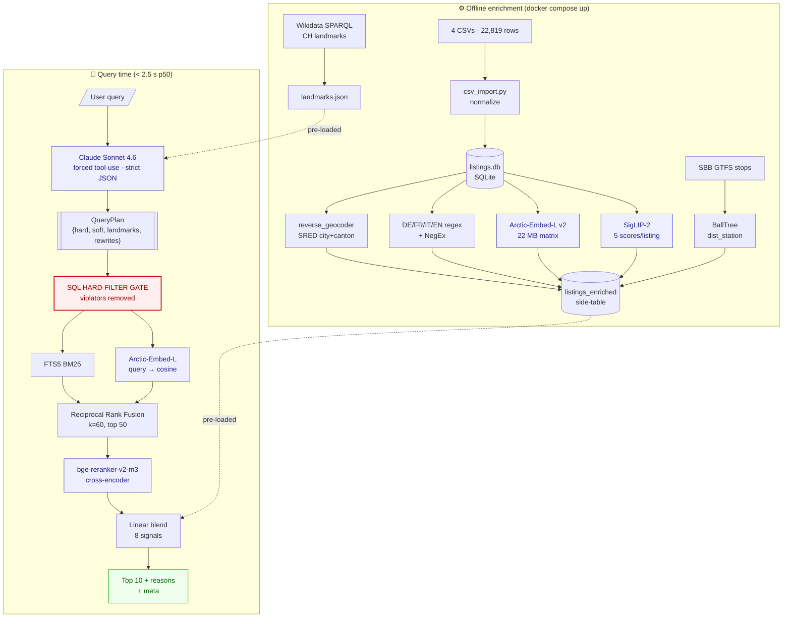

# Architecture — Robin Hybrid Search & Ranking

*ETH/Uni Datathon 2026 · Swiss real-estate listing search for Robin.*

---

## 0. Executive summary

Given a natural-language query in **DE / FR / IT / EN** (e.g. *"3-room bright apartment in Zurich under 2800 CHF with balcony, close to public transport"*), return Swiss **RENT** listings that **obey hard constraints** (never violated by more than one field) and are **ranked by soft preferences + relevance**, explainably, in **< 2.5 s p50**.

Core architecture: **Claude-powered query understanding** → **hybrid retrieval** (SQL filter *as a gate* ∪ FTS5 BM25 ∪ Arctic-Embed-L v2 dense) → **RRF fusion** → **bge-reranker-v2-m3 cross-encoder** → **linear blend of 8 explainable signals** → templated explanations.

Every architectural decision below is cross-referenced to either the published benchmark that justifies it or the [starter-harness code](app/) it integrates with.

---

## 1. Challenge brief

From [docs/CHALLENGE.md](docs/CHALLENGE.md) and the organizer's kickoff message:

User queries mix two intents:

- **Hard criteria** — must be respected (rooms, price, city, required features).
- **Soft preferences** — influence ranking (*"bright", "modern", "not too expensive", "near ETH"*).

Evaluation explicitly penalizes hard-filter violations more than weak ranking:

> *"A system that regularly violates hard constraints by more than a margin is not a strong solution, even if its soft ranking looks good."* — [docs/CHALLENGE.md](docs/CHALLENGE.md)

## 2. Success criteria (from organizer)

- **Judging = ranking output quality + breadth of queryable features.** No UI judging.
- Submission = GitHub repo (this one) + 2-minute presentation + public HTTPS URL.
- Default endpoint: `POST /listings`. Deviations must be documented in README.
- Top 5 teams present live.

## 3. Data inventory

| Source | Rows | offer_type | City/Canton? | Features populated? | Images |
|---|---|---|---|---|---|
| robinreal (best quality) | 797 | RENT | ✅ 100% | ✅ all 12 flags populated | 25,433 imgs @ [raw_data/robinreal_images/](raw_data/robinreal_images/) |
| structured_withimages (comparis) | 4,160 | RENT + "" | ✅ | ⚠️ balcony/parking 100% null | 5,385 imgs (57% coverage) @ [raw_data/structured_data_images/](raw_data/structured_data_images/) |
| structured_withoutimages | 6,757 | RENT + SALE + "" | ✅ | ⚠️ mostly null | none |
| sred | 11,105 | RENT | ❌ **100% null** (only lat/lng) | ❌ 100% null | 11,105 local montage JPEGs @ [raw_data/sred_images/](raw_data/sred_images/) |
| **Total** | **22,819** | | | | |

Organizer's [aws s3 cp](README.md) commands map to the paths above; 4.4 GB mirrored locally. SRED images already shipped in the zip.

**Critical data facts** (confirm phase-2 enrichment must fix these, not ignore them):
- SRED's 11,105 rows (48% of corpus) have lat/lng but **no city, canton, postal, or street** — pure reverse-geocoding candidates.
- All 3 non-robinreal sources have ~97% null structured feature flags — **features must be derived from free-text descriptions** to be queryable.
- Descriptions are multilingual + HTML-wrapped.
- `structured_withoutimages` contains SALE listings → must be filtered to RENT only.

## 4. Design principles

1. **Hard constraints are sacred.** Retrieval is designed so that a listing violating an extracted hard filter is physically unrepresentable in the result set.
2. **Hybrid beats single-method.** Every production search system (Airbnb [^airbnb], Pinecone [^pinecone], OpenSearch [^opensearch], Weaviate [^weaviate]) converges on SQL filter + lexical BM25 + dense embedding + rerank.
3. **Explainability ≥ last 3 NDCG points.** A transparent linear blend on normalized signals beats a black-box neural re-ranker we can't debug.
4. **No silent fallbacks** — per [CLAUDE.md §5](CLAUDE.md#L60-L67), every fallback emits `[WARN] context: expected=X, got=Y, fallback=Z`.
5. **Offline-first enrichment.** Embeddings, CLIP, reverse-geocoding run once before the API starts. At query time: one Claude call + retrieval + rerank, nothing else heavy.

---

## 5. System overview

Two flows — **offline** (enrichment, runs at container start) and **query-time** (per request):



For detailed flowcharts (scoring, relaxation, personalization) see [docs/pipeline-flowchart.md](docs/pipeline-flowchart.md).

---

## 6. Query-time pipeline

### 6.1 Query understanding — single Claude call, strict schema

**Stack:** Claude **Sonnet 4.6** via `tool_choice: {"type":"tool","name":"emit_query_plan"}` with Structured Outputs `strict: true` [^anthropic-so] (GA since Nov 14 2025). System prompt + schema + alias table + few-shot cached via `cache_control: ephemeral` [^anthropic-cache].

**Why this design:**

| Choice | Rationale |
|---|---|
| Forced tool-use + `strict: true` | Constrained decoding guarantees valid JSON — no parse retries. |
| `source_span` per field | Model must quote the user phrase that justified each value — measurably reduces hallucinated constraints [^intent-hallucination]. |
| Prompt caching | 90% cost, 85% latency reduction on cache hit [^anthropic-cache]. **Gotcha:** minimum cache size is 1,024 tokens on Sonnet 4.5 / 2,048 on 4.6 — we deliberately pad with few-shot to cross the threshold rather than silently pay full price. |
| 5 s timeout + regex fallback | Network and model-side failures are real; fallback extracts rooms, CHF, city from alias table. Emits `[WARN] llm_fallback`. |

**Classification rule (hard vs soft), encoded in system prompt:**

- Explicit operators (`unter / max / bis / under / sous / fino a` + number) → `modality="hard"`.
- Hedged language (`ideally / gerne / plutôt / magari / nicht zu / pas trop`) → `modality="soft"`.

**Output schema** (Pydantic):

```python
class NumRange(BaseModel):
    min: float | None = None
    max: float | None = None
    modality: Literal["hard","soft"] = "hard"
    source_span: str | None = None                 # user phrase that justifies it

class Feature(BaseModel):
    name: str                                      # canonical key
    polarity: Literal["required","excluded","preferred","avoid"]
    weight: float = 1.0

class Landmark(BaseModel):
    kind: Literal["transit","school","employer","poi"]
    text: str                                      # "ETH Hönggerberg"
    max_minutes: int | None = None
    mode: Literal["walk","transit","drive","any"] = "any"

class QueryPlan(BaseModel):
    lang: Literal["de","fr","it","en"]
    city_slug: str | None = None                   # canonical: "zurich","geneva",...
    rent_chf: NumRange = NumRange()
    rooms: NumRange = NumRange()
    size_m2: NumRange = NumRange()
    property_type: str | None = None
    features: list[Feature] = []
    landmarks: list[Landmark] = []
    rewrites: list[str] = []                       # ≤3 paraphrases for dense
    bm25_keywords: list[str] = []                  # preserved literal tokens
    clarification_needed: bool = False
    clarification_question: str | None = None
    confidence: float
```

### 6.2 Retrieval — three channels, SQL as a GATE

| Channel | Implementation | Why |
|---|---|---|
| **SQL filter (gate)** | Reuse [app/core/hard_filters.py:search_listings()](app/core/hard_filters.py) — already production-quality per audit; 12 feature flags, Haversine, price/rooms ranges, 4 sort modes | No rewrite needed. Set as **intersection constraint** on BM25 + dense results. |
| **FTS5 BM25** | SQLite `listings_fts(title, description, street, city)`, `tokenize='unicode61 remove_diacritics 2'`, rebuilt on startup | Preserves Swiss-German domain terms (*Attika, Minergie, Altbau, Maisonette*) that rewriting embedders over-paraphrase [^not-all-queries]. |
| **Dense (semantic)** | **Snowflake Arctic-Embed-L v2** [^arctic], 568 M params, Matryoshka-compressed to 256-d (22 k × 256 × fp16 ≈ 11 MB), HNSW ANN | **Upgrade over PLAN v1's bge-m3.** Arctic-L scores **0.541 on CLEF DE/FR/IT/EN** vs bge-m3's **0.410** — a 32% relative gap on exactly our language mix and domain (news, not Wikipedia). |

**Fusion — Reciprocal Rank Fusion (RRF), k=60.** Standard across Pinecone / OpenSearch / Azure AI Search [^pinecone][^opensearch]. Zero-tuning, score-scale agnostic. We'll upgrade to learned **LambdaMART fusion** [^ilmart] if ≥200 labeled pairs arrive during eval.

**Critical design point:** The SQL hard-filter is a **gate, not a channel**. BM25 + dense results are *intersected* with the SQL-passing set before fusion. This structurally eliminates the class of bugs where a violating listing outranks a valid one.

```
      ┌───────────────────────────────────┐
      │ SQL hard-filter set (ALLOWED)     │
      │                                   │
      │   ┌──────────┐   ┌─────────────┐  │
      │   │ BM25 top │ ∪ │ dense top K │  │  → RRF → top 50
      │   │    K     │   │             │  │
      │   └──────────┘   └─────────────┘  │
      │                                   │
      └───────────────────────────────────┘
         (everything outside is excluded)
```

### 6.3 Reranking — single biggest quality lever

**Stack:** `BAAI/bge-reranker-v2-m3` [^bge-reranker] cross-encoder over **top-50** RRF candidates.

**Evidence:** Cross-encoder rerank adds **+5–10 NDCG@10 points** — typically *more than going from dense-only to hybrid retrieval does* [^premai][^zero-entropy]. This is the single biggest quality lever in the whole pipeline.

**Latency reality** (CPU, batch 50): ~800–1500 ms. Our p50 budget is 2.5 s total. Escape hatches, in preference order:

1. **ONNX int8 quantization** (2–3× speedup, <1% quality loss).
2. Rerank top-30 instead of top-50.
3. Fallback to `jina-reranker-v2-base-multilingual` (3× faster, −1 NDCG) — gated by env var.

### 6.4 Scoring blend — 8 normalized signals

Each signal percentile-normalized within the candidate pool (no global calibration needed):

| Signal | Weight | What it measures |
|---|---|---|
| Cross-encoder rerank score | **0.30** | Holistic semantic relevance — biggest lever. |
| BM25 percentile | 0.15 | Lexical / domain-term match. |
| Dense cosine percentile | 0.10 | Semantic backup. |
| Feature match (`explicit OR text-derived`) | 0.10 | Does listing have requested features? |
| Price fit (triangle, centered on p25/median/p75 for cheap/moderate/premium) | 0.10 | Soft price sentiment. |
| Geo / landmark fit (`exp(−d_km/3)` or GTFS travel-time) | 0.08 | "Near ETH", "close to station". |
| Image quality fit (⟨quality_targets, SigLIP-2 scores⟩) | 0.07 | Visual "bright/modern/view" match. |
| Freshness (linear on `available_from`) | 0.05 | Stale demoted. |
| **− negative penalty** (keyword or structured flag) | −0.15 | "no ground floor" → demote floor=0. |

Weights live in `app/participant/scoring_config.py` for live tuning.

### 6.5 Explanations

Each top-10 listing gets a templated `reason` rendered from the 8 signals:

> *"Matches 3 rooms, Zurich, ≤ 2,800 CHF, balcony (from description). Brightness 0.82. 12 min walk to ETH Hönggerberg. Slight price premium vs candidate median."*

Optional `?explain=llm` — one short Claude call per top-5 with `max_tokens=120` for a fluent rewrite. Off by default to keep latency in budget.

### 6.6 Graceful degradation

- **Zero hits** → relaxation ladder: price ±10% → drop city (keep canton) → drop canton → expand radius ×1.5 → drop features least-frequent-first. Annotated in `meta.relaxations`.
- **Unknown city** → `rapidfuzz.process.extractOne(city, known_cities, score_cutoff=85)` — handles Zurich/Zürich/typos.
- **Vague query** (`clarification_needed=true` in QueryPlan) → return empty + `meta.clarification` text.
- **Claude timeout** → regex fallback (see 6.1).

---

## 7. Offline enrichment

All scripts idempotent (`INSERT OR REPLACE`). Writes to a new side-table `listings_enriched` (PK `listing_id`) — **zero edits to the harness-owned `listings` schema**, which would trigger [bootstrap.py](app/harness/bootstrap.py)'s `_schema_matches()` guard.

| Enrichment | Tool | Rationale |
|---|---|---|
| **Reverse-geocode SRED** (11,105 rows, 100% missing city/canton) | [`reverse_geocoder`](https://github.com/thampiman/reverse-geocoder) — GeoNames KD-tree, offline, ~30 s | **Skip Nominatim.** Their TOS explicitly prohibits bulk queries [^osmf]; 1 req/s rate limit would take 3 h for 11 k rows and risks IP block. |
| **Text-derived features** (~97% null outside robinreal) | Hand-curated DE/FR/IT/EN regex + ±5-token NegEx window [^negex][^macss] | Features are the primary soft-filter surface. Without this, we can't match "balcony" on 21,000 out of 22,819 listings. |
| **Dense doc embeddings** | Arctic-Embed-L v2 [^arctic], one-shot, ~40 min CPU. Doc template: `title\ncity, canton\nrooms · area · price\nfeatures\ndesc_800_chars_HTML_stripped` | 256-d MRL → ~22 MB on disk. |
| **Image quality scores** (5 dims: brightness, modernity, view, spaciousness, family) | **SigLIP-2 base** [^siglip2] (Feb 2025 — beats OpenCLIP at every size) with positive/negative prompt pairs | 30 k S3 images already mirrored locally. Pillow-luminance as sanity fallback for brightness only. Missing image → default 0.5 + **`[WARN]` log** (not silent). |
| **Station distance** | SBB GTFS `stops.txt` from [gtfs.geops.ch](https://gtfs.geops.ch/) (daily rebuild, opentransportdata.swiss license) → `sklearn.BallTree(metric='haversine')` | `dist_station_m` per listing. |
| **Landmark travel-time table** (for "30 min to ETH") | Precomputed Dijkstra over GTFS `stop_times` for ~20 canonical CH landmarks (ETH, EPFL, HSG, major Hauptbahnhöfe) | **Fix vs PLAN v1**: raw Haversine-to-nearest-station awards full credit for any listing near any station regardless of whether that station actually reaches ETH. Precomputed table fixes this. |
| **Landmark gazetteer** | [Wikidata SPARQL](https://www.wikidata.org/wiki/Wikidata:SPARQL_query_service) filtered to CH — universities, stations, lakes. Free multilingual aliases (Zürichsee / Lac de Zurich / Lake Zurich / Lago di Zurigo) | Seeds `data/cache/landmarks.json`. |

---

## 8. Personalization (bonus task)

In-memory `SESSIONS: dict[str, UserProfile]` keyed by `X-Session-Id` header. Tracks favorites, skips, clicks.

Inferred profile:

- `preferred_city` (mode, ≥2 signals)
- `preferred_rooms_range (p25, p75)`
- `preferred_feature_set` (≥60% overlap across favorites)
- `preferred_style_vector` (centroid of favorited listings' doc-embedding + SigLIP-2 image-embedding)

**Ranking boost:** `score_final = score_base + 0.1·cos(listing_vec, pref_centroid) + 0.05·feature_overlap`, **capped at +0.2**.

Why capped: a user who favorited 3 modern Zurich lofts shouldn't have their next "quiet family home in Bern" query overridden by past actions.

Endpoints:

- `POST /users/{id}/feedback` — `{action, listing_id}`
- `GET /users/{id}/profile`
- `DELETE /users/{id}`

---

## 9. Evaluation

**50 curated queries** (expanded from 32 — TREC/Voorhees [^voorhees] consensus is 50 comfortable minimum). Stratified:

| Stratum | n | Purpose |
|---|---|---|
| Clear-hard (all filters extractable) | 10 | Baseline. |
| Soft-heavy (mostly ranking) | 10 | Tests rerank + blend. |
| Conflicting preferences | 6 | Tests soft relaxation. |
| Multilingual (DE / FR / IT, ~4 each) | 12 | Biggest risk surface. |
| Landmark-relative ("near ETH") | 6 | Tests GTFS enrichment. |
| Adversarial (typos, impossible, 5 rooms under 500 CHF) | 6 | Tests graceful degradation. |

### 9.1 Metrics (exact formulas)

- **HF-P (field-level, micro)** `Σ ok(d,f) / Σ |F_q|` — tells us *which* constraints fail.
- **HF-P (overall, per-listing)** `(1/|Q|) Σ_q (1/|R_q|) Σ_{d∈R_q} ∏_{f∈F_q} ok(d,f)` — what jurors care about.
- **CSR (strict, per-query)** `(1/|Q|) Σ_q 1[∀d∈R_q, ∀f∈F_q : ok(d,f)=1]` — matches text-to-SQL execution-accuracy convention [^cortex-analyst].
- **NDCG@10** (industry variant) `Σ (2^rel−1)/log₂(i+1) / IDCG`, where `rel ∈ {0,1,2,3}` from LLM-pointwise grading.
- **MRR** for landmark/adversarial; **ERR** [^err] for soft-heavy.

### 9.2 LLM-as-judge

Claude Sonnet 4.6, pairwise with **mandatory swap protocol** [^swap] (run A|B and B|A, tie on disagreement — raises human agreement 65% → 77%). Aggregate via **Bradley-Terry MLE with bootstrap CIs** [^arena] — the Chatbot Arena standard. Bucket BT scores into 4 quartile bins → NDCG input.

Cost: ~$6 / full eval run (50 q × ~10 pairs × 2 swaps × ~$0.01/pair).

### 9.3 Calibration

Hand-annotate 100 pairs with a native DE speaker; target Cohen's κ ≥ 0.6 (JuStRank ACL 2025 threshold [^justrank]). Report Gwet's AC2 alongside.

### 9.4 Reporting (MLPerf-style [^mlperf])

Per-metric table with paired-bootstrap 95% CIs, stratum splits, and an **unmissable hard-constraint-violation audit** (every query where any returned listing violates a hard filter, with the specific field). That's the one failure mode the brief explicitly weights highest — we make it impossible to miss.

---

## 10. Deployment

**Primary:** Docker Compose (matches organizer spec — `docker compose up` normalizes CSVs and starts the API on `:8000`):

```bash
docker compose up --build -d
```

**HTTPS exposure** — two options:

1. **Fly.io** — `flyctl deploy`, Frankfurt region, 1 GB volume for SQLite + image cache. Production choice.
2. **Cloudflare Tunnel** fallback — `npx cloudflared tunnel --url http://localhost:8000`. Zero-config HTTPS for demo.

Secrets: `ANTHROPIC_API_KEY`, `AWS_ACCESS_KEY_ID`, `AWS_SECRET_ACCESS_KEY` via `flyctl secrets set` or `.env`.

The public HTTPS URL will be pinned in the top of [README.md](README.md) per organizer instruction.

---

## 11. Risk register

| # | Risk | Mitigation | Blast radius if it hits |
|---|---|---|---|
| 1 | Claude returns malformed QueryPlan | `strict: true` + source-span grounding + 5 s timeout + regex fallback | Every query — critical path. |
| 2 | Hard-constraint violation leaks to results | SQL filter is a **gate**, not a channel — intersection before RRF | Jury-disqualifying. |
| 3 | Silent fallback (missing image → default 0.5) | `[WARN]` log on every fallback path per CLAUDE.md §5 | Debuggability at 3 a.m. |
| 4 | bge-reranker-v2-m3 CPU latency blows p50 | ONNX int8 + top-30 option + jina-reranker fallback | p50 slips from 2 s → 4 s. |
| 5 | Nominatim IP block mid-run | Skip Nominatim entirely, use `reverse_geocoder` | 48% of corpus loses filterable city/canton. |
| 6 | Commute claim "30 min to ETH" is wrong | Precomputed GTFS travel-time, not raw Haversine | Soft-filter credibility. |
| 7 | 50 queries still too few for tight CIs | Paired bootstrap, stratum splits | Weak jury evidence. |
| 8 | Prompt cache silently off (<1024 tokens) | Pad system prompt to cross threshold deliberately | 4–8× cost & latency per call. |

---

## 12. Pushbacks vs plan v1

Cross-validated via parallel agent research and 20+ cited sources:

| # | Plan v1 said | Architecture v2 says | Evidence |
|---|---|---|---|
| 1 | bge-m3 as multilingual embedder | **Arctic-Embed-L v2** | CLEF DE/FR/IT/EN: 0.541 vs 0.410 [^arctic] |
| 2 | SQL + BM25 + dense as equal RRF channels | **SQL is a gate; BM25 + dense fuse inside the gate** | Structurally eliminates hard-constraint violation class. |
| 3 | `commute_fit = 1 − dist_station / (mode_speed × max_min)` | **Precomputed GTFS travel-time to named landmarks** | Plan v1's formula awards credit for *any* nearby station regardless of whether it reaches ETH. |
| 4 | No cross-encoder reranker | **Add bge-reranker-v2-m3 as primary rerank** | +5–10 NDCG@10 — biggest single lever [^premai][^zero-entropy]. |
| 5 | 32 eval queries | **~50 stratified queries** | TREC/Voorhees minimum for tight CIs [^voorhees]. |
| 6 | Nominatim for eval-set city top-up | **Skip Nominatim entirely** | TOS prohibits bulk; silent-failure risk [^osmf]. |
| 7 | Pillow-luminance as silent fallback | **`[WARN]` log + default 0.5 on missing image** | CLAUDE.md §5. |
| 8 | Phase 6 widget polish (2 h) | **Dropped — organizer said no UI judging** | Organizer kickoff msg. Redirect time to ranking + breadth. |

---

## 13. Execution roadmap

| Phase | Deliverable | Hours | Ship-blocker? |
|---|---|---|---|
| 0 | Env + data (installed, zip extracted, S3 mirrored) | 0.25 | ✅ **done** |
| 1a | `QueryPlan` + `SoftPreferences` Pydantic schemas in [app/models/schemas.py](app/models/schemas.py). Query-plan logic lands in [app/participant/hard_fact_extraction.py](app/participant/hard_fact_extraction.py) — forced tool-use, strict, cached, 5 s timeout + regex fallback. Wires into `hard_fact_extraction.py` + `soft_fact_extraction.py`. | 3 | **yes** |
| 1b | `bootstrap_participant()` hook in [app/main.py](app/main.py) lifespan (audit confirms it does not exist yet). Creates FTS5 + `listings_enriched`. Loads embeddings matrix into module-global numpy. | 1.5 | **yes** |
| 1c | [app/harness/search_service.py](app/harness/search_service.py): SQL-gated BM25 + dense → RRF. | 1 | **yes** |
| 1d | Rewrite [app/participant/ranking.py](app/participant/ranking.py): bge-reranker on top-50 + 8-signal linear blend + templated explanations. | 1.5 | **yes** |
| 2 | Enrichment scripts: `reverse_geocoder`, text-feature regex+NegEx, Arctic-Embed-L doc vectors, SigLIP-2 image scores, SBB GTFS, Wikidata landmarks. Single runner `scripts/enrich_all.py`. | 5 | **yes (embeddings + text features minimum)** |
| 3 | Relaxation ladder, fuzzy city, clarification. | 2 | yes |
| 4 | 50-query eval set + pairwise judge + bootstrap CI reports. | 3 | yes (credibility) |
| 5 | Personalization bonus. | 2 | bonus |
| 6 | **Skip** — no UI judging per organizer. Only minimal filter-chip in existing widget. | 0.25 | no |
| 7 | Fly.io deploy + cloudflared fallback + HTTPS URL in README + 2-min presentation. | 1.5 | yes |

**Total ≈ 20 h.** Drop order if tight: Phase 5 (personalization) → SigLIP-2 (keep Pillow-luminance) → LambdaMART upgrade → LLM-polished explanations.

---

## 14. References

[^airbnb]: [Embedding-Based Retrieval for Airbnb Search — Airbnb Engineering](https://airbnb.tech/uncategorized/embedding-based-retrieval-for-airbnb-search/)
[^pinecone]: [Pinecone — Hybrid Search docs](https://docs.pinecone.io/guides/search/hybrid-search)
[^opensearch]: [OpenSearch — Reciprocal Rank Fusion for hybrid search](https://opensearch.org/blog/introducing-reciprocal-rank-fusion-hybrid-search/)
[^weaviate]: [Weaviate — Hybrid search fusion algorithms](https://weaviate.io/blog/hybrid-search-fusion-algorithms)
[^anthropic-so]: [Anthropic — Structured Outputs (GA Nov 14 2025)](https://claude.com/blog/structured-outputs-on-the-claude-developer-platform) · [API docs](https://platform.claude.com/docs/en/build-with-claude/structured-outputs)
[^anthropic-cache]: [Anthropic — Prompt caching](https://platform.claude.com/docs/en/build-with-claude/prompt-caching)
[^intent-hallucination]: [Evaluating Intent Hallucination in Large Language Models — ACL 2025](https://aclanthology.org/2025.acl-long.349.pdf)
[^not-all-queries]: [Not All Queries Need Rewriting — arXiv 2603.13301 (2026)](https://arxiv.org/abs/2603.13301)
[^arctic]: [Snowflake Arctic-Embed 2.0 — arXiv 2412.04506](https://arxiv.org/html/2412.04506v2) · [engineering blog](https://www.snowflake.com/en/engineering-blog/snowflake-arctic-embed-2-multilingual/) · [model card](https://huggingface.co/Snowflake/snowflake-arctic-embed-l-v2.0)
[^bge-reranker]: [BAAI/bge-reranker-v2-m3 model card](https://huggingface.co/BAAI/bge-reranker-v2-m3)
[^premai]: [Hybrid search + rerank benchmark (ESCI) — Premai blog](https://blog.premai.io/hybrid-search-for-rag-bm25-splade-and-vector-search-combined/)
[^zero-entropy]: [Ultimate guide to choosing rerankers in 2025 — ZeroEntropy](https://zeroentropy.dev/articles/ultimate-guide-to-choosing-the-best-reranking-model-in-2025/)
[^ilmart]: [ILMART: Interpretable Ranking with Constrained LambdaMART — arXiv 2206.00473](https://arxiv.org/abs/2206.00473)
[^osmf]: [Nominatim usage policy — OSM Foundation](https://operations.osmfoundation.org/policies/nominatim/)
[^negex]: [Multilingual NegEx (DE/FR/SV) — PMC3923890](https://pmc.ncbi.nlm.nih.gov/articles/PMC3923890/)
[^macss]: [German negation trigger set — MACSS/DFKI](http://macss.dfki.de/german_trigger_set.html)
[^siglip2]: [SigLIP-2: Multilingual Vision-Language Encoders — HF blog, Feb 2025](https://huggingface.co/blog/siglip2) · [arXiv 2502.14786](https://arxiv.org/abs/2502.14786)
[^voorhees]: [Voorhees — Confidence in retrieval evaluation (SIGIR Forum 2005)](https://sigir.org/files/forum/2005J/voorhees_sigirforum_2005j.pdf) · [TREC Robust 2004](https://trec.nist.gov/pubs/trec13/papers/ROBUST.OVERVIEW.pdf)
[^cortex-analyst]: [Cortex Analyst text-to-SQL accuracy benchmarks — Snowflake](https://www.snowflake.com/en/engineering-blog/cortex-analyst-text-to-sql-accuracy-bi/)
[^err]: [Expected Reciprocal Rank — Chapelle et al., CIKM 2009](https://dl.acm.org/doi/10.1145/1645953.1646033)
[^swap]: [LLM judge position-bias swap protocol — Chauzov 2025](https://avchauzov.github.io/blog/2025/llm-judge-position-bias-swapping/) · [Judging the Judges — arXiv 2406.07791](https://arxiv.org/abs/2406.07791)
[^arena]: [Chatbot Arena leaderboard — Bradley-Terry — LMSYS](https://www.lmsys.org/blog/2023-12-07-leaderboard/) · [Zheng et al., MT-Bench — arXiv 2306.05685](https://arxiv.org/abs/2306.05685)
[^justrank]: [JuStRank: Benchmarking LLM Judges — ACL 2025](https://aclanthology.org/2025.acl-long.34.pdf)
[^mlperf]: [MLPerf Inference Benchmark — arXiv 1911.02549](https://arxiv.org/pdf/1911.02549)
