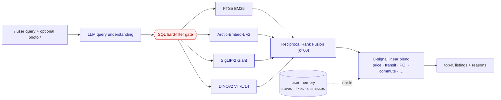

# Robin — Hybrid Search & Ranking for Swiss Real Estate

> Natural-language + image search over 25,546 Swiss rental listings, with explainable ranking in **DE / FR / IT / EN**.

[📦 Install](docs/INSTALLATION.md) · [🚀 Usage](docs/USAGE.md) · [🏗 Architecture](ARCHITECTURE.md) · [🧪 Dev](docs/DEVELOPMENT.md) · [☁ Deploy](docs/DEPLOYMENT.md) · [🎯 Challenge](docs/CHALLENGE.md)

---

## What it does

Given a query like *"3-room bright apartment in Zurich under 2,800 CHF with balcony, close to public transport"*, Robin:

1. **Extracts hard constraints** with an LLM (rooms, price, city, required features).
2. **Gates retrieval** through SQL — a listing that violates a hard constraint is structurally unable to reach the result set.
3. **Fuses four retrieval channels** inside the gate — BM25 (FTS5), dense text embeddings, SigLIP-2 text→image, DINOv2 image→image — via **Reciprocal Rank Fusion** (k=60).
4. **Blends 8 normalized signals** into a final score with templated, explainable reasons.
5. **Remembers** each authenticated user's saves / likes / clicks to personalize the next query (opt-in).

Design doc: [ARCHITECTURE.md](ARCHITECTURE.md). Built for the ETH/Uni Datathon 2026 in partnership with robinreal.

---

## Features

- **Hard-filter gate** — constraint violations are impossible, not merely unlikely
- **4-language query understanding** — DE / FR / IT / EN, LLM-structured outputs
- **Hybrid retrieval** — [BM25](https://www.sqlite.org/fts5.html) + [Arctic-Embed-L v2](https://huggingface.co/Snowflake/snowflake-arctic-embed-l-v2.0) + [SigLIP-2 Giant](https://huggingface.co/google/siglip2-giant-opt-patch16-384) + [DINOv2 ViT-L/14](https://github.com/facebookresearch/dinov2)
- **Image-to-image search** — upload any photo, find listings that look like it
- **Commute-aware ranking** — ~125 k real transit-minute pairs (r5py over SBB GTFS)
- **Enrichment** — 166-column side table, 100% coverage with explicit `UNKNOWN` sentinels (no fabrication)
- **Session-scoped personalization** — save / like / dismiss → memory-based re-ranking
- **Explainable** — every ranked listing carries a human-readable reason

---

## Architecture at a glance



See [`ARCHITECTURE.md`](ARCHITECTURE.md) for the full design, evidence, and references.

---

## Quickstart

```bash
git clone https://github.com/<org>/Datathon_2026
cd Datathon_2026

cp .env.example .env            # fill in your API keys
uv sync --group image_search    # ~1 GB torch + transformers

# Get the pre-built dataset bundle (fastest path — see docs/DATASET.md):
unzip datathon2026_dataset.zip  # into the repo root

uv run uvicorn app.main:app --reload
open http://localhost:8000/demo
```

Full setup walk-through: [`docs/INSTALLATION.md`](docs/INSTALLATION.md).

---

## Tech stack

Python 3.12 · FastAPI · SQLite (FTS5) · Snowflake Arctic-Embed-L v2 · Google SigLIP-2 Giant · Meta DINOv2 ViT-L/14 · r5py + SBB GTFS · OpenAI Structured Outputs · MCP Apps SDK · React + Vite (widget)

---

## Repo layout

| Path | What |
| --- | --- |
| [`app/`](app/) | FastAPI server — routes, hard filters, ranker, auth, memory |
| [`apps_sdk/`](apps_sdk/) | MCP bridge + React widget for ChatGPT / Claude Desktop |
| [`enrichment/`](enrichment/) | **Layer 1** — fill the 166-col `listings_enriched` side table · [README](enrichment/README.md) |
| [`ranking/`](ranking/) | **Layer 2** — 30 ranking signals + commute matrix + text embeddings · [README](ranking/README.md) |
| [`image_search/`](image_search/) | SigLIP-2 + DINOv2 indexes over 70,548 photos · [README](image_search/README.md) |
| [`analysis/`](analysis/) | v2 data audit (`REPORT_v2.md`, 19 plots, `stats_v2.json`) |
| [`docs/`](docs/) | Installation · Usage · Development · Deployment · Reports |
| [`tests/`](tests/) | 34 integration test files · run: `uv run pytest -q` |
| [`scripts/`](scripts/) | Ops scripts — dataset install, DB migration, MCP smoke |
| [`presentation/`](presentation/) | Typst pitch deck |

---

## Documentation

| | |
| --- | --- |
| [📦 docs/INSTALLATION.md](docs/INSTALLATION.md) | Local setup from scratch |
| [🚀 docs/USAGE.md](docs/USAGE.md) | API reference, demo UI, example queries |
| [📀 docs/DATASET.md](docs/DATASET.md) | Pre-built dataset bundle install |
| [🧪 docs/DEVELOPMENT.md](docs/DEVELOPMENT.md) | Tests, rebuilding indexes, adding a signal |
| [☁ docs/DEPLOYMENT.md](docs/DEPLOYMENT.md) | Docker, Fly.io, Cloudflare tunnel, MCP |
| [🏗 ARCHITECTURE.md](ARCHITECTURE.md) | Full system design with cited evidence |
| [🎯 docs/CHALLENGE.md](docs/CHALLENGE.md) | Organizer's problem brief (reference) |
| [📊 docs/query-evaluation-report.md](docs/query-evaluation-report.md) | Query eval results |

Module reports (cross-check against the design doc):

| | |
| --- | --- |
| [`docs/hard-filter-mvp-report.md`](docs/hard-filter-mvp-report.md) | Hard-filter gate + 123 tests |
| [`docs/bm25-fts5-report.md`](docs/bm25-fts5-report.md) | SQLite FTS5 + BM25 tuning |
| [`docs/visual-search-rrf-report.md`](docs/visual-search-rrf-report.md) | SigLIP × BM25 RRF fusion |
| [`docs/pipeline-flowchart.md`](docs/pipeline-flowchart.md) | Detailed scoring flowcharts |

---

## Acknowledgments

- **robinreal** — challenge sponsor and listing corpus
- **Comparis** & **SRED** — additional listing sources
- **SBB / OpenTransportData.swiss** — GTFS feed (CC-BY)
- **OpenStreetMap** — Nominatim + Switzerland extract (ODbL)
- **Snowflake** — Arctic-Embed-L v2 (Apache 2.0)
- **Google Research** — SigLIP-2 (Apache 2.0)
- **Meta FAIR** — DINOv2 (Apache 2.0)

---

## License

MIT — see [`LICENSE`](LICENSE).
