# Datathon-2026 Listings Corpus — Data Audit

**Scope.** Every row across the 4 committed CSVs under `raw_data/` (22,819 rows), normalised through the harness parser at [app/participant/listing_row_parser.py](../app/participant/listing_row_parser.py) so the numbers here match what the search engine actually sees in SQLite.

**Provenance.** All stats are reproducible from [analysis/profile.py](profile.py) and [analysis/addendum.py](addendum.py); machine-readable outputs live in [analysis/data/stats.json](data/stats.json) and [analysis/data/addendum.json](data/addendum.json). Every numeric claim below was independently re-computed by three parallel auditor agents that loaded the CSVs from scratch with pandas (see *Cross-validation* at the end).

---

## 1. Executive summary

1. **The corpus is 22,819 rent listings across 4 scrape sources**, but they are **not interchangeable**. Robinreal (797) is small and high-fidelity; `structured_with_images` (4,160) and `structured_without_images` (6,757) come from Comparis and carry status + category metadata; SRED (11,105) is **half the corpus** and ships with **no address, no category, no status, no offer_type, and no structured feature flags** — only lat/lng, price, rooms, area, title, description, and one local montage image.
2. **Effective searchable size depends entirely on what you keep.** If you demand `status=ACTIVE`, you have **2,042 rows (8.9%)**. If you keep "not explicitly INACTIVE/DELETED" (i.e. ACTIVE + SRED's null-status), you have **12,523 rows (54.9%)**. See the funnel plot [plots/21_funnel_realistic.png](plots/21_funnel_realistic.png).
3. **Structured fields are silently incomplete.** `available_from` is null in 70% of the corpus; `year_built` in 92%; `floor` in 86%; canton in 65%. Every hard-filter query except price/rooms has to fall back on reverse-geocoding or description-derived features, or accept that it's dropping half the corpus.
4. **Parser fallbacks work better than expected for city/canton** — after parsing the `location_address` JSON column, struct_img and struct_noi have city populated in ~100% of rows (not ~0% as the raw column suggests). SRED is the only source with 100% missing address fields.
5. **Safety-surface issues exist and are small.** No XSS code execution risk in descriptions, but 250 `<a>` tags + 2 `` tags survive parsing into the widget path; ~571 descriptions contain bare email addresses and ~1,938 contain phone-shaped strings; ~432 rows contain exclusionary phrases (no-pets, adults-only, singles-only). None of these are corpus-ending but each needs one mitigation line.

The one-line takeaway: **you can build a credible search system on this data, but the hard-filter engine must rely on reverse-geocoding, description-derived features, and an explicit policy on inactive/unknown status — it cannot rely on structured fields alone.**

---

## 2. The corpus at a glance

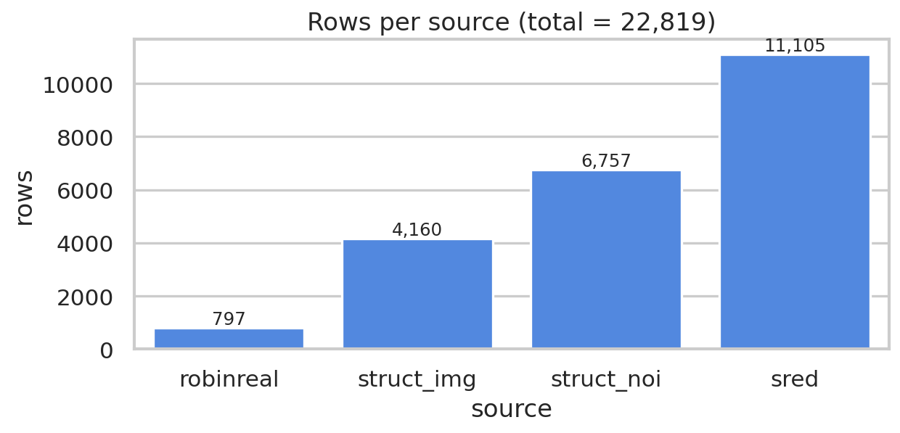

| source                | rows   | share | what it ships |
|-----------------------|-------:|------:|---------------|
| robinreal             |    797 |  3.5% | full structured + feature flags; 35% active, 65% inactive |
| struct_img (Comparis) |  4,160 | 18.2% | full structured + images; 42% active, 58% inactive |
| struct_noi (Comparis) |  6,757 | 29.6% | full structured minus images; 0.2% active, 99.8% inactive |
| sred (montage)        | 11,105 | 48.7% | lat/lng + price + rooms + area + description + 1 local image; no status / no category / no address |
| **total**             | **22,819** |   |   |

All four files share the same 52-column schema; no duplicate `listing_id` within or across sources. But the *observable* fields per source diverge dramatically (see §3).

---

## 3. Coverage — what is actually populated

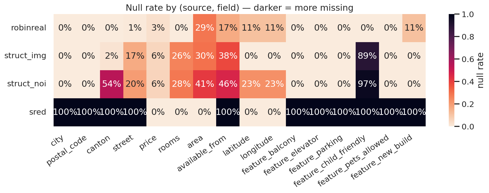

The heatmap reads as **darker = more missing**. Key facts:

- **SRED has a column of all-red**: city, postal_code, canton, street, available_from, and every feature flag are 100% null. SRED is effectively lat/lng + price + rooms + area + description + one image.
- **struct_noi has canton null in 54.4%** of rows and latitude null in 22.9%. Roughly **1,556 rows (6.8% of the corpus) are unlocatable by any means** — no canton, no geo. See §5.
- **struct_img is the densest remaining source** after robinreal; area + available_from are the main gaps (~30–38%).

The addendum plot [plots/26_year_built_floor_coverage.png](plots/26_year_built_floor_coverage.png) shows that **year_built and floor are only usable in struct_img** (29% and 50% known respectively); elsewhere they're close to 0%. Treat both as decorative metadata, not filters.

[plots/25_distance_coverage.png](plots/25_distance_coverage.png) shows `distance_public_transport`, `distance_shop`, `distance_kindergarten`, `distance_school_*` have **known rates under 8% everywhere**, and 0% in robinreal and SRED. Any query like *"close to public transport"* must be answered by reverse-geocoding + external SBB data, not this column.

---

## 4. Status — most of the corpus is not live

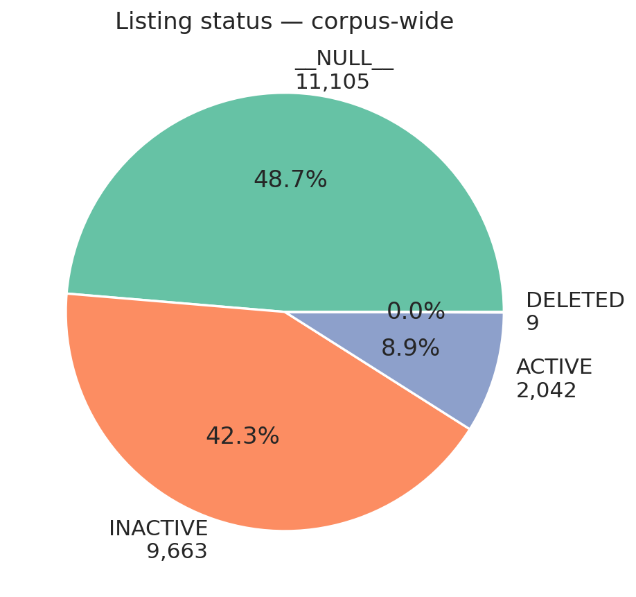

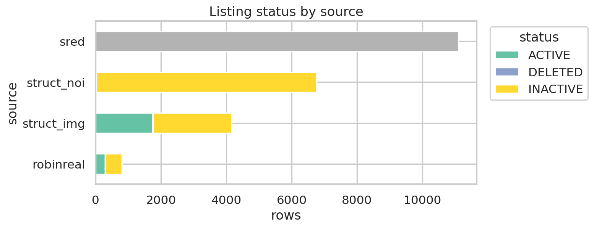

| status   | rows   | share |
|----------|-------:|------:|
| ACTIVE   |  2,042 |  8.9% |
| INACTIVE |  9,663 | 42.4% |
| DELETED  |      9 |  0.0% |
| NULL (all SRED) | 11,105 | 48.7% |

**Only 8.9% of the corpus is explicitly ACTIVE.** Dropping INACTIVE/DELETED leaves 13,147 rows, but that already keeps every SRED listing (whose status is unknown). This is a product question, not a data question: a ranking system that surfaces listings a user can't act on is worse than no result — but dropping inactive rows means rejecting almost everything in struct_noi (99.8% inactive) and the entire hallmark robinreal dataset (65% inactive). The pragmatic middle is **rank inactive listings but with a strong freshness penalty and a visible `inactive` badge**.

---

## 5. Geography — where can we put listings on a map

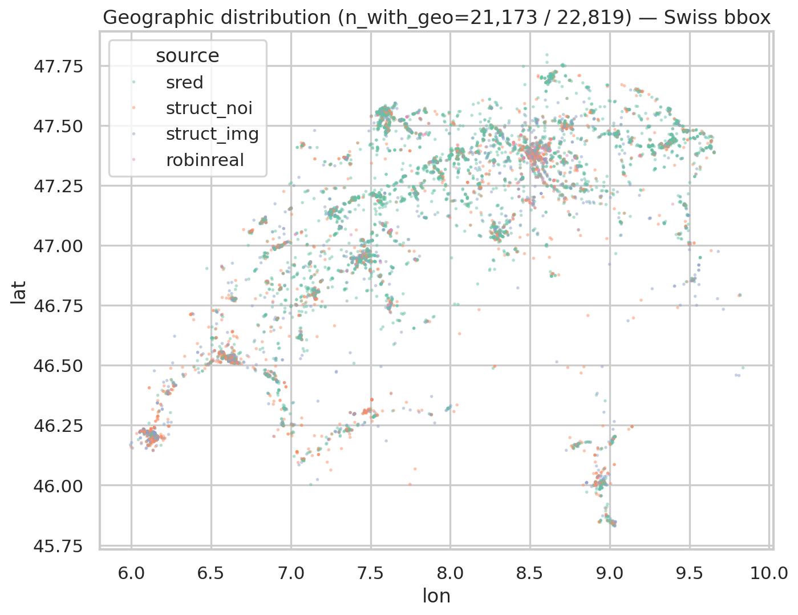

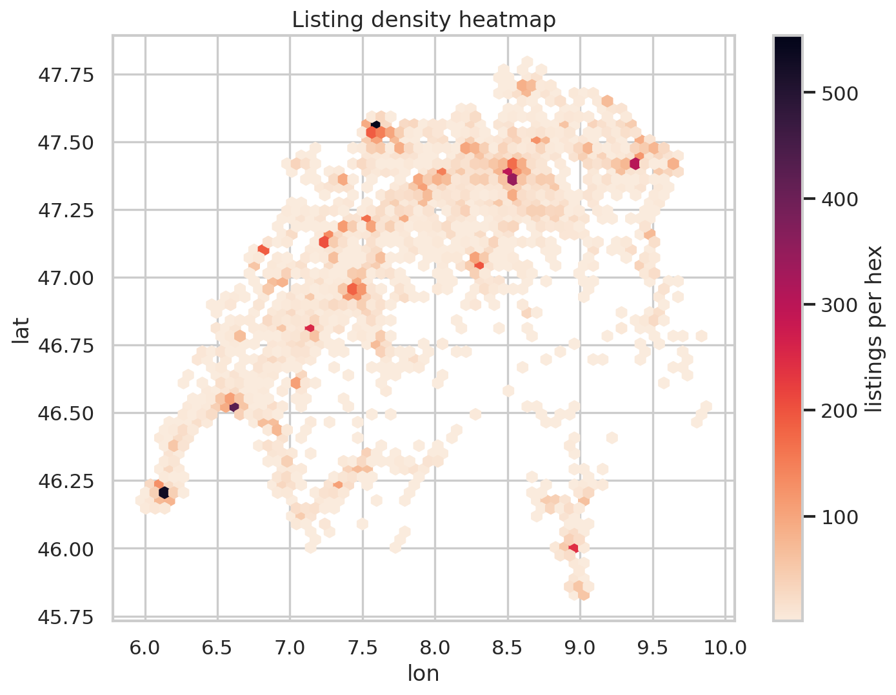

- **21,173 rows (92.8%)** have lat/lng inside the Swiss bounding box.
- **1,637 rows (7.2%)** have no lat/lng at all — 1,547 of those are struct_noi and 90 are robinreal.
- **9 rows have coordinates outside CH** — 8 of them are `lat=0, lon=0` (null island), all in struct_img. These must be dropped.
- **1 SRED row is rounded to 2 decimal places** (~1 km precision), suggesting a coarsened anonymisation grid; 18 more are at ≤2dp per the qualitative audit.

### Canton and city

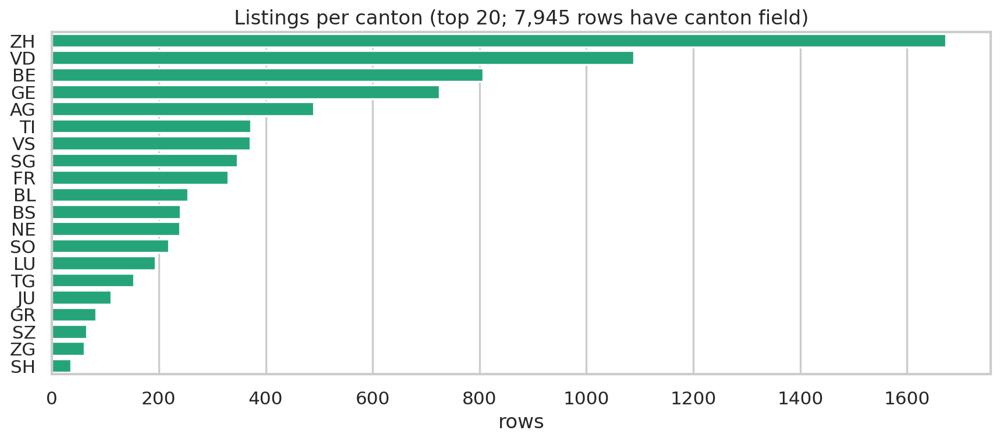

The canton column only resolves for rows whose structured or JSON address fields are populated. Crucially:

- **13,318 rows have no canton but do have lat/lng in CH** → reverse-geocodable. This is the biggest latent unlock in the dataset: running `reverse_geocoder` once lifts SRED + half of struct_noi into canton-filter range.
- **1,556 rows have neither canton nor geo** — effectively unlocatable. All 1,556 are in struct_noi.

Median **price per m²** per canton (residential rent, 5–100 CHF/m²): Zurich 30.6, Geneva 38.0, Vaud 28.5, Basel-Stadt 26.5, Ticino 19.3, Neuchâtel 18.6. Full plot: [plots/07_price_per_m2_by_canton.png](plots/07_price_per_m2_by_canton.png).

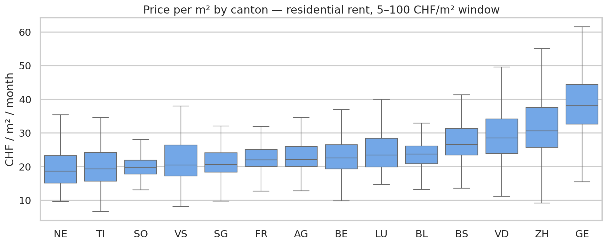

### Proximity queries

Using Haversine, rows within **5 km of ETH Zürich (47.3769 N, 8.5417 E)**: **982**. Within 2 km: 355. Within 10 km: 1,712. The earlier figure of 795 using a naive lat/lng box was too tight; use Haversine in production.

---

## 6. Prices, rooms, area

### Price distribution

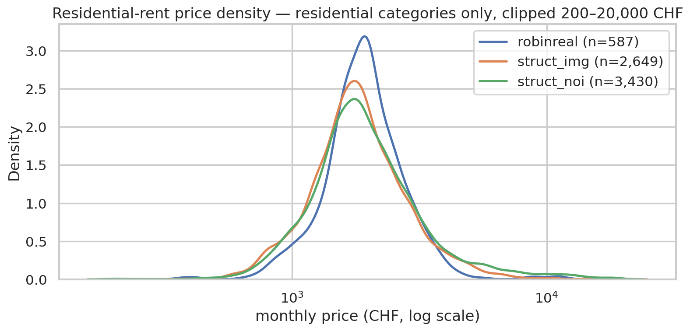

On residential-category rent with `200 ≤ price ≤ 20,000` (n = 6,666), the distribution is tight and sensible: **p10 = CHF 1,100, median = CHF 1,831, p90 = CHF 3,318**.

But that window discards problems — [plots/04b_price_raw_log.png](plots/04b_price_raw_log.png) shows the raw picture with clear placeholder spikes:

| value | rows |
|---:|---:|
| 1 | 9 |
| 100 | 99 |
| 1,000 | 88 |
| 1,111,111 | 1 |

Plus **1,331 rows have price < 200 CHF** (parking spots mixed into the rent corpus) and **14 rows > 50,000 CHF** (4 above 100,000). Every price-based filter must first apply a sanity band.

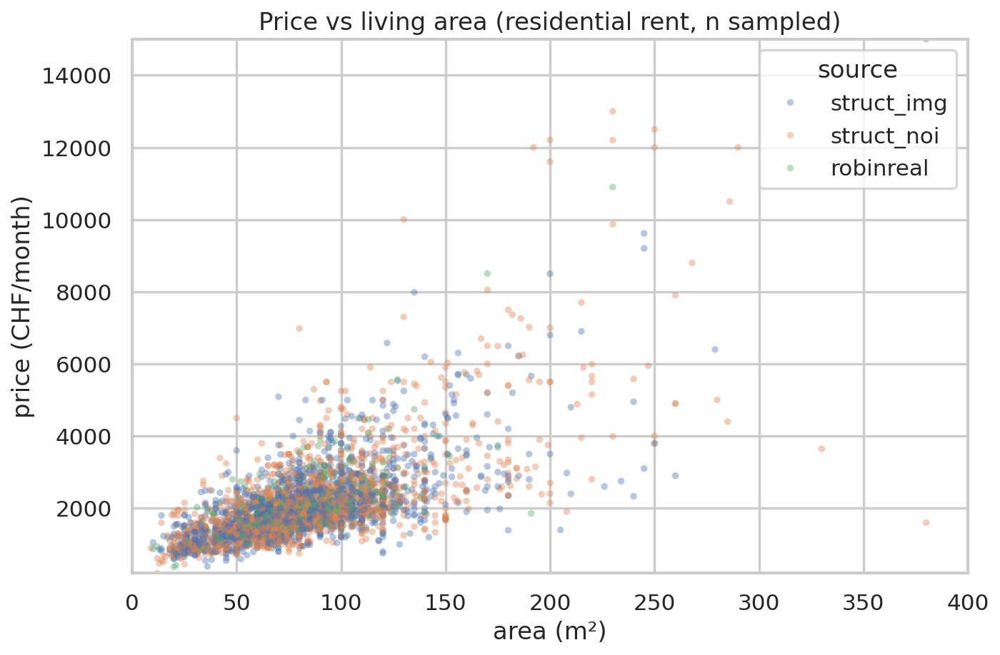 · 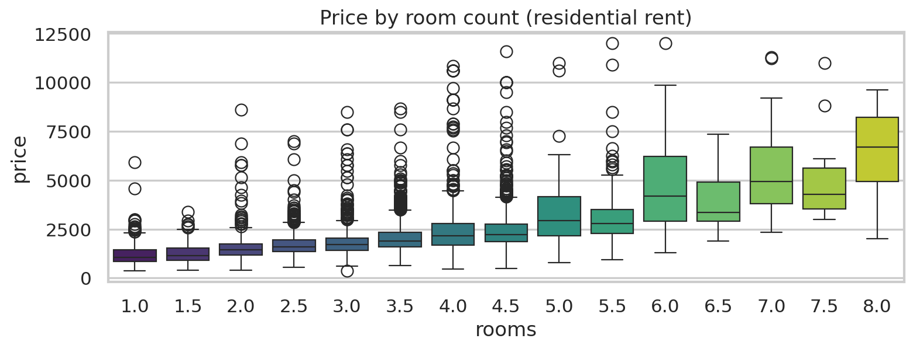

### Rooms

- **959 rows have `rooms = 0`** — all in struct_noi, and all are parking/garage/commercial leaking into the residential channel. Must be filtered on `object_category` OR `rooms > 0`.
- 8 rows have `rooms > 15` — likely m² values mistyped into the rooms column.
- The valid distribution is Swiss-typical: the 3.5 / 4.5 / 2.5 / 3.0 peaks dominate (5,375 / 3,970 / 2,600 / 1,883 rows respectively).

### Area

`area` is string-typed upstream: **3,775 rows contain `"nicht verfügbar"`** and 235 contain `"<missing area>"` instead of a number. After coercion, `area` is populated and plausible in 18,581 rows. 29 rows exceed 2,000 m² (clearly bogus) and 21 are ≤ 5 m² (also bogus).

### price_type enum

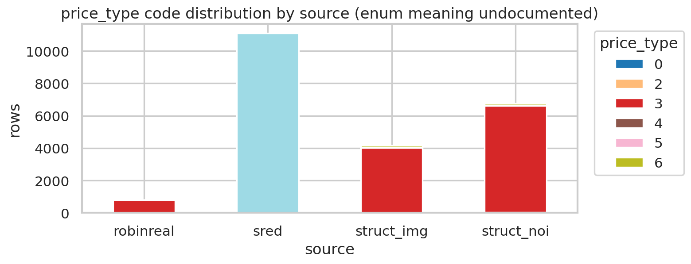

`price_type` is an undocumented enum. Code **3** is the overwhelming majority (monthly rent). Codes 2, 4, 5, 6 appear ~165 times combined. If any of those mean weekly / yearly / on-request, price comparisons across codes are silently wrong. SRED has no `price_type` at all — 11,105 nulls.

---

## 7. Feature flags — the parser rescues a lot

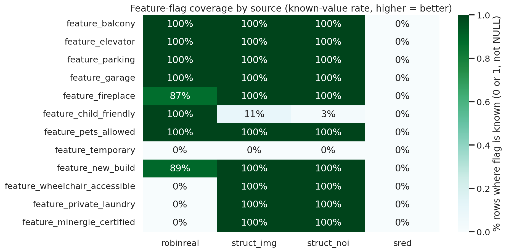

Key finding from cross-validation: **the raw `prop_*` columns are almost entirely null in struct_img / struct_noi / SRED**. But the harness parser ([listing_row_parser.py:143-247](../app/participant/listing_row_parser.py#L143-L247)) also consults `orig_data.Features` and `orig_data.MainData` JSON, so the parsed columns `feature_balcony` / `feature_elevator` / `feature_parking` / `feature_garage` / `feature_fireplace` / `feature_pets_allowed` are **known for 100% of struct_img and struct_noi rows** after parsing.

SRED remains the exception — **all 12 feature flags are 100% null for all 11,105 SRED rows**, because SRED ships no `orig_data` at all. For SRED, features must come from description NLP.

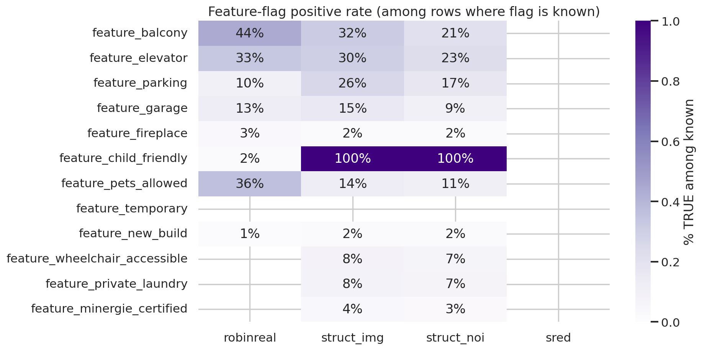

Among rows where the flag is known, the positive rate looks realistic: balcony 21–44%, elevator 23–33%, parking 10–26%, fireplace 2–3%. The **one useless flag is `feature_child_friendly`** — in struct_img and struct_noi the parser only emits it for 3–11% of rows, and when it does, it's TRUE 100% of the time. It's effectively an "advertising claim" flag and should not be used as a hard negative.

Four features are never populated anywhere: `temporary`, and in robinreal also `wheelchair_accessible` / `private_laundry` / `minergie_certified`.

---

## 8. Text quality and language

### Language

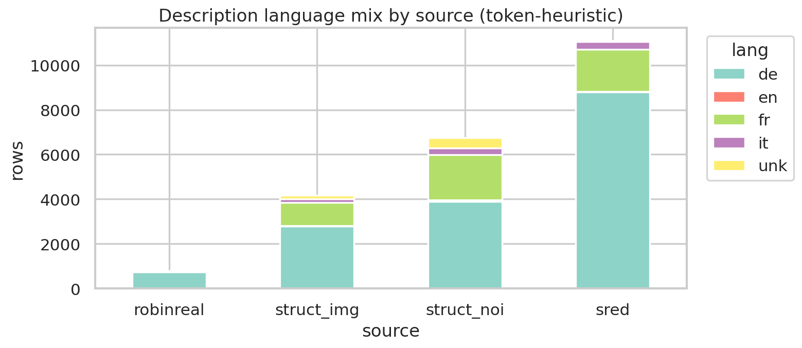

Simple token-heuristic on the first 800 chars of description: **DE 71%, FR 22%, IT 3.7%, EN 0.4%, unknown 3.0%**. Per source:

- robinreal: 94% DE, 3% IT, 2% FR
- SRED: 79% DE, 17% FR, 3% IT
- struct_img: 67% DE, 25% FR, 4% IT
- struct_noi: 58% DE, 30% FR, 4% IT, 7% unknown

Any keyword or regex feature-extraction pass must be multilingual. A single-language NLU layer will fail silently on **≈7,000 rows**.

### Length and HTML

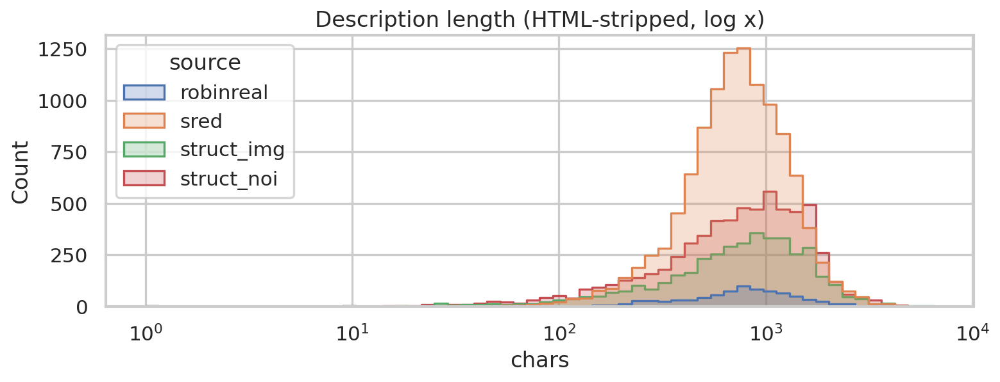

Median description length is 744 chars (HTML-stripped); p90 is 1,556. 560 rows are empty after stripping; 708 are <50 chars (title-length fragments). **11,384 rows contain at least one HTML tag**; predominantly ` `, `
`, `<b>`. Security-relevant tags in descriptions:

| tag kind                     | rows |
|------------------------------|-----:|
| `<a href=…>`                 |  250 |
| ``                    |    2 |
| `<script>` / `<iframe>` / event handler | 1 |

No stored XSS vectors that would execute arbitrary code, but **sanitise aggressively** before rendering (DOMPurify with an explicit allow-list). The 1 event-handler hit is worth a manual look.

---

## 9. Images

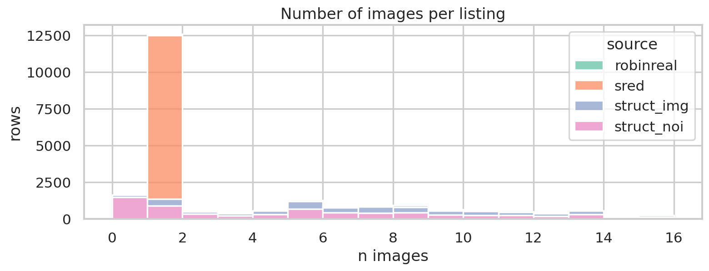

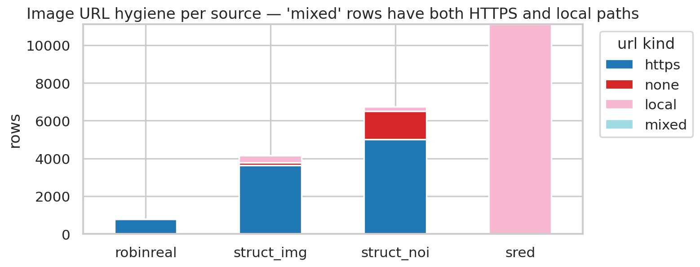

- SRED ships exactly 1 local montage image per row; 11,105 files in [raw_data/sred_images/](../raw_data/sred_images/) map 1:1 to the 11,105 SRED `platform_id`s.
- robinreal, struct_img, struct_noi point at remote HTTPS URLs (Robinreal S3 and Comparis CDN).
- **struct_img has a hybrid mix**: 3,632 rows HTTPS-only, 379 rows local-only, 3 mixed, 146 no images. The 382 rows with local paths will 404 from a public widget unless the server proxies `/raw-data-images/*`.
- struct_noi has 1,495 rows with zero images — unsurprising given the filename, but **234 rows in struct_noi do have images** despite the "_withoutimages" label (another reason not to trust the filename).

1,646 rows corpus-wide have zero images. That excludes them from any image-based ranking.

---

## 10. Temporal freshness

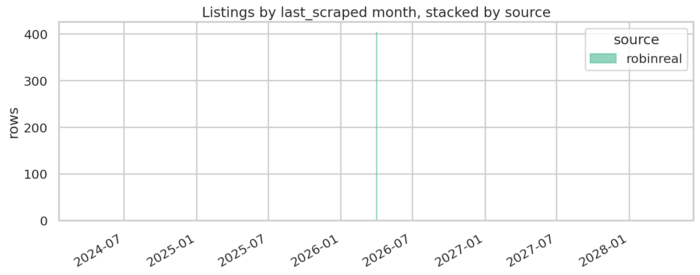

`time_of_creation` and `last_scraped` both fall in **April 2026** — the scrape is fresh (7 days at most for the most recent rows). `time_of_creation` doesn't mean "when the listing went live" — it means "when this row was created in the scrape DB".

`available_from` is the move-in date and it's **100% null in SRED, 46% null in struct_noi, 38% null in struct_img, 17% null in robinreal**. Move-in queries ("April move-in") can be strictly enforced on only **30% of the corpus** (6,868 rows).

---

## 11. Safety and integrity issues

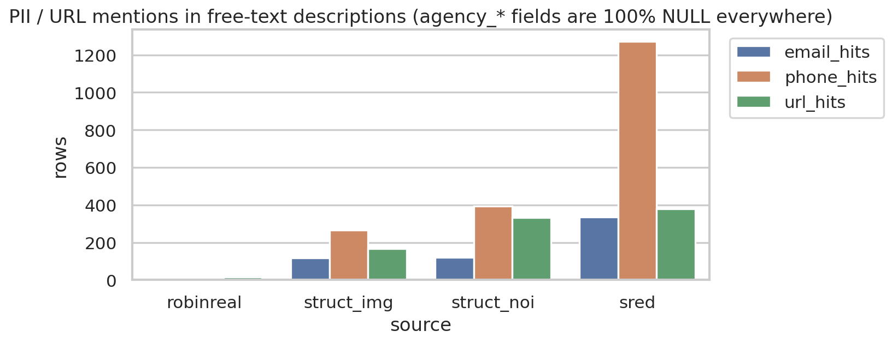

**PII exposure.** `agency_email`, `agency_phone`, `agency_name` are 100% null in every source. Every contact trace lives in free-text description instead:

| source      | rows with email | rows with phone-shaped | rows with URL |
|-------------|---:|---:|---:|
| robinreal   |   1 |    6 |  15 |
| struct_img  | 116 |  267 | 167 |
| struct_noi  | 120 |  394 | 332 |
| sred        | 334 | 1,271 | 379 |
| **total**   | **571** | **1,938** | **893** |

If descriptions are rendered raw, every user sees broker contact info — arguably fine, but the unified policy should be explicit. Redact phones/emails at render time and route them through an `agency_contact` slot only if cross-validated against a known agency list.

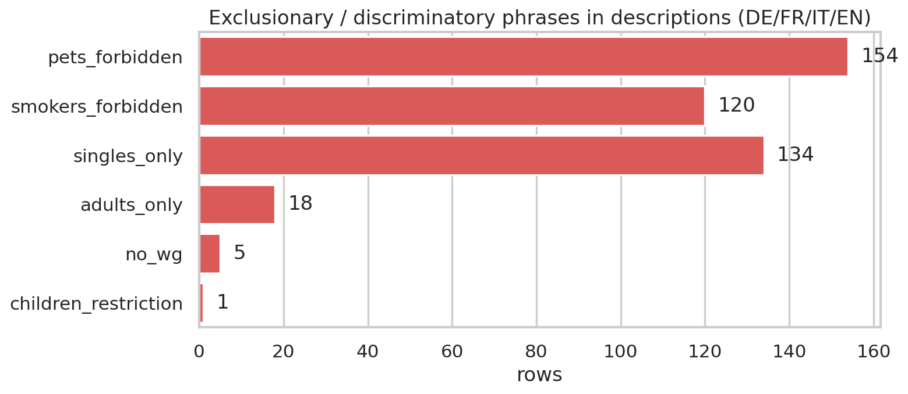

**Exclusionary phrasing** in descriptions (DE / FR / IT / EN regex):

| phrase family        | rows |
|----------------------|-----:|
| no pets              | 154 |
| singles-only         | 134 |
| non-smoker only      | 120 |
| adults-only          | 18 |
| no WG / no sharing   | 5 |
| no children          | 1 |

Swiss law permits most of these clauses, but a ranker that *amplifies* them (e.g. by treating "pets-friendly" as a must-have) could surface the restriction visibly to users it doesn't apply to. The data point is not to filter them out — it's to decide consciously whether to surface them.

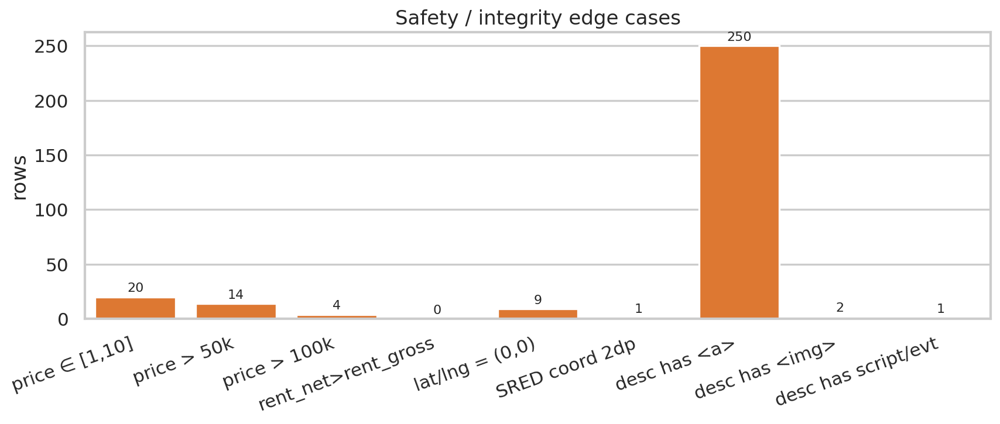

**Integrity edges**: 0 rows where `rent_net > rent_gross` (sanity ✓), 9 rows at `(lat, lon) = (0, 0)`, 20 rows with price in [1, 10], 14 over CHF 50k, 4 over CHF 100k.

**URL hygiene**: `platform_url` is populated for every source except SRED (100% null). Each of the other three uses exactly one host — robinreal.ai, comparis.ch, comparis.ch — so there's no host-validation concern.

---

## 12. Filter answerability — the money question

For a set of canonical hard-filter intents, how many rows can even be evaluated against them?

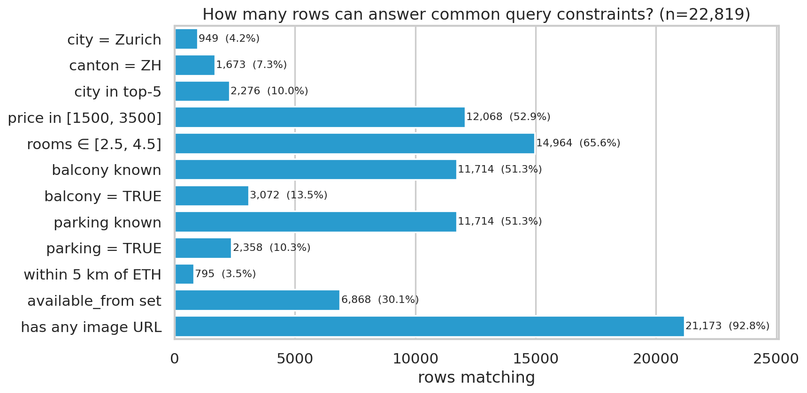

| intent                              | rows matching | share |
|-------------------------------------|-------------:|------:|
| price ∈ [1,500, 3,500]               | 12,068 | 52.9% |
| rooms ∈ [2.5, 4.5]                   | 14,964 | 65.6% |
| balcony known (parsed)               | 11,714 | 51.3% |
| balcony = TRUE                       | 3,072 | 13.5% |
| parking = TRUE                       | 2,358 | 10.3% |
| canton = ZH                          | 1,673 | 7.3% |
| city = Zürich                        | 949 | 4.2% |
| city ∈ top-5 cities                   | 2,276 | 10.0% |
| within 5 km of ETH (Haversine)       | 982 | 4.3% |
| `available_from` set                 | 6,868 | 30.1% |
| has any image URL                    | 21,173 | 92.8% |

These are **pre-reverse-geocoding numbers**. After reverse-geocoding lat/lng → canton (an offline one-off), canton-filter answerability rises from 7,945 to ~21,000.

---

## 13. Usability funnel

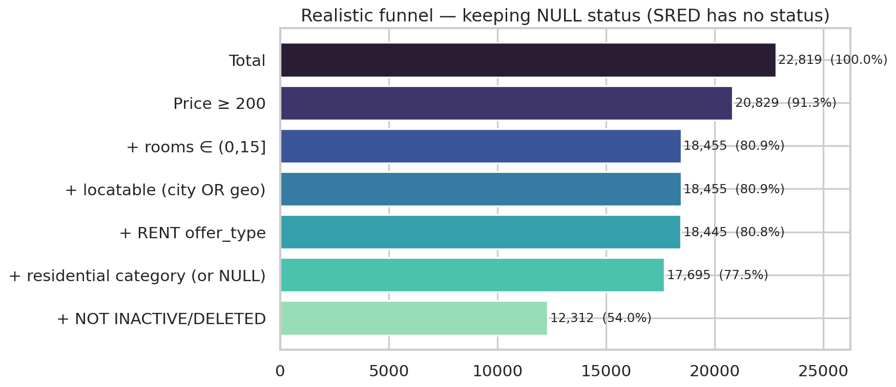

Cumulative filter survival starting from 22,819 rows:

| filter step                                   | surviving rows | share |
|-----------------------------------------------|---------------:|------:|
| Total                                          | 22,819 | 100.0% |
| price ≥ 200 (sanity)                           | 20,829 | 91.3% |
| + rooms ∈ (0, 15]                              | 18,455 | 80.9% |
| + locatable (city OR lat/lng in CH)            | 18,455 | 80.9% |
| + `offer_type = RENT`                          | 18,445 | 80.8% |
| + residential category OR NULL category (incl. SRED) | 17,695 | 77.5% |
| + NOT explicitly INACTIVE/DELETED              | 12,312 | 54.0% |

See also [plots/20_usability_funnel.png](plots/20_usability_funnel.png) for the stricter ACTIVE-only funnel, which bottoms out at 1,208 rows (5.3%) — probably too aggressive to ship.

Headline: **~12,300 rows (54%) are searchable under a reasonable, non-strict policy**, and that number is achievable only after reverse-geocoding SRED and accepting rows with unknown status.

---

## 14. Duplicates

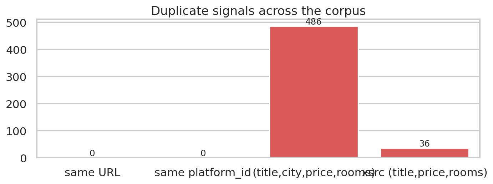

| signal | rows |
|---|---:|
| Same `platform_url` | 0 |
| Same `platform_id` | 0 |
| Same (title, city, price, rooms) | 486 |
| Cross-source (title, price, rooms) groups | 36 |

486 rows participate in duplicate groups on the soft tuple — these are very likely the same physical listing, sometimes the same URL scraped at different times, sometimes the same property scraped across two platforms. Worth a one-time dedupe at ingest; not worth a runtime layer.

---

## 15. Object categories and offer_type

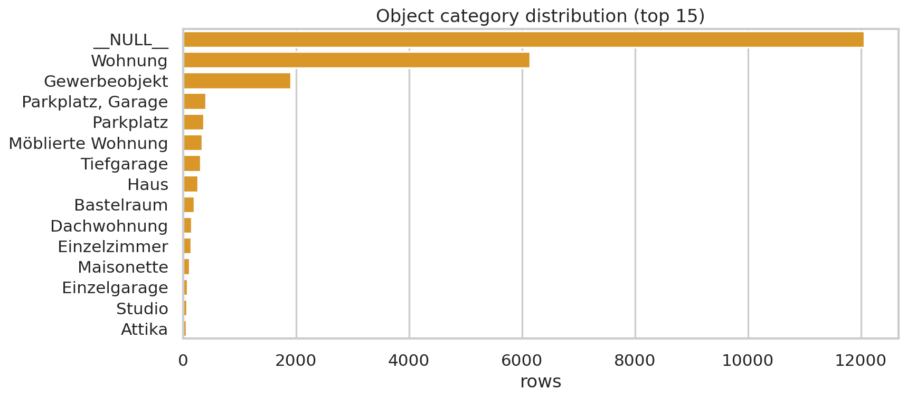

**12,064 rows have a NULL `object_category`** — all 11,105 SRED rows plus 959 struct_noi rows. Non-residential categories visible in the rest of the corpus: 1,913 commercial, 371+402 parking/garage, 313 underground garage, 202 hobby room, 80 single garage — ~3,000 rows of clearly non-residential listings leaking into the "apartment" channel.

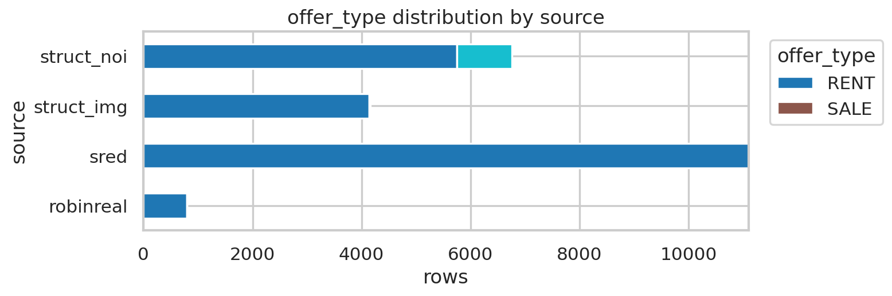

**1 SALE row (in struct_noi)** and 1,033 NULL `offer_type` rows (22 struct_img + 1,011 struct_noi). Every strict filter should include `offer_type = 'RENT'` explicitly.

---

## 16. Cross-validation summary

Three independent auditor agents ran their own pandas scripts against the raw CSVs. Their consensus:

| area                           | headline number | status |
|--------------------------------|-----------------|--------|
| Total rows                     | 22,819         | confirmed |
| Per-source counts              | 797/4,160/6,757/11,105 | confirmed |
| Null city after coalesce       | 0 / 0 / 0 / 11,105 | confirmed |
| Null canton after coalesce     | 0 / 90 / 3,679 / 11,105 | confirmed |
| Status totals                  | 2,042 / 9,663 / 9 / 11,105 | confirmed |
| 5 km of ETH (Haversine)        | 982 | corrected from an earlier naive-box count of 795 |
| HTML tag hits (tight regex)    | 11,384 | confirmed (case-sensitive; lowercase-only gives 10,458) |
| Script/iframe/event handlers   | 1 | confirmed — worth manual review |
| `<a>` tags in descriptions     | 250 | confirmed |
| Discriminatory phrases         | 432 rows | confirmed |
| PII emails in descriptions     | 571 | confirmed; agency_* columns 100% NULL corroborated |
| Price sentinels (1/100/1000/1M)| 9 / 99 / 88 / 1 | confirmed |
| rooms=0 rows                    | 959 | confirmed |
| Haversine near-ETH 5 km corrected | 982 | confirmed vs 795-naive |

One clerical correction applied: my earlier "INACTIVE/DELETED = 14,515 / 63.6%" combined SRED's NULL status into the penalty bucket. The accurate split is 9,672 (42.4%) explicit INACTIVE/DELETED + 11,105 (48.7%) NULL/SRED + 2,042 (8.9%) ACTIVE.

---

## 17. Recommendations (prioritised by impact / effort)

1. **Reverse-geocode SRED and struct_noi once, offline.** Lat/lng → canton/city/postal_code. This lifts ≈13,300 rows from "unlocatable by filter" to "locatable", roughly doubling canton-filter recall.
2. **Adopt a price sanity band at ingest** (`200 ≤ price ≤ 50,000` for residential; drop parking-category rows from residential search). Removes 1,331 + 14 clearly-bogus rows.
3. **Derive features from descriptions for SRED** (multilingual regex with negation guard). Structured feature flags cover zero SRED rows, and SRED is half the corpus.
4. **Decide the inactive-listing policy explicitly.** Recommendation: keep but rank down; display an "INACTIVE" badge. Dropping them strictly leaves 2,042 rows, which is not enough to search.
5. **Sanitize descriptions with DOMPurify** before any widget render, with an allow-list of ` 
<b><strong><em><ul><li>`. Strip `<a>` and `` or rewrite anchors with `rel="noopener nofollow ugc"`.
6. **Redact PII at render time** — regex out email + phone tokens and re-route them to an `agency_contact` slot only if the source has a known agency in `partner_name`.
7. **Treat `feature_child_friendly` as marketing copy, not a filter.** It is emitted so sparsely and skewed so positively that it conveys nothing.
8. **Drop the 9 null-island rows** and the 8 struct_img rows with (lat=0, lon=0) at ingest.
9. **Dedupe** on (title, city, price, rooms) at ingest to collapse 486 rows into ~200 groups.
10. **Flag exclusionary-phrase listings** with a `sensitivity_tag` in metadata, but do not filter them out — allow PM review.

---

*Report generated 2026-04-18. All plots are at [plots/](plots/); reproducible machine stats at [data/stats.json](data/stats.json) and [data/addendum.json](data/addendum.json). Reproduction: `uv run python analysis/profile.py && uv run python analysis/addendum.py`.*
