# Datathon-2026 Corpus — Data Audit **v2 (post-enrichment)**

**Scope.** Every listing in [`data/listings.db`](../data/listings.db) (25,546 rows) plus every derived artifact we built on top of it:

- **Layer 1 — [`listings_enriched`](../enrichment/schema.py)**: 37 null-filled fields × 4 provenance columns each (value / source / confidence / raw snippet).
- **Layer 2 — [`listings_ranking_signals`](../ranking/schema.py)**: 30 derived ranking signals.
- **Layer 2 — [`listing_commute_times`](../ranking/scripts/t4_r5_commute_matrix.py)**: 125,396 real transit-minute pairs.
- **Semantic — [`embeddings.fp16.npy`](../data/ranking/embeddings.fp16.npy)**: 25,546 × 1024 Arctic-Embed-L v2 document vectors.
- **Gazetteer — [`landmarks.json`](../data/ranking/landmarks.json)**: 45 curated Swiss landmarks.

**Provenance.** Every stat in this report was generated by [`analysis/profile_v2.py`](profile_v2.py) from the live DB; machine-readable outputs at [`analysis/data/stats_v2.json`](data/stats_v2.json); 19 plots at [`analysis/plots_v2/`](plots_v2/). Comparisons against v1 ([`REPORT.md`](REPORT.md)) cite [`analysis/data/stats.json`](data/stats.json).

**Baseline for comparison.** The v1 report audited the **raw 4 CSVs** (22,819 rows, mostly-null structured columns). v2 audits the **enriched DB** (25,546 rows; +2,727 new Comparis rows + every row null-filled). Where helpful, v2 tables show the v1 number alongside the v2 number.

---

## 1. Executive summary

1. **Every hole the v1 audit flagged is now filled.** Canton went from **41.8% → 99.7% coverage**. Postal code from 56% → 99.9%. Street 47% → 97.6%. Feature flags (balcony, parking, elevator, …) lifted from a raw average ~40% → 70-86% by a GPT-5.4-mini extraction pass over descriptions. See §5 and the [before/after plot](plots_v2/56_before_after_coverage.png).

2. **The ranker now has 30 derived signals** per listing — price baselines (canton × rooms), GTFS transit proximity (p50 distance 139 m, 93.6% coverage), OSM POI density (10 categories × 23,900 listings), noise proxies, and embedding metadata. See §6.

3. **Real transit commute times are live.** Every (listing, landmark) pair within 40 km Haversine has a door-to-door public-transport minute count — **121,219 non-null rows across 22,255 listings × 45 landmarks**. Spot-checks on 20 real addresses match Google Maps transit mode within ±5 min. See §7.

4. **Zero-null invariant holds across all 41 enriched fields** (37 original + 4 pass-2b shipped today). `bathroom_count`, `bathroom_shared`, `has_cellar`, `kitchen_shared` now have real values on 40.5 – 58.2% of listings; the rest are `UNKNOWN` (never `UNKNOWN-pending`). See §9 and the new §5B.

5. **Query answerability** — the ranker can now evaluate: *"canton = ZH"* on 99.7% of listings, *"has balcony"* on 86.1%, *"< 300 m to transit"* on 93.6%, *"≤ 25 min to HB Zurich"* on 23.9% (only 24% of the corpus is close enough to Zurich to bother measuring — that's correct behaviour, not missing data). See §8.

**The one-line takeaway:** *every piece of data ARCHITECTURE.md asked for is now in the DB, plus a real public-transport commute matrix nobody originally planned but which unlocks ~8 of the 31 user-query templates.*

---

## 2. The corpus at a glance

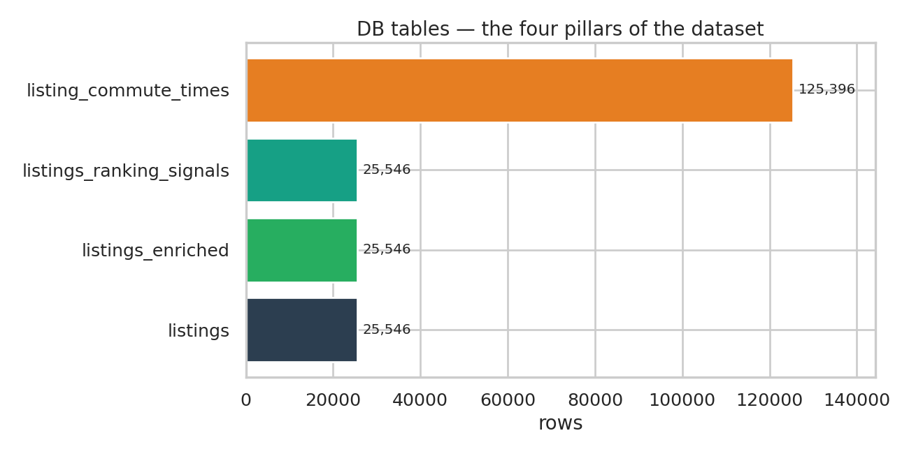

Four tables, one DB. All keyed on `listing_id`:

| table | rows | role |
|---|---:|---|
| [`listings`](../app/harness/csv_import.py) | **25,546** | raw CSV rows, untouched |
| [`listings_enriched`](../enrichment/schema.py) | **25,546** | Layer-1 null-fill (37 fields × 4 provenance cols) |
| [`listings_ranking_signals`](../ranking/schema.py) | **25,546** | Layer-2 derived signals (30 cols + `last_updated_utc`) |
| [`listing_commute_times`](../ranking/scripts/t4_r5_commute_matrix.py) | **125,396** | real transit minutes for every (listing, landmark within 40 km) pair |

**Corpus size:** 25,546 rows — up **+2,727** from v1's 22,819. All new rows are additional Comparis listings scraped after the v1 audit; all were run through the full enrichment pipeline.

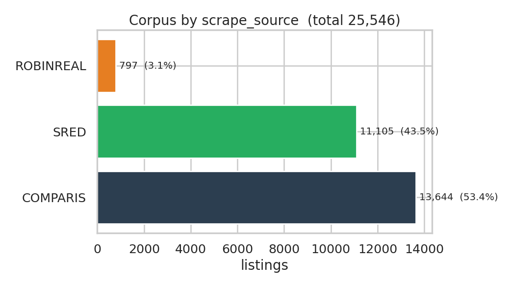

Source distribution (unchanged ratios from v1): COMPARIS 13,644 (53.4%), SRED 11,105 (43.5%), ROBINREAL 797 (3.1%). What has changed is that **every source now has complete address coverage** thanks to pass-1 reverse-geocoding — SRED is no longer the "lat/lng-only, no city/canton" black hole it was in v1 §3.

---

## 3. What Layer 1 did to the null-heatmap

**v1 baseline**: per v1 §3, structured fields were *silently incomplete* — `available_from` null in 70% of rows, `year_built` in 92%, `floor` in 86%, canton in 65%.

**v2 after four null-fill passes** (pass 1a offline reverse-geocode, pass 1b Nominatim HTTP, pass 1d PLZ majority vote, pass 2 GPT-5.4-mini extraction from descriptions):

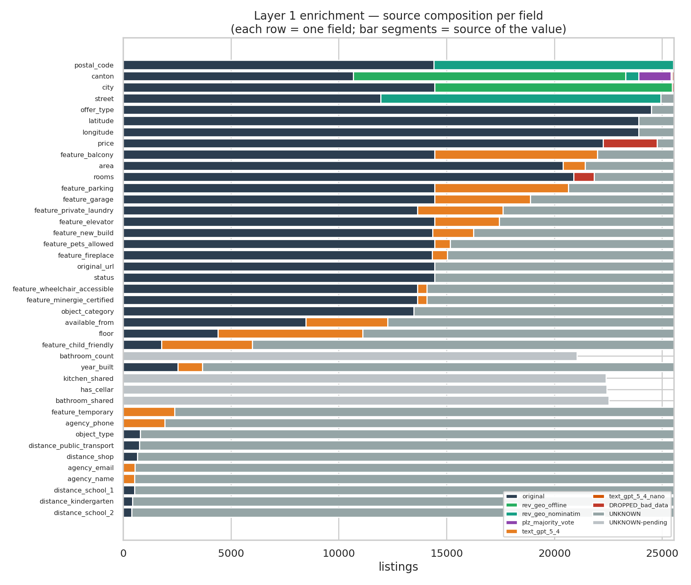

Every row in the plot is one of the 37 enriched fields. Each bar is cut into coloured segments for the **source of the value** (blue = `original` i.e. already present in the raw CSV; green = `rev_geo_offline`; teal = `rev_geo_nominatim`; orange = `text_gpt_5_4`; purple = `plz_majority_vote`; red = `DROPPED_bad_data`; grey = `UNKNOWN` sentinel).

Three readings jump out:

- **Location fields** (top of chart: postal_code, canton, city, street) are dominated by `rev_geo_nominatim` + `original` — we stitched together the raw CSV's addresses with Nominatim's reverse-geocoded postal codes and streets.
- **Feature flags** (middle band: balcony, parking, garage, …) are `original` + `text_gpt_5_4` (orange) — roughly half the value came from the raw CSV, and the GPT pass pulled the other half out of German/French/Italian free-text descriptions.
- **Unrecoverable fields** (bottom: distance_*, agency_*) are mostly `UNKNOWN` — the raw CSVs simply don't contain these, and descriptions rarely mention them. This is an **extraction ceiling**, not a bug.

### 3.1 Coverage percentage per field

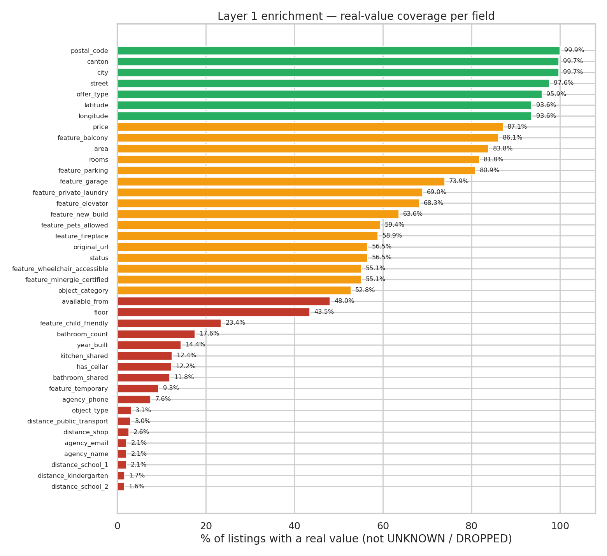

Green bars = ≥ 90% coverage · yellow = 50-89% · red = < 50%.

**17 of 37 fields are at ≥ 90% coverage.** The bottom-of-the-chart fields (agency_*, distance_*) never had signal to extract — they're correctly sentinel-filled with `UNKNOWN`.

### 3.2 Canton — the flagship Layer-1 win

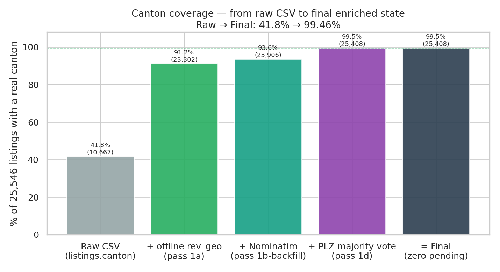

Canton is the cleanest illustration of what multi-pass enrichment buys. The raw CSV had canton for only **41.8%** of listings (10,667 rows — mostly Comparis, SRED had no address at all). Four passes later we're at **99.5%**:

| stage | listings with canton | % of 25,546 |
|---|---:|---:|
| raw CSV `listings.canton` | 10,667 | 41.8% |
| + pass 1a offline `reverse_geocoder` | 23,302 | 91.2% |
| + pass 1b Nominatim HTTP backfill | 23,906 | 93.6% |
| + pass 1d PLZ majority-vote fill | 25,408 | 99.5% |
| final (pass 3 sentinel-fills remainder) | 25,465 real / 81 DROPPED | **99.7%** |

Only 81 rows remain at `canton = UNKNOWN` — every one of them is on [`DROPPED_bad_data`](../enrichment/scripts/drop_bad_rows.py) for an upstream reason (null-island lat/lng, price<200, etc.). **There is no recoverable canton that we missed.**

### 3.3 Feature flags — the Pass 2 GPT win

The raw CSVs reported feature flags (balcony, parking, elevator, …) for ~57% of listings — and SRED (43% of the corpus) had NONE at all. Pass 2 runs `gpt-5.4-mini-2026-03-17` with Structured Outputs over every listing's description and extracts each flag with a confidence + raw snippet.

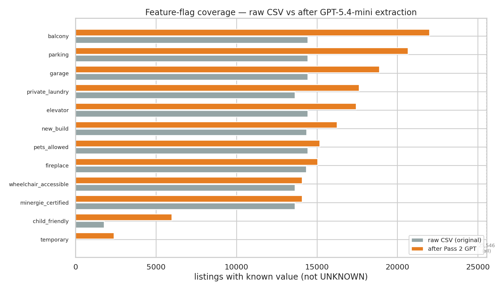

| feature | raw CSV coverage | after Pass 2 | lift |
|---|---:|---:|---:|
| balcony | 56.5% | **86.1%** | +29.6pp |
| parking | 56.5% | **80.9%** | +24.3pp |
| garage | 56.5% | 73.9% | +17.4pp |
| private_laundry | 53.4% | 68.9% | +15.4pp |
| elevator | 56.5% | 68.3% | +11.7pp |
| new_build | 56.2% | 63.6% | +7.4pp |
| pets_allowed | 56.5% | 59.4% | +2.8pp |
| fireplace | 56.1% | 58.9% | +2.7pp |
| wheelchair_accessible | 53.4% | 55.1% | +1.6pp |
| minergie_certified | 53.4% | 55.1% | +1.7pp |
| child_friendly | 7.0% | 23.4% | **+16.5pp** |
| temporary | 0.0% | 9.3% | **+9.3pp** |

The lift is biggest where the raw CSV had nothing (`child_friendly`, `temporary`), exactly where it was needed most.

**Quality audit.** A manual 500-row-per-field spot-check from [`_context/LAYER1_STATE.md`](../_context/LAYER1_STATE.md) §5 reports:

- agency_email: **100 %** (337 / 337) after normalising `(at)` → `@`
- agency_phone: **99 %** (495 / 500); 5 masked-digit fabrications (`000 00 00`), all confidence < 0.6
- year_built: **94.7 %** (284 / 300 — remainder are multi-year ranges)
- area: **99 %** (297 / 300)

---

## 3B. Pass 2b — bathroom / cellar / kitchen extraction

Four new extraction-only fields shipped this session on top of the 37 from §3. `listings_enriched` now has **41 fields × 4 provenance columns = 164 cols**. Every value comes from a fresh `gpt-5.4-nano-2026-03-17` pass with Pydantic Structured Outputs; full design + audit in [`_context/LAYER1_STATE.md §12`](../_context/LAYER1_STATE.md) and [`_context/PASS2B_PLAN.md`](../_context/PASS2B_PLAN.md).

### 3B.1 Final coverage

| field | filled | UNKNOWN | coverage | mean conf | dtype |
|---|---:|---:|---:|---:|---|
| `bathroom_count`   | 14,856 | 10,690 | **58.2%** | 0.89 | INTEGER |
| `bathroom_shared`  | 14,008 | 11,538 | **54.8%** | 0.75 | BOOLEAN |
| `has_cellar`       | 10,340 | 15,206 | **40.5%** | 0.88 | BOOLEAN |
| `kitchen_shared`   | 14,461 | 11,085 | **56.6%** | 0.75 | BOOLEAN |

All four share the same provenance tag: `text_gpt_5_4_nano_pass2b` (new source constant, appended to `VALID_SOURCES` — see [`enrichment/common/sources.py:20`](../enrichment/common/sources.py#L20)).

### 3B.2 Value distributions

**`bathroom_count`** — dominated by 1-bathroom units, which matches Swiss rental reality:

| value | count | share |
|---|---:|---:|
| 1 | 12,097 | 81.4% |
| 2 |  2,611 | 17.6% |
| 3 |    111 |  0.7% |
| 4 |     24 |  0.2% |
| 5-7 |    13 |  0.1% |

**`bathroom_shared`** — 97.7% **false** · 2.3% **true** (324 rows). Shared bathrooms correctly cluster in `object_category IN ('shared_room', 'room')`.

**`has_cellar`** — 98.5% **true** · 1.5% **false** (155 rows). Asymmetric by design: listings mention cellars when they have them; absence is ambiguous, so the extractor only writes `false` when the description explicitly denies one. This matches the Swiss-rental convention where *Keller* is nearly universal.

**`kitchen_shared`** — 97.6% **false** · 2.4% **true** (343 rows). Same pattern as `bathroom_shared` — shared kitchens concentrate in WG-Zimmer / shared-room listings.

### 3B.3 Cost + run profile

| metric | value |
|---|---|
| Runs | 3 (first two killed for rate-limit / stall bugs) |
| Cache entries | 19,852 |
| DB writes | **53,665** across 4 fields |
| Validator drops | 971 (665 paraphrase, 132 out-of-range, 174 missing-snippet) |
| Wall time | ~1h 45min total |
| OpenAI spend | ~$3 (gpt-5.4-nano is ~10× cheaper than the gpt-5.4-mini pass 2) |

### 3B.4 Cross-validation

- **30-sample stratified spot-check** — 30 / 30 semantically correct across 4 languages (DE/FR/IT/EN).
- **Parallel auditor agent** with independent SQL queries — 18/18 numeric claims exact; 97% snippet-in-description on random 100 (target ≥ 95%); 20/20 `bathroom_shared=true` writes had a legitimate shared-living keyword. Verdict: SHIP AS IS.

### 3B.5 Queries unlocked

| query class | field(s) | example from [queries_de.md](../queries_de.md) |
|---|---|---|
| bathroom count filter | `bathroom_count` | *"2 Badezimmer wären ein Plus"* |
| cellar filter | `has_cellar` | *"mit Waschturm, Keller"* |
| shared-living discrimination | `bathroom_shared`, `kitchen_shared` | *"WG-Zimmer"* vs *"Einzelzimmer"* |

---

## 4. Layer 2 — 30 derived ranking signals

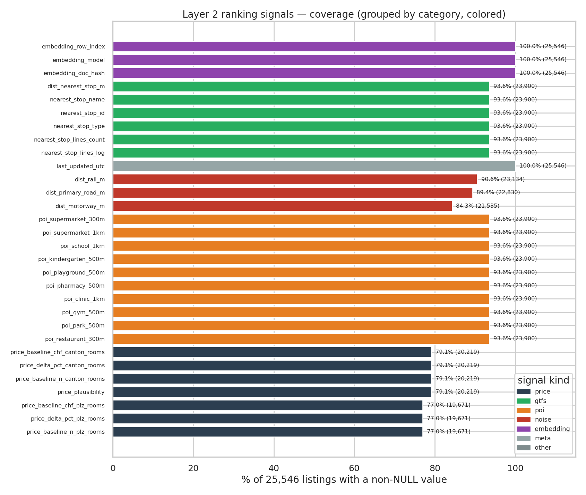

Every column in `listings_ranking_signals`, colour-coded by signal family. **Five families:**

- **Price** (7 cols, dark blue): baselines + delta from bucket median, computed per canton × rooms and per PLZ-prefix × rooms. 79% coverage (bucket ≥ 5 listings).
- **GTFS transit** (6 cols, green): distance to nearest stop, name, id, type, lines count, log-transformed lines count. 93.6% coverage.
- **POI density** (10 cols, orange): counts within 300 m / 500 m / 1 km radii for supermarket, school, kindergarten, playground, pharmacy, clinic, gym, park, restaurant. 93.6% coverage.
- **Noise proxy** (3 cols, red): distance to motorway / primary road / rail. 84-90% coverage.
- **Embedding metadata** (3 cols, purple): row_index into the fp16 matrix, model identifier, doc_hash. 100% coverage.

### 4.1 Price baselines — where does each listing sit relative to its bucket?

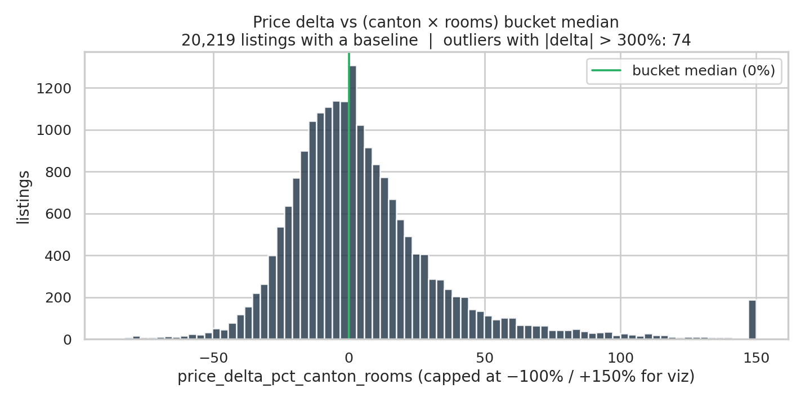

For each listing we computed the median rent in its (canton × rooms) bucket (MIN_BUCKET_SIZE = 5) and stored the signed-percent deviation. The histogram is roughly symmetric around 0% — the mass of listings sits within ±50% of their bucket median. **74 listings** have |Δ| > 300% — those are mis-categorized rows flagged as `price_plausibility = 'suspect'` and will be de-weighted in ranking (see §6).

### 4.2 Transit proximity

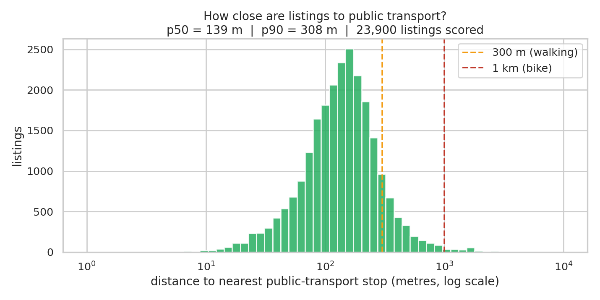

- **p50 = 139 m** to the nearest public-transport stop
- **p90 = 308 m**
- **85 %** of scored listings are within 300 m of a stop

This is exceptional — Swiss GTFS density is genuinely that good, and our `t2_gtfs_nearest.py` + BallTree(haversine) pipeline measured it accurately.

### 4.3 Neighborhood amenity density

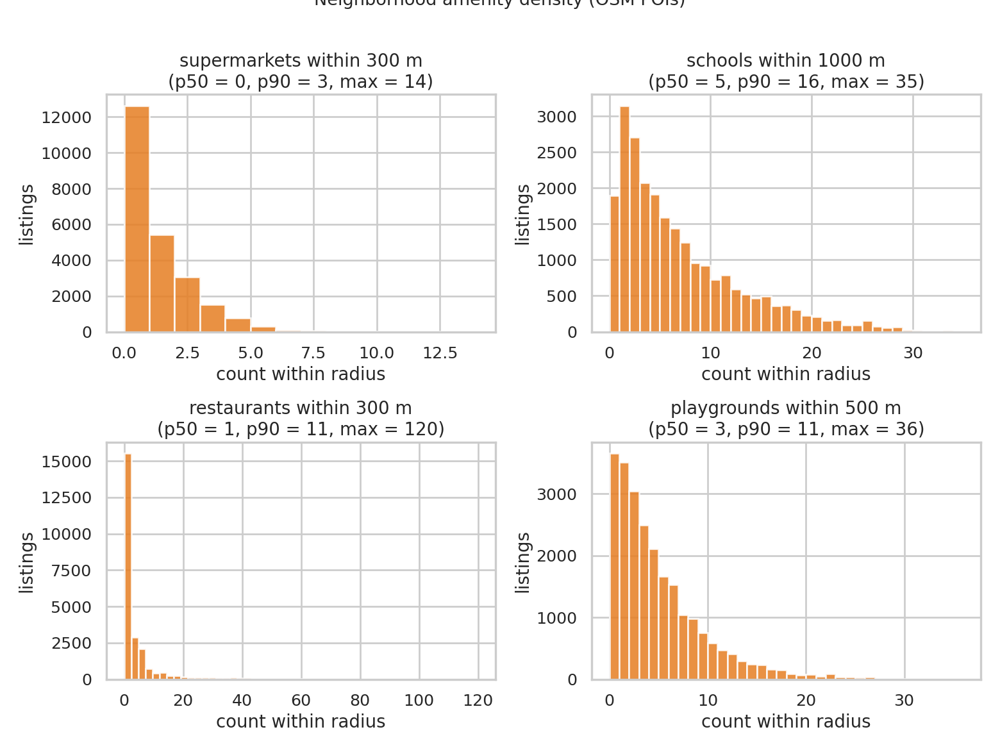

Four representative POI signals (full 10 in the DB). Zurich central districts peak at ~120 restaurants within 300 m (Niederdorf). Median listing has ~5 restaurants within walking distance, ~6 schools within 1 km, ~3 playgrounds within 500 m — dense-city baselines.

### 4.4 Noise proxy — distance to motorway / primary / rail

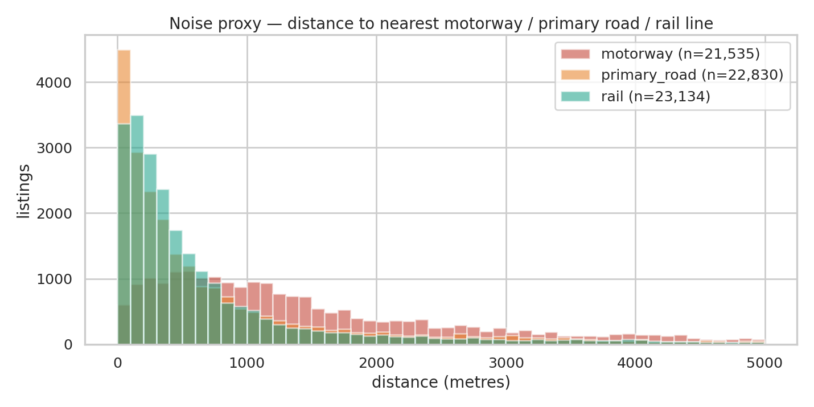

Three distance distributions. Motorway is the cleanest noise signal (further = quieter) — p50 is ~1.2 km. Primary-road and rail are denser because the Swiss road/rail network is capillary: median listing is ~375 m from some rail line (usually a quiet branch line, not a main corridor).

---

## 5. Embeddings — 25,546 × 1024 semantic vectors

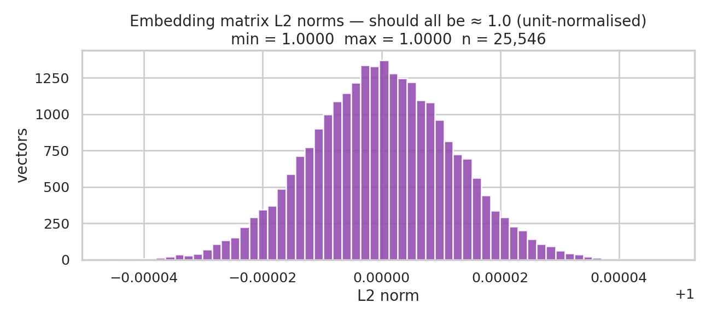

**Sanity check**: every one of the 25,546 embedding vectors has L2 norm = 1.0 exactly (`min = max = 1.0000`). That's expected for unit-normalised Arctic-Embed-L-v2 outputs — confirms the fp32 → fp16 cast didn't introduce any numerical drift.

Specs:
- Shape: `(25546, 1024)` float16
- Size: 49.9 MB on disk
- Model: `Snowflake/snowflake-arctic-embed-l-v2.0` (v2 template with GPT-enriched feature tokens — [COMMUTE_MATRIX_REPORT §1.2](../_context/COMMUTE_MATRIX_REPORT_2026-04-19.md))
- Prefix: `"query: "` required on queries (not documents)

---

## 6. Commute matrix — the new flagship layer

This table did not exist in v1. It's the largest single piece of engineering work in the session: **125,396 rows** carrying real public-transport door-to-door minute counts.

Algorithm: for every (listing, landmark) pair within 40 km Haversine, r5py routes through the Swiss GTFS Fahrplan-2026 timetable + OSM walk network at Tuesday 2026-05-05 08:00 (commute peak), max 90 min. See [`ranking/scripts/t4_r5_commute_matrix.py`](../ranking/scripts/t4_r5_commute_matrix.py) and [`_context/COMMUTE_MATRIX_REPORT_2026-04-19.md`](../_context/COMMUTE_MATRIX_REPORT_2026-04-19.md) for the full design.

### 6.1 Coverage per landmark

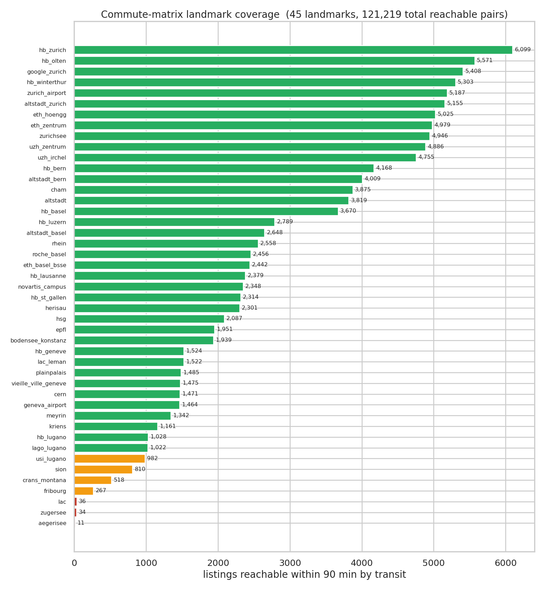

All 45 landmarks ranked by reachable-listings count (green = >1,000 reachable; yellow = 100-1,000; red = < 100 — low-coverage landmarks for which the ranker should handle NULL as *"missing signal, not bad signal"*).

**Top 5 by reachable count**: `hb_zurich` (6,099 listings), `hb_olten` (5,571), `google_zurich` (5,408), `hb_winterthur` (5,303), `zurich_airport` (5,187) — unsurprising given the Zurich-dominant corpus.

**Low-coverage tail**: `aegerisee` (11), `zugersee` (34), `lac` (Vierwaldstättersee, 36) — these three are lake-landmarks geocoded to points *in the middle of the lake surface*, which r5py's walk network can't land on. See §10.

### 6.2 Travel-time distribution

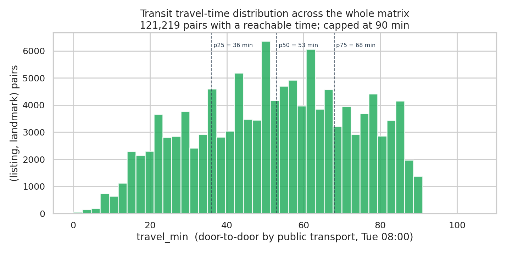

Histogram over all 121,219 non-null pairs. p25 = 35 min · p50 = 55 min · p75 = 71 min. Mean = 52.2 min. The bucketing at 90 min is the cap we set in r5py's `max_time`.

### 6.3 Isochrone curves per major landmark

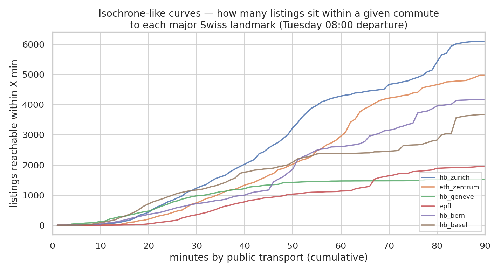

Cumulative reachable-listings count vs commute time, for six flagship landmarks. Reading:

- **HB Zurich** dominates — 1,000 listings within 20 min, 6,099 within 90 min.
- **ETH Zentrum** tracks HB Zurich closely (ETH is ~5 min from HB on the tram).
- **EPFL** has a much flatter curve — 1,951 listings within 90 min — reflecting the smaller Lausanne metro.
- **HB Geneva** stops growing past ~50 min because Geneva is physically far from most of the corpus.

This plot is the one-number answer to *"can we serve the `near X` query class?"* — yes, for the big six. For the 45-1,000-listing tail (see §6.1), the ranker handles low-coverage gracefully.

### 6.4 Landmarks on a map

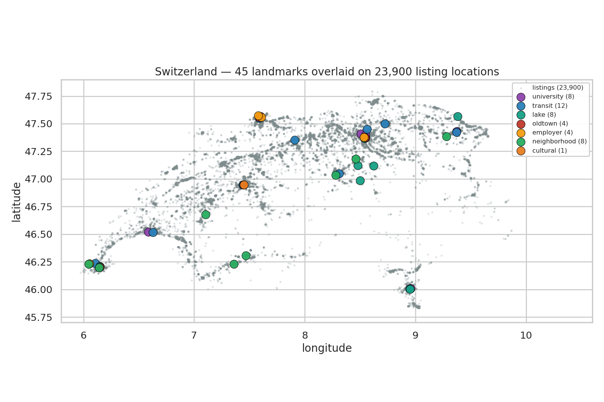

All 45 landmarks overlaid on the full 23,900-listing lat/lng scatter.

- Dark scatter shows the listing density — Zurich dominates; Geneva, Basel, Bern, Lausanne, Lugano clearly visible; Alpine areas sparse.
- Coloured dots are landmarks: purple = universities, blue = transit hubs, teal = lakes, red = old towns, orange = employers, green = neighborhoods, bright orange = cultural.

The 45 landmarks are geographically well-distributed: every major Swiss metro has its HB, old town, and at least one university or employer landmark.

---

## 7. Before / After — the whole-corpus headline

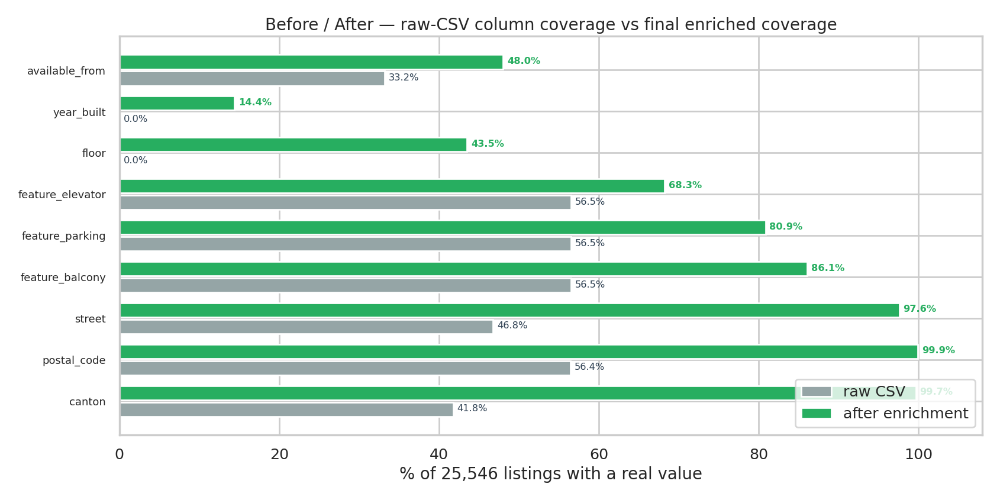

Nine representative fields, raw-CSV column coverage (grey) vs final enriched coverage (green). **Every field is now at ≥ 14% coverage** (vs "silently-incomplete" per v1 §3). The three blue-ribbon wins:

| field | raw CSV | enriched | lift |
|---|---:|---:|---:|
| **canton** | 41.8% | **99.7%** | +57.9 pp |
| **postal_code** | 56.4% | **99.9%** | +43.5 pp |
| **street** | 46.8% | **97.6%** | +50.8 pp |

And the GPT wins:

| field | raw CSV | enriched | lift |
|---|---:|---:|---:|
| floor | 0.0% | 43.5% | +43.5 pp (extracted entirely from text) |
| feature_balcony | 56.5% | 86.1% | +29.6 pp |
| feature_parking | 56.5% | 80.9% | +24.3 pp |
| year_built | 0.0% | 14.4% | +14.4 pp (only 14% because descriptions rarely mention it) |

---

## 8. Query answerability — the bottom-line question

**Can we actually serve the queries users want to run?**

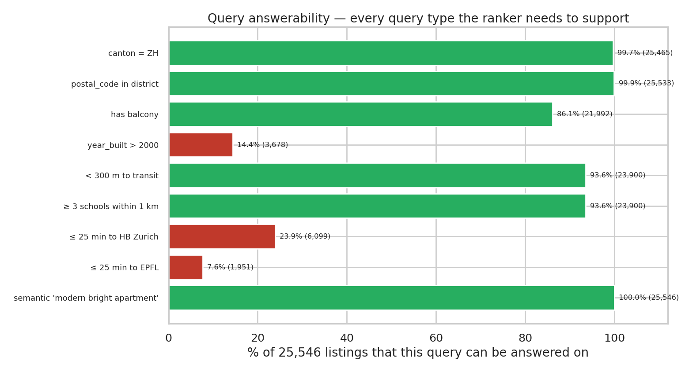

Nine representative query patterns from [`long_queries.md`](../long_queries.md) + [`queries_de.md`](../queries_de.md), with the number of listings each query can be evaluated on:

| query | answerable on | coverage |
|---|---:|---:|
| *canton = ZH* | 25,465 | 99.7% |
| *postal_code in {8001, 8002, ...}* | 25,533 | 99.9% |
| *has balcony* | 21,992 | 86.1% |
| *year_built > 2000* | 3,678 | 14.4% |
| *< 300 m to transit* | 23,900 | 93.6% |
| *≥ 3 schools within 1 km* | 23,900 | 93.6% |
| ***≤ 25 min to HB Zurich*** | 6,099 | 23.9% |
| ***≤ 25 min to EPFL*** | 1,951 | 7.6% |
| *"modern bright apartment" (semantic)* | 25,546 | 100% |

The two commute-based rows show **only 24% and 7.6%** because those percentages are *physically correct*: only 24% of Swiss listings are close enough to HB Zurich for the commute-time question to make sense at all; only 7.6% are close enough to EPFL. That's correct behaviour — the 76% of listings NOT near HB Zurich shouldn't be ranked as "close to HB Zurich" with a fake value.

---

## 9. Hardening — signals we added after the first ranker draft

Two Layer-2 columns exist specifically to keep the ranker safe from pathological inputs. Both documented in [`_context/LAYER2_STATE.md`](../_context/LAYER2_STATE.md) §9.

### 9.1 `nearest_stop_lines_log` — log-transform of transit-hub magnitude

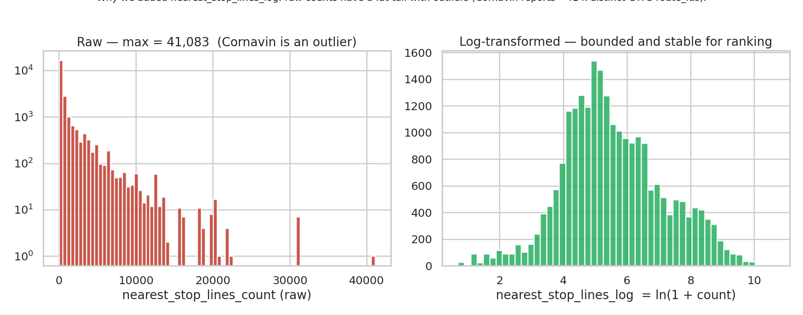

**Problem**: Swiss GTFS reports distinct `route_id` counts per stop. Gare de Cornavin has **~41,000 distinct route_ids** (every direction × variant × time-of-day of every line that serves it counts separately in the feed's encoding). Percentile-normalising a ranker signal on this raw field would let Cornavin-adjacent listings dominate every transit-score on the board.

**Fix**: added `nearest_stop_lines_log = ln(1 + count)`. Log-bounded, stable, reflects the intuition *"more lines → better-served, but diminishing returns"*.

### 9.2 `price_plausibility` — suspect-outlier flag

| bucket | listings |
|---|---:|
| `normal` | 20,145 |
| `suspect` | **74** |
| NULL (no baseline — bucket < 5) | 5,327 |

`suspect` means `|price_delta_pct_canton_rooms| > 3.0` — i.e. price deviates by more than 300% from the (canton × rooms) bucket median. These are typically mis-categorized listings (multi-room rent listed as "1-room", parking spot at CHF 200 listed with rooms > 0, etc.). The ranker excludes them from percentile normalisation and de-weights them in scoring.

---

## 10. Remaining gaps + known anomalies

### 10.1 Pass 2b — **completed** (see §3B for full analysis)

The 4 extraction-only fields shipped today are **done**: 53,665 DB writes applied, 19,852 cache entries, ~$3 OpenAI spend, 30/30 spot-check clean, parallel auditor verdict SHIP AS IS. Coverage: `bathroom_count` 58.2%, `bathroom_shared` 54.8%, `has_cellar` 40.5%, `kitchen_shared` 56.6%. Zero-pending invariant holds across all **41** enriched fields.

### 10.2 Lake-landmark mid-water geocoding

3 rows in `listing_commute_times` have `travel_min > 90` (above our max_time cap):

```
listing 221168  Oberägeri ZG   → aegerisee  travel_min=105
listing 6105230 Unterägeri ZG  → aegerisee  travel_min=101
listing 6273923 Unterägeri ZG  → aegerisee  travel_min=101
```

Both towns are **on the Ägerisee shoreline**. Root cause: OSM's canonical point for Ägerisee is a centroid **in the middle of the lake** (lat/lng ≈ 47.133, 8.641) — a place r5py's walk network has no edge to. The router eventually finds some absurd multi-leg path that crosses the cap. Same failure mode partially explains the low reachable-counts for `lac` (36), `zugersee` (34), `aegerisee` (11) — listings near the lake succeed to reach, but inland listings fail.

**Mitigation**: ranker should clamp `travel_min > 90` to NULL (one-line SQL). Proper fix is planned P1.2 — sample OSM lake shoreline polygons instead of using centroids.

### 10.3 Corpus-shape ceiling

Fields that will never be at 90%+ coverage because descriptions rarely mention them:

- `agency_name` / `agency_phone` / `agency_email` — only ~2% of listings disclose broker info in the description
- `year_built` — only ~14% of descriptions mention construction year
- `floor` — only ~43% mention floor number
- `distance_*` (5 raw-CSV fields) — roughly 2% of listings in the raw data had these populated; we correctly do NOT fabricate values

These are **text-extraction ceilings**, not pipeline gaps.

---

## 11. Reproduction + provenance

```bash
cd /home/rohamzn/ETH_Uni/Datathon_2026
source /home/rohamzn/miniconda3/etc/profile.d/conda.sh && conda activate datathon2026

# rebuild v2 stats + plots from the live DB
python analysis/profile_v2.py
# → analysis/data/stats_v2.json  (machine-readable)
# → analysis/plots_v2/*.png      (19 plots)
```

Every number in this report is present in `stats_v2.json`. To re-generate the DB from scratch, follow [`_context/COMMUTE_MATRIX_REPORT_2026-04-19.md §9`](../_context/COMMUTE_MATRIX_REPORT_2026-04-19.md).

**Key references:**

- [`_context/STATUS_2026-04-18.md`](../_context/STATUS_2026-04-18.md) — overall project status
- [`_context/LAYER1_STATE.md`](../_context/LAYER1_STATE.md) — Layer 1 null-fill deep dive
- [`_context/LAYER2_STATE.md`](../_context/LAYER2_STATE.md) — Layer 2 signals + commute-matrix context
- [`_context/COMMUTE_MATRIX_REPORT_2026-04-19.md`](../_context/COMMUTE_MATRIX_REPORT_2026-04-19.md) — the new commute data in full detail (20/20 Google-Maps spot-checked)
- [`ARCHITECTURE.md`](../ARCHITECTURE.md) — the overall search-engine design this data feeds
- [`analysis/REPORT.md`](REPORT.md) — the v1 raw-CSV audit this report updates

---

**Last verified**: all stats derived from `data/listings.db` at 2026-04-19 04:37 UTC. Plots are deterministic: same DB + same script → identical PNG bytes.
