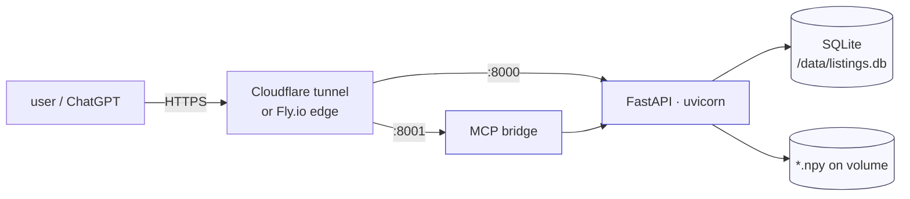

# Deployment

Getting Robin to a public HTTPS URL. Three paths, from easiest (local demo) to most robust (Fly.io).

---

## Topology



---

## Pre-flight checklist

- [ ] `.env` filled with **real** API keys (not `.env.example` defaults)
- [ ] Dataset bundle extracted — `data/listings.db` present and row-counts match [`docs/DATASET.md`](DATASET.md)
- [ ] `curl localhost:8000/health` returns `{"status":"ok"}`
- [ ] Startup log shows all four indexes loaded (`visual_index_loaded`, `text_embed_index_loaded`, `dinov2_index_loaded`, `bootstrap_database`)
- [ ] `uv run pytest -q` green
- [ ] (If MCP) `uv run python scripts/mcp_smoke.py` passes
- [ ] `LISTINGS_COOKIE_SECURE=1` set for any public deploy

---

## 1. Docker Compose (local / VPS)

Two services in one file: FastAPI API (`:8000`) and MCP bridge (`:8001`).

```bash
docker compose up --build -d
docker compose logs -f api
```

[`docker-compose.yml`](../docker-compose.yml) mounts the repo and a named volume `listings_data` at `/data`. On first boot, [`app/harness/bootstrap.py`](../app/harness/bootstrap.py) creates `listings.db` from the CSVs in `raw_data/` — so **`raw_data/` must exist** in the build context.

For production use, bake the dataset into a separate volume rather than relying on startup bootstrap:

```bash
# pre-load the volume
docker volume create listings_data
docker run --rm -v listings_data:/data -v "$PWD/data":/src alpine \
  sh -c "cp -r /src/* /data/"
```

---

## 2. Cloudflare Tunnel (zero-config HTTPS)

Fastest way to get a public URL for a demo or MCP test.

```bash
# shell 1 — FastAPI
uv run uvicorn app.main:app --host 0.0.0.0 --port 8000

# shell 2 — MCP bridge (if needed)
uv run uvicorn apps_sdk.server.main:app --host 0.0.0.0 --port 8001

# shell 3 — tunnel either port
npx cloudflared tunnel --url http://localhost:8000
# → https://something-random.trycloudflare.com
```

**After getting the URL**, export it for the MCP widget JS/CSS asset resolver:

```bash
export APPS_SDK_LISTINGS_API_BASE_URL=http://localhost:8000
export APPS_SDK_PUBLIC_BASE_URL=https://something-random.trycloudflare.com
```

Then restart `apps_sdk.server.main` so it picks up the env.

---

## 3. Fly.io (production)

Recommended for the final public URL.

### `fly.toml` (minimum)

```toml
app = "robin-listings"
primary_region = "fra"

[build]
  dockerfile = "Dockerfile"

[env]
  LISTINGS_DB_PATH        = "/data/listings.db"
  LISTINGS_RAW_DATA_DIR   = "/app/raw_data"
  LISTINGS_COOKIE_SECURE  = "1"

[[mounts]]
  source = "listings_data"
  destination = "/data"

[http_service]
  internal_port = 8000
  force_https = true
  auto_stop_machines = true
  auto_start_machines = true
  min_machines_running = 1

[[vm]]
  cpu_kind = "shared"
  cpus = 2
  memory_mb = 4096      # SigLIP-2 Giant needs ~2 GB RAM; DINOv2 adds ~1.5 GB
```

### Deploy

```bash
flyctl launch --copy-config --no-deploy   # review config, don't ship yet
flyctl volumes create listings_data --region fra --size 4   # 4 GB, for bundle

# set secrets — never commit these
flyctl secrets set \
  OPENAI_API_KEY=sk-proj-… \
  ANTHROPIC_API_KEY=sk-ant-api03-… \
  AWS_ACCESS_KEY_ID=AKIA… \
  AWS_SECRET_ACCESS_KEY=… \
  NOMINATIM_CONTACT_EMAIL=you@example.com \
  OJP_API_KEY=… \
  LISTINGS_SESSION_SECRET=$(openssl rand -hex 32)

flyctl deploy
flyctl open
```

### Upload the dataset bundle

Fly volumes are ephemeral until you write to them. Ship the bundle via SSH:

```bash
flyctl ssh sftp shell
> put datathon2026_dataset.zip /data/
> quit

flyctl ssh console -C "cd /app && unzip -o /data/datathon2026_dataset.zip"
```

Now restart the app so it reloads the indexes:

```bash
flyctl apps restart robin-listings
flyctl logs | head -50   # look for the four *_index_loaded lines
```

### Smoke it

```bash
curl -s https://robin-listings.fly.dev/health
curl -s https://robin-listings.fly.dev/listings \
     -H content-type:application/json \
     -d '{"query":"2-room in Bern under 2000 CHF"}'
```

---

## MCP (ChatGPT / Claude Desktop)

Both clients expect an HTTPS `/mcp` endpoint. Two options:

### a) On Fly next to the API

Add a second process group in `fly.toml`:

```toml
[processes]
  api = "uvicorn app.main:app --host 0.0.0.0 --port 8000"
  mcp = "uvicorn apps_sdk.server.main:app --host 0.0.0.0 --port 8001"

[[services]]
  internal_port = 8001
  processes = ["mcp"]
  protocol = "tcp"
  [[services.ports]]
    handlers = ["tls", "http"]
    port = 443
```

### b) Cloudflare tunnel to a VPS/local

Simpler for a demo (see §2 above).

### Register with the client

| Client | Where to add `https://…/mcp` |
| --- | --- |
| ChatGPT | [OpenAI Apps SDK testing](https://developers.openai.com/apps-sdk/deploy/testing) (requires active subscription) |
| Claude Desktop / Web | [MCP client-testing docs](https://modelcontextprotocol.io/extensions/apps/build#testing-with-claude) |

**Stricter host/origin enforcement** (optional):

```bash
export MCP_ALLOWED_HOSTS="robin-listings.fly.dev"
export MCP_ALLOWED_ORIGINS="https://robin-listings.fly.dev"
```

Leave unset for local dev — misconfigured values cause the MCP server to return `421 Misdirected Request`.

---

## Observability

Every fallback path in the codebase logs via the project-wide discipline from [`CLAUDE.md §5`](../CLAUDE.md):

```text
[WARN] <context>: expected=<X>, got=<Y>, fallback=<Z>
```

Tail in production:

```bash
flyctl logs --app robin-listings | grep -E '\[WARN\]|\[ERROR\]'
```

Key warnings to alert on:

- `[WARN] visual_load_failed` — SigLIP index missing or corrupt
- `[WARN] dinov2_load_failed` — DINOv2 index missing; `/similar` will 503
- `[WARN] llm_fallback` — OpenAI unavailable, query understanding degraded to regex
- `[WARN] session_secret_generated` — `LISTINGS_SESSION_SECRET` not set (fine for dev, not prod)

---

## Rollback

Dataset artifacts are re-creatable — the risky surface is app-image rollback. Fly supports:

```bash
flyctl releases                 # list
flyctl releases rollback <v>    # pin to a prior version
```

Database migrations (only [`scripts/migrate_db_to_app_schema.py`](../scripts/migrate_db_to_app_schema.py)) are forward-only — back up `/data/listings.db` before running.
