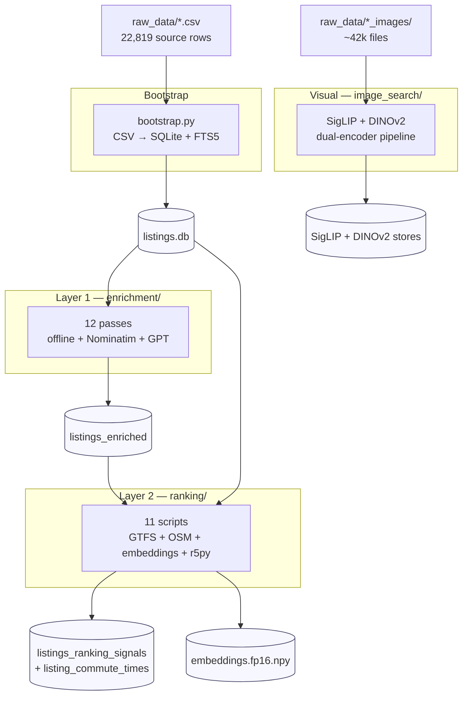

# Development

How to test, rebuild indexes, add a new ranking signal, and work on the MCP app.

---

## Running tests

```bash
uv run pytest -q                   # all 34 integration test files
uv run pytest tests/ -q            # FastAPI + API layer
uv run pytest enrichment/tests -q  # 307 enrichment tests
uv run pytest ranking/tests -q     # 7 ranking unit tests
uv run pytest image_search/tests -q # 15 image-search unit tests
```

The `smoke` marker is **excluded by default** (see [`pyproject.toml:64`](../pyproject.toml#L64)) — these run against the full dataset bundle and take minutes. Run explicitly:

```bash
uv run pytest -m smoke -q
```

Test layout:

| Directory | Scope | Run cost |
| --- | --- | --- |
| [`tests/`](../tests/) | API / auth / interactions / bootstrap / FTS5 / migrate / personalization / latency | ~10 s |
| [`tests/smoke/`](../tests/smoke/) | End-to-end against real dataset bundle | minutes |
| [`enrichment/tests/unit/`](../enrichment/tests/) | Pure functions — regex / NegEx / schema / validators | 1-2 s |
| [`enrichment/tests/integration/`](../enrichment/tests/) | Each pass against an in-memory SQLite | ~5 min for 307 total |
| [`ranking/tests/unit/`](../ranking/tests/) | Price math · diversify · schema · landmarks · OJP · signals reader | ~1 s |
| [`image_search/tests/unit/`](../image_search/tests/) | 14 files — SRED split (pixel-exact SHA-256) · triage logic · embed · store safety-net · GeM · DINOv2 transform | ~2 s |

---

## Rebuild pipelines



### Stage 0 — `listings.db` from CSVs

Happens automatically on first `uvicorn app.main:app` startup via [`app/harness/bootstrap.py`](../app/harness/bootstrap.py). To force rebuild:

```bash
rm data/listings.db
uv run uvicorn app.main:app --no-server   # or just start and stop
```

Schema drift fix (if `FTS5 no such table: listings_fts`):

```bash
uv run python scripts/migrate_db_to_app_schema.py
```

### Stage 1 — Enrichment (`enrichment/`)

See [`enrichment/README.md`](../enrichment/README.md) for the 12-pass pipeline and cost budget (~$50 OpenAI + ~3 h wall time).

```bash
# offline only
uv run python enrichment/scripts/pass0_create_table.py
uv run python enrichment/scripts/pass1_geocode.py
uv run python enrichment/scripts/pass2_text_extract.py

# HTTP + GPT
uv run python enrichment/scripts/pass1b_nominatim.py         # needs NOMINATIM_CONTACT_EMAIL
uv run python enrichment/scripts/pass2_gpt_extract.py        # needs OPENAI_API_KEY
uv run python enrichment/scripts/pass2b_bathroom_cellar_kitchen.py
uv run python enrichment/scripts/pass3_sentinel_fill.py
```

### Stage 2 — Ranking signals (`ranking/`)

See [`ranking/README.md`](../ranking/README.md).

Data-source prep:

```bash
# SBB GTFS feed (~300 MB)
curl -L "https://gtfs.geops.ch/dl/gtfs_fp2026_2026-01-21_09-10.zip" \
  -o data/ranking/gtfs.zip
unzip data/ranking/gtfs.zip -d data/ranking/gtfs/

# Switzerland OSM extract (~500 MB)
mkdir -p data/ranking/osm
curl -L "https://download.geofabrik.de/europe/switzerland-latest.osm.pbf" \
  -o data/ranking/osm/switzerland-latest.osm.pbf
```

Then:

```bash
uv run python ranking/scripts/t1_create_table.py
uv run python ranking/scripts/t1_price_baselines.py
uv run python ranking/scripts/t2_gtfs_nearest.py
uv run python ranking/scripts/t2_osm_poi.py
uv run python ranking/scripts/t3_embed_listings.py        # ~30 min CPU / 5 min GPU
uv run python ranking/scripts/t4_r5_commute_matrix.py     # ~4-6 h parallel
uv run python ranking/scripts/t1_signal_hardening.py
```

### Stage 3 — Image indexes (`image_search/`)

See [`image_search/README.md`](../image_search/README.md).

```bash
uv run python image_search/scripts/run_full.py               # SigLIP-2 Giant, ~2 h GPU
uv run python image_search/scripts/build_dinov2_index.py     # DINOv2 ViT-L/14, ~1 h GPU
uv run python image_search/scripts/verify_results.py
uv run python image_search/scripts/verify_dinov2_index.py
```

---

## Add a new ranking signal — 5-step recipe

Say you want to add `flood_risk_100y` to the ranker.

1. **Register the column** in [`ranking/schema.py`](../ranking/schema.py) — append to `SIGNALS` with `name`, `sql_type`, `description`, `category`.
2. **Write the compute script** at `ranking/scripts/t2_flood_risk.py` — read from [`data/listings.db`](../data/listings.db), write via `INSERT OR REPLACE INTO listings_ranking_signals(listing_id, flood_risk_100y) VALUES (?, ?)`. Keep it idempotent.
3. **Expose at runtime** — if the signal needs to be read into a Python dict per batch, extend [`ranking/runtime/signals_reader.py`](../ranking/runtime/signals_reader.py); if it plugs straight into SQL, skip this.
4. **Wire into the ranker** — edit [`app/core/soft_signals.py`](../app/core/soft_signals.py) to add the signal to the blend, and [`app/participant/ranking.py`](../app/participant/ranking.py) for the explanation clause.
5. **Test it** — add `ranking/tests/unit/test_flood_risk.py` against an in-memory SQLite fixture. Run: `uv run pytest ranking/tests -q`.

---

## Code-style rules

Summarized from [`CLAUDE.md`](../CLAUDE.md) — the project's LLM-collaborator guide:

- **No silent fallbacks.** Every `except` branch and every coerced default must emit `[WARN] <context>: expected=… got=… fallback=…` (stderr, flush).
- **Minimal diffs.** Don't "improve" adjacent code — surgical changes only.
- **No premature abstraction.** Three similar lines < one clever helper.
- **No comments explaining what.** Comments explain *why* — non-obvious invariants, workarounds, hidden constraints.

`pyproject.toml` pins everything; the repo has no linter config — `ruff check` and `mypy --strict` run clean out-of-the-box.

---

## MCP app

The React widget ([`apps_sdk/web/`](../apps_sdk/web/)) is a Vite + TypeScript project:

```bash
cd apps_sdk/web
npm install
npm run build           # emits dist/ consumed by apps_sdk/server
npm run dev             # hot reload at localhost:5173
```

Build before shipping the MCP server — [`apps_sdk/server/widget.py`](../apps_sdk/server/widget.py) serves `dist/` assets.

Run the MCP side:

```bash
uv run uvicorn apps_sdk.server.main:app --reload --port 8001
uv run python scripts/mcp_smoke.py --url http://localhost:8001/mcp
```

The smoke test checks `initialize`, `tools/list`, `resources/list`, `resources/read`.

---

## Useful scripts

| Script | Purpose |
| --- | --- |
| [`scripts/download_s3_images.py`](../scripts/download_s3_images.py) | Sync `s3://…/prod/<source>/images/` → `raw_data/` |
| [`scripts/explore_sample.py`](../scripts/explore_sample.py) | Print a random-sample dump of `listings_enriched` |
| [`scripts/install_dataset.py`](../scripts/install_dataset.py) | Extract the pre-built dataset bundle zip into repo layout |
| [`scripts/migrate_db_to_app_schema.py`](../scripts/migrate_db_to_app_schema.py) | Add missing columns + FTS5 index post-bootstrap |
| [`scripts/mcp_smoke.py`](../scripts/mcp_smoke.py) | Protocol-level MCP smoke test |
