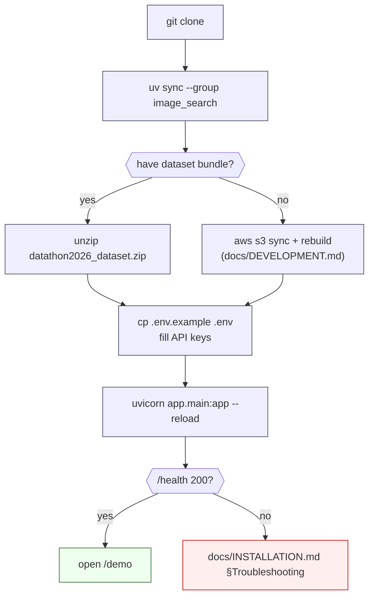

# Installation

Full local-dev setup from a fresh clone. Under 5 minutes if you have the pre-built dataset bundle, ~1 hour if you're rebuilding indexes from raw CSVs.

---

## Install flow



---

## 1. Requirements

| | Minimum | Recommended |
| --- | --- | --- |
| Python | 3.12 | 3.12 |
| Package manager | [`uv`](https://docs.astral.sh/uv/) 0.5+ | same |
| Disk | 3 GB (code + deps) | 7 GB (+ dataset bundle + image weights cache) |
| RAM | 8 GB | 16 GB (SigLIP-2 Giant weights are ~3.7 GB in RAM) |
| GPU | none (CPU works) | CUDA 12.8 for ~10× encoder throughput |
| OS | Linux / macOS | Linux for Docker parity |

The `uv.lock` file pins every dependency. On Linux, `torch` is pulled from `https://download.pytorch.org/whl/cu128` (configured in [`pyproject.toml:44-52`](../pyproject.toml)); on macOS the default PyPI wheel with MPS support is used.

---

## 2. Clone & install

```bash
git clone https://github.com/<org>/Datathon_2026
cd Datathon_2026

# core API + enrichment deps (fast, ~150 MB)
uv sync --dev

# add the image-search group only if you need visual/DINOv2 channels
# (adds torch + transformers + SigLIP-2 weights cache; ~1 GB install)
uv sync --group image_search
```

Verify:

```bash
uv run python -c "import fastapi, sqlite3; print('ok')"
```

---

## 3. Environment variables

Copy the example and fill in real keys:

```bash
cp .env.example .env
```

Required (otherwise startup degrades with `[WARN]` logs):

| Variable | Used by | Notes |
| --- | --- | --- |
| `OPENAI_API_KEY` | [`app/participant/hard_fact_extraction.py`](../app/participant/hard_fact_extraction.py) · [`enrichment/scripts/pass2_gpt_extract.py`](../enrichment/scripts/pass2_gpt_extract.py) | Without this, query understanding falls back to a regex fallback |
| `AWS_ACCESS_KEY_ID` / `AWS_SECRET_ACCESS_KEY` | [`app/core/s3.py`](../app/core/s3.py) | Resolves image URLs; listings still return without it |
| `NOMINATIM_CONTACT_EMAIL` | [`enrichment/scripts/pass1b_nominatim.py`](../enrichment/scripts/pass1b_nominatim.py) | Required for any live geocoding — [OSM policy](https://operations.osmfoundation.org/policies/nominatim/) |

Optional:

| Variable | Default | Purpose |
| --- | --- | --- |
| `LISTINGS_VISUAL_ENABLED` | `1` | Set `0` to skip SigLIP load (CI / low-RAM) |
| `LISTINGS_TEXT_EMBED_ENABLED` | `1` | Set `0` to skip Arctic-Embed load |
| `LISTINGS_DINOV2_ENABLED` | `1` | Set `0` to skip DINOv2 load — disables `/listings/search/image` and `/listings/{id}/similar` (they return 503) |
| `LISTINGS_DB_PATH` | `data/listings.db` | Override DB location |
| `LISTINGS_SESSION_SECRET` | generated & persisted | HMAC secret for session tokens |
| `LISTINGS_COOKIE_SECURE` | `0` | Set to `1` in production (HTTPS-only cookies) |

Full reference: [`docs/USAGE.md §Environment flags`](USAGE.md#environment-flags).

---

## 4. Get the data

Two paths — pick one.

### Path A — Pre-built dataset bundle (recommended)

The team ships a ~2.5 GB zip with the fully built DB + embeddings + landmarks.

```bash
# unzip at repo root — paths inside the zip are already repo-relative
unzip datathon2026_dataset.zip
```

Detailed file-by-file manifest: [`docs/DATASET.md`](DATASET.md).

Quick integrity check:

```bash
uv run python - <<'PY'
import sqlite3
db = sqlite3.connect('data/listings.db')
for t, want in [('listings', 25546),
                ('listings_enriched', 25546),
                ('listings_ranking_signals', 25546),
                ('listing_commute_times', 125396)]:
    got = db.execute(f'SELECT COUNT(*) FROM {t}').fetchone()[0]
    print(f'{t}: {got}', 'OK' if got == want else 'MISMATCH')
PY
```

### Path B — Rebuild from raw CSVs

If you have the raw source bundle:

```bash
# 1. sync images from S3 (~4 GB, ~10 min)
uv run python scripts/download_s3_images.py

# 2. run enrichment pipeline (~$50 in OpenAI, ~2 h)
# see enrichment/README.md
uv run python enrichment/scripts/pass0_create_table.py
# … through pass3 …

# 3. build ranking signals (~6 h including r5py commute matrix)
# see ranking/README.md

# 4. build image indexes (~2 h on GPU)
uv run python image_search/scripts/run_full.py
uv run python image_search/scripts/build_dinov2_index.py
```

Full rebuild recipe: [`docs/DEVELOPMENT.md`](DEVELOPMENT.md).

---

## 5. First startup

```bash
uv run uvicorn app.main:app --reload
```

Expected startup log (within ~30 s on first run, faster on reload):

```text
INFO:     Started server process
INFO:     Waiting for application startup.
[INFO] visual_index_loaded: model=google/siglip2-giant-opt-patch16-384 main_matrix=(70548, 1536) listings_with_images=…
[INFO] text_embed_index_loaded: model=Snowflake/snowflake-arctic-embed-l-v2.0 matrix=(25546, 1024)
[INFO] dinov2_index_loaded: model=dinov2_vitl14_reg main_matrix=(70548, 1024)
INFO:     Application startup complete.
INFO:     Uvicorn running on http://127.0.0.1:8000
```

Smoke test:

```bash
curl -s http://localhost:8000/health                          # {"status":"ok"}
curl -s -X POST http://localhost:8000/listings \
     -H content-type:application/json \
     -d '{"query":"3-room apartment in Zurich under 3000 CHF","limit":5}' \
   | head -c 400
```

Open [`http://localhost:8000/demo`](http://localhost:8000/demo) for the UI.

---

## 6. Troubleshooting

| Symptom at startup | Fix |
| --- | --- |
| `FTS5 no such table: listings_fts` | `uv run python scripts/migrate_db_to_app_schema.py` |
| `[WARN] dinov2_load_failed: expected=dinov2_store` | DINOv2 index missing — see [`docs/DATASET.md`](DATASET.md) |
| `CUDA out of memory` | `export LISTINGS_DINOV2_ENABLED=0` or run on CPU |
| `401 Unauthorized` from OpenAI | `OPENAI_API_KEY` missing / invalid in `.env` |
| `ModuleNotFoundError: transformers` | You skipped `uv sync --group image_search` |
| `[WARN] session_secret_generated` | Fine for dev; set `LISTINGS_SESSION_SECRET` in prod |

Still stuck? Run `uv run pytest -q` — a failing test usually points at the root cause faster than a log dive.
