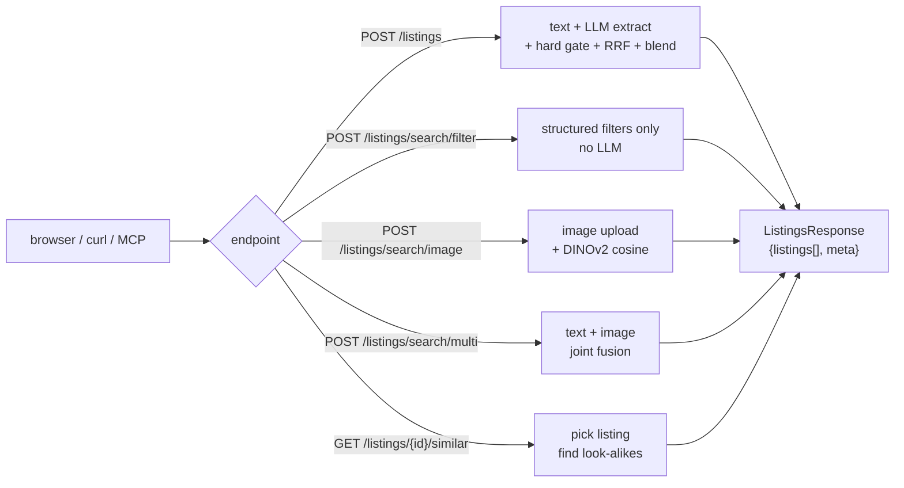

# Usage

How to run Robin, what every endpoint does, and how to query from the terminal, a browser, or ChatGPT.

- [Starting the server](#starting-the-server)
- [The demo UI](#the-demo-ui)
- [API reference](#api-reference)
- [Example queries](#example-queries)
- [Authentication & personalization](#authentication--personalization)
- [MCP app (ChatGPT / Claude Desktop)](#mcp-app)
- [Environment flags](#environment-flags)

---

## Starting the server

```bash
# local dev — hot-reload
uv run uvicorn app.main:app --reload

# production style
uv run uvicorn app.main:app --host 0.0.0.0 --port 8000 --workers 2

# docker
docker compose up --build
```

See [`docs/INSTALLATION.md`](INSTALLATION.md) if startup fails.

---

## The demo UI

```
http://localhost:8000/demo
```

A single-page React-free HTML+JS client ([`app/static/demo.html`](../app/static/demo.html)) that exercises the full API:

- Text query box (DE / FR / IT / EN)
- Hard-filter chips (city · price · rooms · features)
- Map view (Leaflet + OSM tiles) with listing markers
- Per-listing "Show match" drawer with the ranking reason
- Image upload for reverse image search
- Favorite / like / dismiss actions (when signed in)

---

## Request flow



---

## API reference

### Core search

| Method | Path | Body model | Returns | Purpose |
| --- | --- | --- | --- | --- |
| `GET` | `/health` | — | `HealthResponse` | Liveness probe |
| `POST` | `/listings` | `ListingsQueryRequest` | `ListingsResponse` | Natural-language query (the primary endpoint) |
| `POST` | `/listings/search/filter` | `ListingsSearchRequest` | `ListingsResponse` | Structured hard-filter search, no LLM |
| `POST` | `/listings/search/multi` | multipart form | `ListingsResponse` | Hybrid text + image with optional filter overrides |
| `POST` | `/listings/search/image` | multipart file | `ImageSearchResponse` | Upload photo → DINOv2 similar listings |
| `POST` | `/listings/map` | `ListingsMapRequest` | `ListingsMapResponse` | Coords for map dots; accepts query OR hard_filters |
| `GET` | `/listings/default` | — | `ListingsResponse` | Homepage feed (personalized if signed in) |
| `GET` | `/listings/{id}` | — | `ListingData` | Full listing detail + nearest landmarks |
| `GET` | `/listings/{id}/similar` | — | `SimilarListingsResponse` | Image + text + feature fused look-alikes |
| `GET` | `/landmarks` | — | `list[LandmarkPoint]` | 45-entry curated Swiss landmark gazetteer |

**Upload limits** (for the image endpoints): 8 MB raw payload, 4096×4096 px decoded — decompression-bomb guard.

### Auth

| Method | Path | Body | Returns | Notes |
| --- | --- | --- | --- | --- |
| `GET` | `/auth/csrf` | — | `CsrfResponse` | Call on page load before state-changing requests |
| `GET` | `/auth/me` | — | `UserPublic \| null` | Current session, or null |
| `POST` | `/auth/register` | `RegisterRequest` | `UserPublic` | Creates account + auto-logs-in · 201 |
| `POST` | `/auth/login` | `LoginRequest` | `UserPublic` | Rate-limited per (username, IP) |
| `POST` | `/auth/logout` | — | `{ok:true}` | Revokes session |
| `POST` | `/auth/change-password` | `ChangePasswordRequest` | `UserPublic` | Rotates all sessions |
| `POST` | `/auth/delete-account` | `DeleteAccountRequest` | `{ok:true}` | Cascades sessions + interactions |

All state-changing auth routes require the CSRF header from `/auth/csrf`.

### Interactions & memory (bonus task)

| Method | Path | Body | Returns | Purpose |
| --- | --- | --- | --- | --- |
| `POST` | `/me/interactions` | `InteractionRequest` | `{ok, created_at}` | Record save / like / click / dwell / dismiss |
| `GET` | `/me/favorites` | — | `FavoritesResponse` | Listings saved (bookmarks + legacy) |
| `GET` | `/me/likes` | — | `FavoritesResponse` | Liked listings — feed memory profile |
| `GET` | `/me/dismissed` | — | `list[str]` | Explicit dismisses (still-active) |
| `GET` | `/me/profile` | — | `UserProfileSummary` | Inferred taste tags + price band + activity counts |
| `DELETE` | `/me/interactions` | — | `{ok, deleted:int}` | Wipe memory + reset profile |

Interaction kinds: `save` · `unsave` · `like` · `unlike` · `bookmark` · `unbookmark` · `click` · `dwell` · `dismiss` · `undismiss`.

---

## Request & response shapes

Full models in [`app/models/schemas.py`](../app/models/schemas.py). The six you'll actually touch:

### `ListingsQueryRequest` (POST `/listings`)

```json
{ "query": "3 room bright apartment in Zurich under 2800 CHF",
  "limit": 25,          // 1..500, default 25
  "offset": 0,          // >=0
  "personalize": true } // off → vanilla ranking even if signed in
```

### `HardFilters` (POST `/listings/search/filter`, `/listings/search/multi`, `/listings/map`)

Nested under `{"hard_filters": {…}}`.

| Field | Type | Notes |
| --- | --- | --- |
| `city`, `postal_code` | `list[str] \| null` | OR across values |
| `canton` | `str \| null` | 2-letter code |
| `min_price`, `max_price` | `int \| null` | CHF |
| `min_rooms`, `max_rooms` | `float \| null` | Swiss rooms convention |
| `min_area`, `max_area` | `int \| null` | m² |
| `min_floor`, `max_floor` | `int \| null` | — |
| `min_year_built`, `max_year_built` | `int \| null` | — |
| `available_from_after` | `str \| null` | ISO date |
| `latitude`, `longitude`, `radius_km` | `float \| null` | geo circle |
| `features`, `features_excluded` | `list[str] \| null` | 12-flag vocabulary |
| `min_bathrooms`, `max_bathrooms` | `int \| null` | — |
| `bathroom_shared`, `has_cellar`, `kitchen_shared` | `bool \| null` | enriched |
| `bm25_keywords` | `list[str] \| null` | lexical re-ranker hints |
| `soft_preferences` | `SoftPreferences \| null` | soft signals |
| `limit` | `int` | default 20, max 30000 |
| `offset` | `int` | — |
| `sort_by` | `"price_asc" \| "price_desc" \| "rooms_asc" \| "rooms_desc" \| null` | overrides ranker |

### `ListingData` (response object in every listings endpoint)

```json
{ "id": "123",
  "title": "…", "description": "…",
  "street": "…", "house_number": "…", "city": "…",
  "postal_code": "…", "canton": "ZH",
  "latitude": 47.37, "longitude": 8.54,
  "price_chf": 2500, "rooms": 3.0, "living_area_sqm": 78,
  "available_from": "2026-05-01",
  "hero_image_url": "https://…",
  "image_urls": ["…"],
  "features": ["balcony", "parking"],
  "offer_type": "RENT", "object_category": "apartment",
  "bathroom_count": 2, "bathroom_shared": false,
  "has_cellar": true, "kitchen_shared": false,
  "nearby_landmarks": [ { "name": "ETH Zentrum", "dist_m": 1420 } ] }
```

### `RegisterRequest` (POST `/auth/register`)

```json
{ "username": "alice", "email": "alice@example.com", "password": "at-least-8-chars-with-1-digit" }
```

### `InteractionRequest` (POST `/me/interactions`)

```json
{ "listing_id": "42", "kind": "like", "value": null }
```

### `ListingsResponse` (every search endpoint)

```json
{ "listings": [ { "listing_id": "…", "score": 0.82,
                  "reason": "Matched 3 rooms, Zurich, ≤ 2,800 CHF, balcony…",
                  "listing": { …ListingData… } } ],
  "meta":     { "channels": {"bm25": true, "dense": true, "visual": true, "dinov2": true},
                "relaxations": [],
                "extracted_filters": { … } } }
```

---

## Example queries

```bash
# DE — hard + soft
curl -s -X POST http://localhost:8000/listings \
     -H content-type:application/json \
     -d '{"query":"3.5-Zimmer-Wohnung in Zürich unter 3000 CHF mit Balkon","limit":10}'

# FR — same query
curl -s -X POST http://localhost:8000/listings \
     -d '{"query":"appartement 3 pièces à Genève sous 2500 CHF"}' \
     -H content-type:application/json

# landmark-relative
curl -s -X POST http://localhost:8000/listings \
     -d '{"query":"2-Zimmer-Wohnung, max 25 min ÖV bis ETH Hönggerberg"}' \
     -H content-type:application/json

# structured only — no LLM
curl -s -X POST http://localhost:8000/listings/search/filter \
  -H content-type:application/json \
  -d '{"hard_filters":{"city":["Winterthur"],"features":["child_friendly"],
                       "min_rooms":3.5,"max_price":3200,"limit":5}}'

# reverse image search
curl -s -X POST http://localhost:8000/listings/search/image \
     -F "file=@my_kitchen.jpg" -F "limit=10"

# look-alikes for a listing
curl -s http://localhost:8000/listings/42/similar?limit=6
```

More in [`tests/fixtures/queries_de.md`](../tests/fixtures/queries_de.md).

---

## Authentication & personalization

Personalization is **opt-in and per-session**:

1. `GET /auth/csrf` → returns CSRF cookie + body token
2. `POST /auth/register` or `POST /auth/login`
3. Subsequent `POST /listings` runs use memory-based re-ranking when `personalize: true` (default) and a session cookie is present
4. `POST /me/interactions` kinds `like` / `save` / `bookmark` add to the feed; `dismiss` demotes
5. `GET /me/profile` returns inferred taste tags + activity counts
6. `DELETE /me/interactions` fully resets

See [`app/memory/`](../app/memory/) for the profile/rankings/summary logic.

---

## MCP app

The repo ships a minimal MCP bridge for ChatGPT / Claude Desktop.

```bash
# shell 1 — FastAPI
uv run uvicorn app.main:app --port 8000

# shell 2 — MCP server
uv run uvicorn apps_sdk.server.main:app --port 8001

# shell 3 — tunnel
npx cloudflared tunnel --url http://localhost:8001
```

Register `https://<tunnel>.trycloudflare.com/mcp` in your MCP client. The single tool exposed is `search_listings`. Smoke-test:

```bash
uv run python scripts/mcp_smoke.py --url http://localhost:8001/mcp
```

Full MCP deploy notes: [`docs/DEPLOYMENT.md`](DEPLOYMENT.md).

---

## Environment flags

All `LISTINGS_*` vars are read in [`app/config.py`](../app/config.py) and the four `app/core/*_search.py` modules. Toggle without code changes:

| Flag | Default | Effect when `0` |
| --- | --- | --- |
| `LISTINGS_VISUAL_ENABLED` | `1` | No SigLIP load — BM25 + text embed only |
| `LISTINGS_TEXT_EMBED_ENABLED` | `1` | No Arctic-Embed — BM25 + visual only |
| `LISTINGS_DINOV2_ENABLED` | `1` | `/search/image` and `/{id}/similar` return 503 |
| `LISTINGS_SKIP_BUNDLE_INSTALL` | `0` | Skip raw-data bundle install at startup |
| `LISTINGS_COOKIE_SECURE` | `0` | Session cookies HTTPS-only |

Set in `.env`, or inline for one run: `LISTINGS_DINOV2_ENABLED=0 uv run uvicorn app.main:app`.
