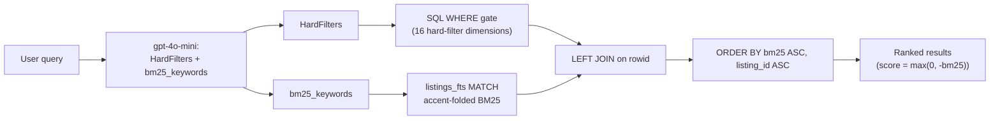

# FTS5 BM25 re-ranker report

Status: April 18, 2026. Second iteration on top of the hard-filter MVP (see [`docs/hard-filter-mvp-report.md`](hard-filter-mvp-report.md)). This iteration adds the first real ranking signal: SQLite FTS5 BM25 over `title + description + street + city + object_category_raw`, driven by LLM-extracted `bm25_keywords`.

## 0. What shipped

`POST /listings` flow now looks like this:

```
user query
  -> OpenAI gpt-4o-mini (same strict JSON schema, now with bm25_keywords)
  -> HardFilters + bm25_keywords
  -> SQL gate (hard filter WHERE clauses) LEFT JOIN listings_fts
  -> ORDER BY bm25(listings_fts) ASC, listing_id ASC
  -> ListingsResponse with real per-listing score + reason
```

Test suite: **142 tests, 8.3 s, green**. No lint errors. Baseline smoke on the real 500-row sample confirms the three "BAUMGARTEN Zürich-Höngg" Minergie-described listings rank above the other Zürich rows when the query mentions Balkon and Minergie.

## 1. Soft vs hard semantics (important)

BM25 is a **soft re-ranker**, never a filter. The distinction matters, and we enforce it structurally:

- Hard filter WHERE clauses are the only thing that can remove a row from the result set (per ARCHITECTURE §4 principle 1, "hard constraints are sacred").
- The FTS5 `MATCH` predicate lives inside a subquery joined with `LEFT JOIN`, not in the outer `WHERE`. Rows without text match still come out — they just get a sentinel score `1e9` and sort to the end.
- The API response score is `max(0.0, -bm25)`: matched rows get a positive relevance number (higher = better), unmatched rows get `0.0` and an explanatory reason.

A one-line switch from `LEFT JOIN` to `INNER JOIN` would turn BM25 into a hard filter. We deliberately did not do that, because a user typing "modern bright flat in Zurich" should not get zero results just because no Zurich listing happens to literally contain "modern" in its first 300 characters of description.

## 2. Pipeline diagram



## 3. Index design

Virtual table created alongside the `listings` schema in [`app/harness/csv_import.py`](../app/harness/csv_import.py):

```sql
CREATE VIRTUAL TABLE IF NOT EXISTS listings_fts USING fts5(
    title, description, street, city, object_category_raw,
    content='listings',
    content_rowid='rowid',
    tokenize='unicode61 remove_diacritics 2'
);
```

Design choices:

- **External-content** (`content='listings'`): zero data duplication, FTS index just points at `listings.rowid`.
- **Rebuild on bootstrap**, not triggers: the DB is built once at startup and immutable at runtime, so a single `INSERT INTO listings_fts(listings_fts) VALUES('rebuild');` after the import run is enough. Triggers would add complexity we don't need.
- **Tokenizer `unicode61 remove_diacritics 2`**: folds `ü -> u`, `é -> e`, `ô -> o`, etc. A user query for "Zurich" matches descriptions containing "Zürich". Confirmed with the `test_accent_fold_query_zurich_matches_umlaut_rows` test.
- **Five fields indexed**, not four: added `object_category_raw` (new TEXT column) so German queries like "Dachwohnung" match even though the structured `object_category` column is now English-canonicalised. The raw field sits alongside the translated one; both are kept in `listings`.

## 4. LLM contract

Same single API call as before. The JSON schema gains one required nullable array field, and the system prompt gains a dedicated section.

### Schema delta

```python
"bm25_keywords": _nullable(["array", "null"], items={"type": "string"}),
# also added to the schema's "required" list
```

### Prompt delta (abridged)

```
BM25_KEYWORDS: emit short literal terms the user mentioned that help lexical
text matching against listing descriptions. Include:
- Domain nouns: "Minergie", "Altbau", "Attika", "Dachwohnung", "Loft",
  "Keller", "Terrasse", "Lift", "Waschturm".
- Named places / landmarks: "ETH", "EPFL", "HB", "Hauptbahnhof",
  "Stadelhofen", "See", "Plainpalais".
- Soft quality adjectives IF stated verbatim: "modern", "hell", "ruhig",
  "bright", "quiet". These are BM25 signal only; they are still forbidden
  from turning into `features`.
Skip generic words already in the hard schema (apartment, Wohnung, house,
city names, numbers, dates) and stopwords. <= 8 terms. Empty list OK.
```

Both few-shot examples were updated end-to-end so the model sees the full output shape:

- EN: `"bm25_keywords":["bright"]`
- DE: `"bm25_keywords":["Balkon","Waschturm","Stadelhofen"]`

The DE example is deliberately built to illustrate the division of labour: `Balkon` is also a hard feature (`features:["balcony"]`), `Waschturm` is also a hard feature (`features:["private_laundry"]`), and `Stadelhofen` appears nowhere in HardFilters because commute-to-landmark is still on the no-emit list. BM25 is the only place these words meaningfully route to right now.

## 5. SQL integration

`search_listings` in [`app/core/hard_filters.py`](../app/core/hard_filters.py) branches on whether `bm25_keywords` are present:

**With keywords** — gated BM25 re-rank:

```sql
SELECT listings.<cols>,
       COALESCE(fts.bm25_score, 1e9) AS bm25_score
FROM listings
LEFT JOIN (
    SELECT rowid, bm25(listings_fts) AS bm25_score
    FROM listings_fts
    WHERE listings_fts MATCH ?
) fts ON fts.rowid = listings.rowid
WHERE <hard filter clauses>
ORDER BY bm25_score ASC, listing_id ASC
```

**Without keywords** — unchanged, default order.

Two safety details worth naming:

1. **Quotes are stripped from each keyword before building the MATCH string** (`_build_fts_match`). A user-emitted keyword like `'Altbau"; DROP TABLE x'` is sanitised to `Altbau; DROP TABLE x` and wrapped in a safe `"..."` phrase query. FTS5 syntax is never injected.
2. **Each keyword becomes a quoted phrase**, OR-joined: `"Balkon" OR "Minergie"`. This is phrase-level matching (the whole keyword must appear), OR'd across keywords for recall-friendly retrieval.

## 6. Ranking integration

[`app/participant/ranking.py`](../app/participant/ranking.py) used to emit a constant `score=1.0` stub. It now translates `bm25_score` into an API-friendly contract:

```python
if bm25 is None or bm25 >= 1e8:
    score = 0.0
    reason = "Matched hard filters; no text match."
else:
    score = float(-bm25)  # flip sign so higher = better
    reason = "Matched hard filters; ranked by text relevance."
```

The candidate list is already BM25-sorted by the SQL layer, so the ranker does not re-sort.

## 7. Behaviour on the real data

Smoke test, `city=["Zurich"], bm25_keywords=["Balkon","Minergie"], limit=5`:

```
listing_id   bm25_score    API score     reason
218847       -3.5787       3.5787        text match
218897       -3.4916       3.4916        text match
218901       -3.4635       3.4635        text match
26817        -1.7643       1.7643        text match
58602        -1.5774       1.5774        text match
```

The three BAUMGARTEN listings are Minergie-described flats in Zürich-Höngg; they correctly out-rank the plain-Balkon listings. With `limit=100` all ~25 Zürich listings come back and the non-matching ones tail the result set with `score=0.0`.

## 8. Assumptions

Additions over the hard-filter report's assumption list:

1. **BM25 is soft, not a filter.** Hard constraints decide inclusion; BM25 only changes order. Switching to INNER JOIN is a one-line change if product wants stricter semantics later.
2. **LLM-emitted keywords are the BM25 input**, not the raw query. Rationale: the LLM already extracts structured facts, so it can denoise "idealerweise / am besten / ich suche" at zero additional API cost, and sanitation against FTS5 operators becomes LLM-side instead of server-side.
3. **`description_head` (first 300 chars) is what we index.** The enriched CSV only carries the head. Matches that require text deep in the full description are not recoverable. The teammate full-dataset export is expected to ship the complete description; when it does, no code changes are needed.
4. **Accent-fold is enough for multilingual matching.** We do not do stemming. "Wohnung" matches "Wohnungen" would require a stemmer. For MVP this is a deliberate accepted loss.
5. **Empty or whitespace-only keyword entries are dropped.** An empty keyword list is a no-op (identical to hard-filter-only behaviour). `bm25_keywords=None` is the same.
6. **`object_category_raw` is populated verbatim from the CSV.** Unknown values do not crash or translate; they flow into FTS as-is.

## 9. Known gaps / explicit non-goals

Unchanged from the hard-filter report, plus these BM25-specific items:

- No dense embeddings, no RRF fusion, no cross-encoder reranker. BM25 alone is the soft signal right now.
- No query rewrites (`rewrites: list[str]` in the ARCHITECTURE v2 QueryPlan).
- No relaxation ladder. If a hard filter returns zero rows, it still returns zero rows; BM25 cannot unlock them.
- No GTFS / landmark commute integration. `bm25_keywords=["ETH","Stadelhofen"]` rides on pure lexical match against descriptions.
- No score calibration. BM25's negative-number scale is exposed as-is (after sign flip) in the API. Downstream consumers should treat scores as a ranking, not a probability.
- No ranking-config file. Weights are implicit in "sort by BM25 ASC".

## 10. File map for this iteration

New:

- [`tests/test_fts5.py`](../tests/test_fts5.py) — 11 tests covering index build, accent fold, multilingual terms, BM25 ordering, OR semantics, gate intersection, LEFT-JOIN fallback, empty / whitespace keyword no-op, quote sanitisation.

Modified:

- [`app/harness/csv_import.py`](../app/harness/csv_import.py) — `object_category_raw` column + `listings_fts` virtual table DDL.
- [`app/harness/bootstrap.py`](../app/harness/bootstrap.py) — post-import FTS rebuild; `object_category_raw` added to `_schema_matches`.
- [`app/harness/enriched_import.py`](../app/harness/enriched_import.py) — populates `object_category_raw` alongside the English canonical.
- [`app/core/hard_filters.py`](../app/core/hard_filters.py) — `HardFilterParams.bm25_keywords`, `_build_fts_match`, LEFT-JOIN subquery.
- [`app/harness/search_service.py`](../app/harness/search_service.py) — forwards `bm25_keywords`.
- [`app/models/schemas.py`](../app/models/schemas.py) — `HardFilters.bm25_keywords`.
- [`app/participant/hard_fact_extraction.py`](../app/participant/hard_fact_extraction.py) — schema + prompt rule + updated few-shot examples.
- [`app/participant/ranking.py`](../app/participant/ranking.py) — real BM25-derived score + reason.

Tests updated:

- [`tests/test_hard_filters.py`](../tests/test_hard_filters.py) — fixture rows gained `description`, fixture rebuilds FTS index; 3 new BM25 tests (ranking matching rows first, gate intersection, empty-list no-op).
- [`tests/test_enriched_import.py`](../tests/test_enriched_import.py) — asserts `object_category_raw` keeps German; a dedicated test bootstraps the real DB and confirms `MATCH 'Wohnung'` returns a non-zero count.
- [`tests/test_hard_fact_extraction.py`](../tests/test_hard_fact_extraction.py) — schema pins `bm25_keywords` as required nullable array of strings; prompt pins `BM25_KEYWORDS` and `Minergie`.
- [`tests/test_bootstrap.py`](../tests/test_bootstrap.py) — required-column assertion extended; `listings_fts` presence checked.
- [`tests/test_listings_route.py`](../tests/test_listings_route.py) — end-to-end test with `bm25_keywords=["Balkon"]`; verifies score > 0 for matching rows and that matched rows strictly precede zero-score rows in the response.

## 11. How to re-run

```bash
uv sync
rm -f data/listings.db                        # force rebuild with new schema
uv run pytest tests -q                        # 142 tests, ~8 s
uv run pytest tests/test_fts5.py -q           # BM25 slice only
uv run uvicorn app.main:app --reload          # start API
```

A quick programmatic sanity check (no HTTP server needed):

```python
from pathlib import Path
from app.harness.bootstrap import bootstrap_database
from app.core.hard_filters import HardFilterParams, search_listings

db = Path("data/listings.db")
bootstrap_database(db_path=db, raw_data_dir=Path("raw_data"))
rows = search_listings(
    db,
    HardFilterParams(city=["Zurich"], bm25_keywords=["Balkon", "Minergie"], limit=5),
)
for r in rows:
    print(r["listing_id"], r["bm25_score"], r["title"][:40])
```
