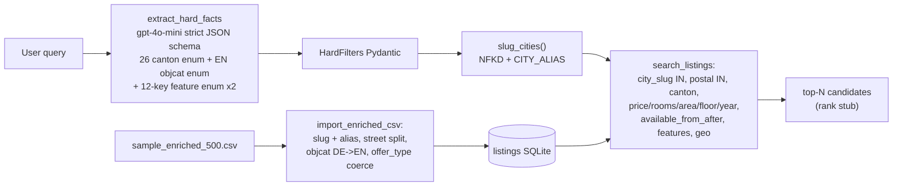

# Hard-filter MVP report

Status: April 18, 2026. Scope covered: query understanding and hard-constraint filtering only. Retrieval, ranking, explanations, enrichment, and personalization are deliberately unchanged (still pass-through stubs from the harness).

## 0. What shipped

`POST /listings` now implements the flow the challenge demands at the hard-constraint level:

```
user query
  -> OpenAI gpt-4o-mini (strict JSON schema, forced structured output)
  -> HardFilters (Pydantic)
  -> SQL hard-filter gate (SQLite, slug-matched city + 15 other constraint dimensions)
  -> pass-through ranking stub
  -> ListingsResponse
```

No silent fallback. No regex fallback. No LLM cache. On any failure in the LLM call (missing key, SDK error, malformed JSON, schema-invalid payload) we emit a `[WARN]` per CLAUDE.md §5 and re-raise.

The DB source is `raw_data/sample_data_enriched/sample_enriched_500.csv` (500 rows, teammate-produced clean subset; not committed — see [docs/DATASET.md](DATASET.md)). The legacy multi-CSV loader is still in the tree but unreferenced from `bootstrap.py`.

Test suite: **123 tests, 5.8 s, green**.

## 1. Data exploration (summary)

Script: [`scripts/explore_sample.py`](../scripts/explore_sample.py). Run it after any data change.

Column coverage on the 500-row enriched sample:

| column | coverage | kind | notes |
|---|---:|---|---|
| `listing_id` | 100% | string | PK, unique |
| `scrape_source` | 100% | enum | 498 COMPARIS, 2 ROBINREAL (no SRED in the sample) |
| `city` | 100% | string, native-language | 335 distinct; `Zürich`/`Genève`/`Biel/Bienne`/`St. Gallen` all appear in raw form |
| `canton` | 99.2% | enum, 2-char upper | 24/26 CH codes present; already clean |
| `postal_code` | 100% | numeric, 4-digit | range 1003-9630 |
| `street` | 96.8% | string, mixed case | 408/484 rows end in pure int; 40 in int+letter; 31 have no trailing number (plazas) |
| `price` | 99.4% | int CHF | 213-8050 (213 is suspect parking-space pricing) |
| `rooms` | 99.2% | float, Swiss half-step | 14 distinct, 1.0-7.5 |
| `area` | 98.8% | int m^2 | 2-397; `2` is likely bad data |
| `available_from` | 98.4% | ISO `YYYY-MM-DD` | 492/500 parseable, no format drift |
| `floor` | 97.4% | int | -1 (basement) to 24 (tower) |
| `year_built` | 86.4% | int | 1600-2027 (1600 is historic, 2027 under construction) |
| `object_category` | 100% | **German strings** | 15 distinct in sample, 29 in full DB |
| `offer_type` | 100% | enum | sample is all `RENT`; full DB also has `""` (1033) and `SALE` (1) |
| `status` | 100% | enum | `ACTIVE`/`INACTIVE`, ignored per user decision |
| 12 `feature_*` flags | 84-100% | binary 0/1/NULL | see below |
| `hero_image_url` | 0% | - | always empty in this sample |
| `agency_*` | 11-17% | low-signal | not used as filter |

Feature flags worth flagging:

- `feature_child_friendly`: 82 NULL, 414 positive, 4 negative. 99% of non-null rows are `1` so the signal is weak as a positive filter.
- `feature_temporary`: 416 NULL (83%), 81 positive, 3 negative. Only useful when user explicitly asks for "temporary rental".

## 2. Key findings that drove the design

### 2.1 City column is the biggest recall hole without normalization

Measured on the full 22,819-row DB before normalization:

| Query user types | Raw DB spellings | Rows recovered with case-only SQL | Rows missed |
|---|---|---:|---:|
| "Zurich" | `Zürich` (877), `Zurich` (71), `zurich` (1) | 72 / 949 | ~92% |
| "Geneva" | `Genève` (488), `Geneva` (48), `Genf` (40), `GENEVE` (2) | 50 / 578 | ~91% |

Fix: store a normalized `city_slug` column (NFKD ASCII-fold + lowercase + alias map) and slugify every incoming city query value before comparing. Both sides now agree on `zurich` / `geneva` / `biel` / `st-gallen` / etc.

### 2.2 `object_category` is entirely German but queries are English

Challenge queries say "apartment" / "studio" / "house". DB says `Wohnung` / `Studio` / `Haus` / `Dachwohnung` / `Attika` / `Maisonette`. Without translation, an English query matches zero rows.

Fix: translate once at import into a 29-entry English canonical enum. The LLM JSON schema exposes the English enum, so the model cannot emit German and cannot emit anything outside the enum.

### 2.3 Real queries mix hard + soft in the same sentence

From the 26 real queries in [`tests/fixtures/queries_de.md`](../tests/fixtures/queries_de.md) and [`docs/CHALLENGE.md`](CHALLENGE.md), I pulled these recurring constraints (and what the plan did with each):

| Phrase pattern | Schema field | Handled |
|---|---|---|
| "Zurich / Zürich / Lausanne / several cities" | `city: list[str]` via slug match | yes |
| "Kreis 3 / 4 / 5" (Zurich districts) | `postal_code: list[str]` via prompt rule | yes (prompt) |
| "ab 70 m^2 / at least 60 sqm" | `min_area` | yes |
| "bis 3100 CHF / under 2800" | `max_price` | yes |
| "2.5 bis 3.5 Zimmer / 3 or 4 rooms" | `min_rooms` + `max_rooms` | yes |
| "nicht im Erdgeschoss" | `min_floor=1` | yes |
| "2 Schlafzimmer / 2 bedrooms" | Swiss-rooms heuristic in prompt | yes |
| "möbliert / furnished" | `object_category=["furnished_apartment"]` | yes |
| "mit Balkon / Lift / Waschturm" | `features: list[str]` | yes |
| "ohne Kamin / no garage" | `features_excluded: list[str]` | yes |
| "June move-in" | `available_from_after: ISO date` | yes |
| "max 25 Min zum HB / near ETH / nah am See" | (left as soft signal) | deliberately skipped |
| "ruhig / hell / modern / family-friendly" | (left as soft signal) | deliberately skipped |

The "deliberately skipped" rows are encoded as **non-emission rules** in the system prompt. Without them, gpt-4o-mini will hallucinate `radius_km` or infer `features=["child_friendly"]` from "family-friendly", silently violating hard constraints.

### 2.4 Data gaps the current DB cannot answer

Queries ask for these, but the data has no column to filter on:

- Bathroom count ("2 Badezimmer", query 21).
- Cellar (`Keller`, query 2).
- Commute time to a named landmark (GTFS not integrated).
- "Near the lake", "good schools", "safe neighborhood" — need external POI / crime / geo data.

These stay as soft signals and are the job of later retrieval / ranking work. The MVP is not worse for missing them as long as the LLM doesn't fake hard values.

## 3. Architecture of the hard-filter layer



### 3.1 HardFilters surface (what a query can pin down)

16 filter dimensions, every one backed by an indexed column:

- `city` (list, slug-matched)
- `postal_code` (list)
- `canton` (enum, 2-char ISO)
- `min_price`, `max_price`
- `min_rooms`, `max_rooms`
- `min_area`, `max_area`
- `min_floor`, `max_floor` (accepts `-1` for basement)
- `min_year_built`, `max_year_built`
- `available_from_after` (ISO date, `available_from >= ?`)
- `latitude` + `longitude` + `radius_km` (Haversine, post-SQL filter)
- `features: list[str]` (AND, feature_X = 1)
- `features_excluded: list[str]` (AND, feature_X = 0 strict; NULL-unknown rows dropped)
- `object_category: list[str]` (IN, English canonical)

### 3.2 LLM contract

Single OpenAI call, model `gpt-4o-mini`, `temperature=0`, `response_format={"type":"json_schema","json_schema":{..., "strict": True}}`. Enums lock the model:

- `canton`: 26 ISO codes.
- `object_category.items`: English canonical enum.
- `features.items` + `features_excluded.items`: the 12 canonical feature keys from `FEATURE_COLUMN_MAP`.
- `offer_type`: dropped entirely. Column is mono-`RENT` in the DB after the `""` coercion, so there is nothing to filter on.

System prompt carries, in order:

1. Field list and canton-code reminder.
2. City alias list (zurich, geneva, bern, basel, lucerne, biel, neuchatel, fribourg, st-gallen, lausanne, lugano, sion, winterthur).
3. Object-category translation intent.
4. ISO date format.
5. Five emission rules (Kreis to postal, furnished to category, bedrooms to Swiss rooms, neighborhood union, range inclusivity).
6. Two non-emission rules (commute is soft, vague adjectives don't become features).
7. Two few-shot examples (one EN, one DE).

A test in [`tests/test_hard_fact_extraction.py`](../tests/test_hard_fact_extraction.py) pins these key substrings so the rules cannot be silently removed.

## 4. Assumptions

These are load-bearing; revisit if the data or the challenge brief changes.

1. **English-lowercase is the canonical form for `city`.** This is the user's explicit target schema. ASCII-fold + a ~20-entry alias map covers every query we've seen. For Swiss cities without a common English name (e.g. `Chêne-Bourg`), the fold result (`chene-bourg`) is used as-is.
2. **Canton is always the 2-char ISO code.** Full DB validation confirmed 100% conformance.
3. **Postal codes are 4-digit integers.** No Swiss postal code starts with 0, so `INTEGER` storage loses no information.
4. **`offer_type = ""` is equivalent to RENT.** Per ARCHITECTURE §0 the challenge is RENT-only, and the 1033 empty-string rows in the full DB are consistent with RENT listings that lost their type tag during scraping. Coerced at import.
5. **`status` is irrelevant for the MVP.** Locked by user. No listings are hidden based on it.
6. **`features_excluded` is strict.** If a listing has `feature_fireplace = NULL`, a user saying "no fireplace" excludes it. This preserves hard-constraint correctness (ARCHITECTURE §4 principle 1) at the cost of some recall on columns with many NULLs (only `feature_temporary` has that problem today).
7. **Commute time, proximity to landmarks, "quiet neighborhood", "good schools" are soft.** MVP has no GTFS, no POI graph, no crime data. The LLM is instructed via prompt to leave these out of HardFilters and let downstream retrieval/ranking handle them.
8. **LLM failures are fatal.** No regex fallback and no cache. Surfacing the failure is more useful than pretending we got a result.
9. **`platform_id` equals `listing_id` for the enriched sample.** The sample CSV does not carry the real source-side platform_id; the S3 image lookup therefore uses the harness id. Teammates' full-data export is expected to restore the proper value and the `get_image_urls_by_listing_id` contract is unchanged.
10. **500 rows is enough for MVP demos.** Numbers in the test suite are tight enough to detect regressions; real quality evaluation will need the full enriched dataset.

## 5. Known gaps and deliberate out-of-scope items

- No retrieval beyond SQL filter (no BM25, no dense embeddings, no cross-encoder reranker).
- No soft-fact / soft-filter / ranking implementation; the harness stubs pass data through unchanged.
- No schema migration tool. Bootstrap guards against schema drift; to rebuild the DB from a newer schema, delete `data/listings.db`.
- No relaxation ladder on zero hits, no fuzzy city fallback. Slug + alias is deterministic; fuzz would only help typos, which are rare in formal queries.
- Legacy loader path (`csv_import.py::import_csvs`, `listing_row_parser`, `sred_transform`) is kept but unreferenced. Teammates may still use it for the full-data ingest.
- `challenge.md` shows evaluation-style queries that expect bathroom count, cellar, commute time, and POI proximity. These cannot be answered today and are soft-signal handoffs until later phases.

## 6. How to re-run everything

```bash
uv sync                                   # install deps
rm -f data/listings.db                    # force a clean bootstrap
uv run pytest tests -q                    # 123 tests, ~6 s
uv run python scripts/explore_sample.py   # refresh column stats
uv run uvicorn app.main:app --reload      # starts the API
```

## 7. File map for this iteration

New:

- [`app/core/normalize.py`](../app/core/normalize.py) - slug, CITY_ALIAS, OBJECT_CATEGORY_MAP, split_street.
- [`app/harness/enriched_import.py`](../app/harness/enriched_import.py) - loader with every normalization baked in.
- [`scripts/explore_sample.py`](../scripts/explore_sample.py) - column-wise exploration.
- [`tests/test_normalize.py`](../tests/test_normalize.py) - 22 unit tests.
- [`tests/test_enriched_import.py`](../tests/test_enriched_import.py) - 11 round-trip tests.
- [`tests/test_hard_fact_extraction.py`](../tests/test_hard_fact_extraction.py) - 15 LLM-schema + prompt-pin tests.
- [`tests/test_listings_route.py`](../tests/test_listings_route.py) - end-to-end POST /listings check.

Modified:

- [`app/models/schemas.py`](../app/models/schemas.py), [`app/core/hard_filters.py`](../app/core/hard_filters.py), [`app/harness/search_service.py`](../app/harness/search_service.py), [`app/harness/csv_import.py`](../app/harness/csv_import.py), [`app/harness/bootstrap.py`](../app/harness/bootstrap.py), [`app/participant/hard_fact_extraction.py`](../app/participant/hard_fact_extraction.py), [`app/participant/ranking.py`](../app/participant/ranking.py), [`app/config.py`](../app/config.py), [`pyproject.toml`](../pyproject.toml).
- Tests: [`tests/test_hard_filters.py`](../tests/test_hard_filters.py), [`tests/test_hard_fact_extraction.py`](../tests/test_hard_fact_extraction.py), [`tests/test_api.py`](../tests/test_api.py), [`tests/test_bootstrap.py`](../tests/test_bootstrap.py), [`tests/test_s3.py`](../tests/test_s3.py).

Untouched (still stubs or orthogonal):

- [`app/participant/ranking.py`](../app/participant/ranking.py) (only a small `postal_code -> str` coercion for the API contract), [`app/participant/soft_fact_extraction.py`](../app/participant/soft_fact_extraction.py), [`app/participant/soft_filtering.py`](../app/participant/soft_filtering.py), [`app/participant/listing_row_parser.py`](../app/participant/listing_row_parser.py), [`app/harness/sred_transform.py`](../app/harness/sred_transform.py).
