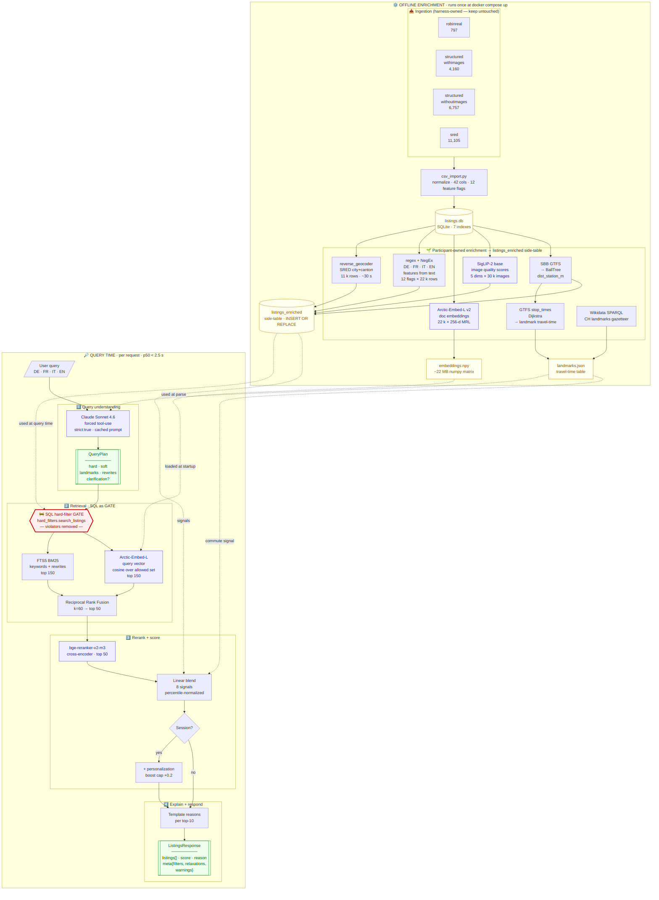
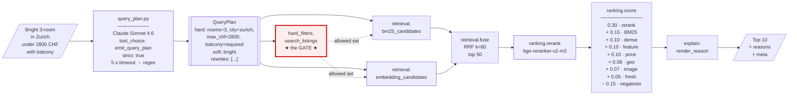
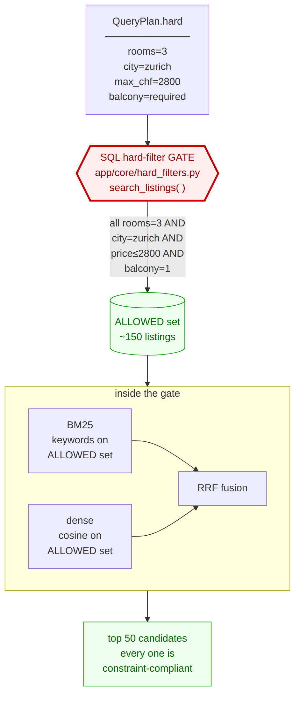
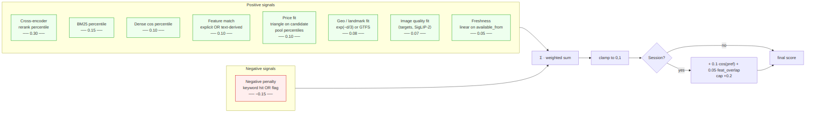
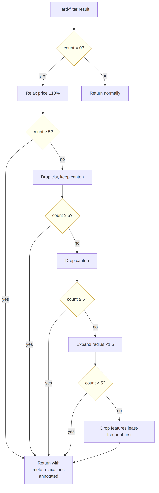
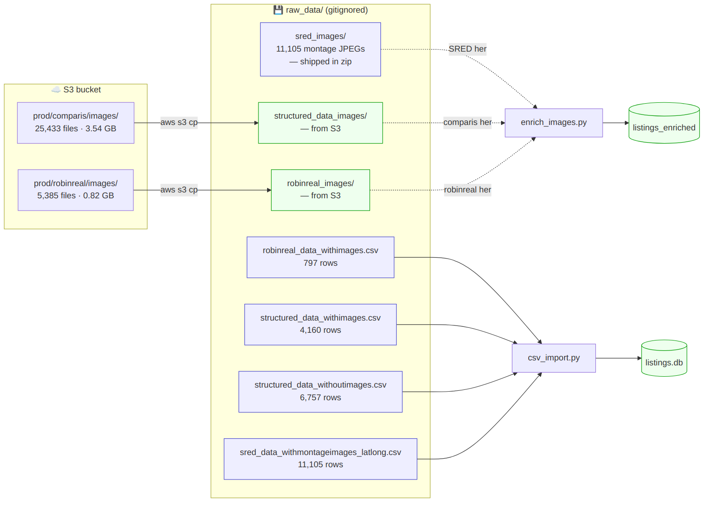
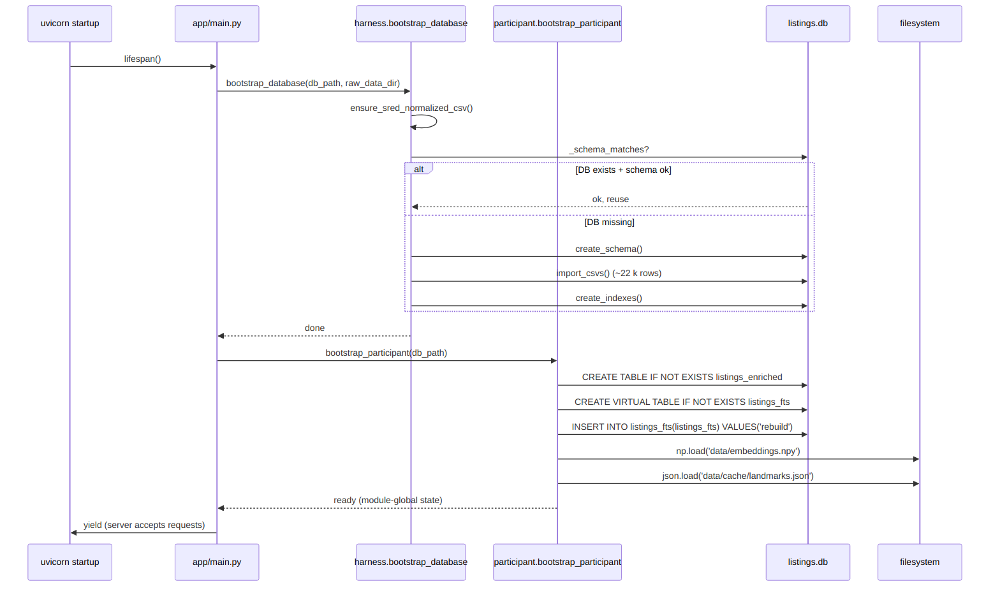

# Pipeline Flowcharts

Rendered diagrams for the Robin hybrid search architecture. See [ARCHITECTURE.md](../ARCHITECTURE.md) for the component specs.

Source `.mmd` files live in [diagrams/src/](diagrams/src/); PNGs are regenerated with:

```bash
npx -y -p @mermaid-js/mermaid-cli mmdc \
  -i docs/diagrams/src/01_full_system.mmd \
  -o docs/diagrams/01_full_system.png \
  -b white -s 2
```

---

## 1. Full system — offline enrichment + query-time



The two halves: **offline enrichment** runs once on `docker compose up`; **query time** runs per request.

---

## 2. Query time — single request



How one request flows through the participant-owned modules.

---

## 3. Hard filter as a GATE (the critical design)



The single most important design decision. The SQL hard filter is an **intersection gate**, not a retrieval channel. A listing violating a hard constraint is structurally unrepresentable in the result set.

---

## 4. Scoring blend — 8 signals + personalization boost



Each signal is percentile-normalized within the candidate pool so weights compose meaningfully. Weights live in `app/participant/scoring_config.py`.

---

## 5. Graceful degradation — relaxation ladder



When hard filters admit zero listings, we relax in a documented order and annotate `meta.relaxations`. Users see *why* they got broader results.

---

## 6. Data sources → local layout



Organizer's expected file layout. `app/core/s3.py` still works for direct S3 fetches; every enrichment script uses local paths.

---

## 7. Bootstrap lifecycle



On API container start, `app/main.py:lifespan` kicks off the pipeline. We add **one** hook — `bootstrap_participant()` — which does *not* touch the harness-owned schema (which would trip the `_schema_matches()` guard).

---

## Legend

- **🚧 red / bold-border** = gates / hard-filter-critical paths
- **🧠 blue** = ML inference (Claude / embeddings / reranker / CLIP)
- **📦 yellow** = data artifacts (DB, numpy, JSON caches)
- **✅ green** = final outputs
