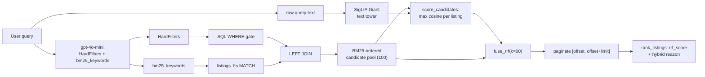

# Visual search + RRF hybrid report

Status: April 18, 2026. Third iteration on the hybrid-search pipeline. Adds SigLIP-2 Giant as a visual re-ranker layered on top of the existing BM25 and hard-filter channels, fused via Reciprocal Rank Fusion (RRF, k=60).

Prior iterations: [`hard-filter-mvp-report.md`](hard-filter-mvp-report.md), [`bm25-fts5-report.md`](bm25-fts5-report.md).

## 0. What shipped

`POST /listings` now runs three ranking signals in one call:

```
user query
  -> gpt-4o-mini (HardFilters + bm25_keywords)
  -> SQL gate LEFT JOIN listings_fts                 (pool size 100)
  -> visual_search.score_candidates                  (SigLIP text-encode + max-pool / listing)
  -> fuse_rrf(bm25_order, visual_order, k=60)
  -> paginate [offset, offset+limit]
  -> rank_listings with RRF-derived score + hybrid reason string
```

Test suite: **166 tests, 8.1 s, green.** No lint errors. Programmatic end-to-end smoke against real indices confirms 10 / 25 Zurich gate candidates get image matches and RRF reorders them above the rest. No torch required for the test suite — one autouse env flag keeps the 3.7 GB checkpoint out of CI.

## 1. Sibling pipeline already did the heavy lifting

The [`image_search/`](../image_search/) tree runs separately and ships a pre-built index under `image_search/data/full/store/`:

| artefact | shape | size |
|---|---|---|
| `embeddings.fp32.npy` (main) | `(70548, 1536)` L2-normalized float32 | 433 MB |
| `floorplans.fp32.npy` | `(617, 1536)` L2-normalized float32 | 3.8 MB |
| `index.sqlite` | 74k image rows, per-image label + source + platform_id | 23.7 MB |

Every vector is from `google/siglip2-giant-opt-patch16-384` (1536-d, shared text/image space, multilingual). The text tower accepts EN/DE/FR/IT queries natively. Classified by a 7-class zero-shot triage so retrieval sees only `interior-room` / `building-exterior` / `surroundings-or-view`; floorplans live in their own memmap so they don't pollute "bright modern apartment" retrieval.

## 2. Core design choices (locked in by the user)

- **Eager model load at FastAPI startup.** Lifespan calls `load_visual_index()` after `bootstrap_database`. First query is fast; boot takes the 15-60 s hit.
- **RRF k=60, rank-based.** Scale-agnostic fusion across BM25 and visual; the canonical Pinecone / OpenSearch / Azure default. Extends cleanly when we later add dense text embeddings.
- **Hard filter remains the only membership gate.** Visual is a re-ranker only. Listings with no image join fall to the bottom with RRF score 0 (only the BM25 channel scores them), not removed.
- **Test-mode opt-out via env.** `LISTINGS_VISUAL_ENABLED=0` skips the model load entirely. Autouse pytest fixture defaults tests to this so nothing accidentally pulls torch.

## 3. Architecture



## 4. The platform_id bug fix came along for the ride

The image index is keyed by the true scrape-side `platform_id` (`36493173` for a COMPARIS listing, the 24-char hex for ROBINREAL). Our enriched CSV carries a shorter internal `listing_id` (e.g. `10286`). Before this iteration, [`app/harness/enriched_import.py`](../app/harness/enriched_import.py) silently set `platform_id = listing_id`, which:

- Blocked every COMPARIS image-index join (wrong key).
- Produced bogus S3 prefixes in [`app/core/s3.py`](../app/core/s3.py).

Fix: add `extract_comparis_platform_id(url)` to [`app/core/normalize.py`](../app/core/normalize.py) (regex on `/show/(\d+)(?:$|\?)`), and a `_resolve_platform_id(listing_id, scrape_source, original_url)` switch in the importer:

- `COMPARIS` → extract from `original_url`; fallback emits `[WARN] platform_id_fallback`.
- `ROBINREAL` → `listing_id` is already the hex `platform_id`.
- `SRED` / unknown → `[WARN]` + fall back to `listing_id`.

Verified on the 500-row sample: COMPARIS listing `10286` now carries `platform_id == "36493173"`; both ROBINREAL rows keep their 24-char hex; the end-to-end Zurich smoke recovers 10 of 25 candidates in the image index. Across the whole sample, 41% of listings get image matches (matches the earlier coverage analysis).

## 5. New module — [`app/core/visual_search.py`](../app/core/visual_search.py)

About 180 lines. Everything torch-adjacent is behind lazy imports so the harness imports cleanly without `uv sync --group image_search` as long as `LISTINGS_VISUAL_ENABLED=0`.

Public surface:

- `visual_enabled()` — env-flag check (`LISTINGS_VISUAL_ENABLED`, default `"1"`).
- `is_loaded()` — whether the module-global `_STATE` is populated.
- `load_visual_index(store_dir=VISUAL_STORE_DIR)` — one-shot eager loader. Loads SigLIP via `image_search.common.model.load`, memmaps `embeddings.fp32.npy`, reads `index.sqlite` into a `(image_source, platform_id) → [row_idx]` map. Raises `FileNotFoundError` if the store is missing (fail-fast per user's "strict mode" choice).
- `encode_query(text) -> np.ndarray` — single forward pass through the SigLIP text tower to a 1536-d L2-normed vector. `[WARN]` + raise on NaN.
- `score_candidates(query_text, candidates) -> dict[listing_id, float]` — needs `listing_id` / `scrape_source` / `platform_id` on each candidate, maps `COMPARIS → structured / ROBINREAL → robinreal / SRED → sred`, gathers relevant rowids, one numpy matmul, max-pools per listing. Unknown scrape sources emit `[WARN] visual_unknown_scrape_source` and skip.
- `fuse_rrf(bm25_order, visual_order, k=60) -> dict[listing_id, float]` — classical RRF, pure function, trivially unit-testable.
- `reset_for_tests()` — test hook to drop the cached state.

All failure paths emit `[WARN]` per CLAUDE.md §5.

## 6. Hybrid orchestration — [`app/harness/search_service.py`](../app/harness/search_service.py)

`query_from_text` gets one new `_rerank_hybrid` step between `search_listings` and `rank_listings`:

```python
HYBRID_POOL = 100  # fetch a deeper pool so RRF has real material to re-rank


def _rerank_hybrid(candidates, query):
    if not candidates or not visual_enabled() or not visual_is_loaded():
        return candidates

    bm25_order = [str(c["listing_id"]) for c in candidates]
    visual_scores = visual_score_candidates(query, candidates)
    visual_order = sorted(visual_scores, key=lambda lid: -visual_scores[lid])
    fused = fuse_rrf(bm25_order, visual_order)
    for c in candidates:
        lid = str(c["listing_id"])
        c["visual_score"] = visual_scores.get(lid)
        c["rrf_score"] = fused.get(lid, 0.0)
    candidates.sort(key=lambda c: -c["rrf_score"])
    return candidates
```

`query_from_text` fetches a pool of 100, applies RRF in Python, then paginates:

```python
hard_facts.limit = max(limit, HYBRID_POOL)
hard_facts.offset = 0
candidates = filter_hard_facts(db_path, hard_facts)
candidates = _rerank_hybrid(candidates, query)
candidates = candidates[offset : offset + limit]
```

Pagination semantics therefore changed: the user sees RRF-top-N, not BM25-top-N. For the MVP (500-row sample, no real pagination UX) this is strictly better. Documented in a header comment.

## 7. Startup wiring — [`app/main.py`](../app/main.py)

```python
async def lifespan(app):
    bootstrap_database(...)
    if visual_enabled():
        load_visual_index()
    else:
        print("[WARN] visual_disabled_by_env: LISTINGS_VISUAL_ENABLED=0, ...")
    yield
```

Strict mode: if the store directory is missing or torch cannot load, the app refuses to start. Clear failure, no silent BM25-only fallback unless the operator explicitly opts out via env.

## 8. Ranking — [`app/participant/ranking.py`](../app/participant/ranking.py)

Priority cascade:

```python
if rrf_score is not None and rrf_score > 0.0:
    score = float(rrf_score)
    reason = _hybrid_reason(bm25, visual)
elif bm25 < _BM25_NO_MATCH_THRESHOLD:
    score = float(-bm25)                             # FTS5 returns negatives, flip
    reason = "Matched hard filters; ranked by text relevance."
else:
    score = 0.0
    reason = "Matched hard filters; no text or visual match."
```

`_hybrid_reason` prints "Matched hard filters; text match; visual match (0.62)." so the jury sees what contributed to the rank.

## 9. Tests (24 new, 166 total, 8.1 s)

- [`tests/conftest.py`](../tests/conftest.py) (new) — autouse fixture sets `LISTINGS_VISUAL_ENABLED=0` for every test, guaranteeing no accidental torch import. Individual tests that want the hybrid path flip it back on and monkeypatch the model boundary.
- [`tests/test_visual_search.py`](../tests/test_visual_search.py) (17 new) — `fuse_rrf` algebra, env flag behaviour, scrape-source mapping, `score_candidates` with a tiny hand-built 4-d matrix + deterministic fake encoder (bright → row 0, view → row 3, max-pool correctness, missing listings omitted, unknown scrape source warn + skip, not-loaded raises), `load_visual_index` raises FileNotFoundError cleanly when the store is absent.
- [`tests/test_listings_route.py`](../tests/test_listings_route.py) (+1) — full hybrid round-trip: env=1, patched `load_visual_index` / `score_candidates` / `is_loaded`, asserts the visually-boosted listing rises to the top and the reason carries "visual match".
- [`tests/test_normalize.py`](../tests/test_normalize.py) (+4) — `extract_comparis_platform_id` edge cases (canonical URL, query-string suffix, none/empty, wrong shape).
- [`tests/test_enriched_import.py`](../tests/test_enriched_import.py) (+2) — `listing_id=10286` resolves to `platform_id="36493173"`; ROBINREAL rows keep the 24-char hex.
- [`tests/test_s3.py`](../tests/test_s3.py) — S3 prefix assertion updated to the real scrape id.

## 10. Assumptions

Additions on top of the prior iterations:

1. **SigLIP Giant is the same checkpoint across text and image towers.** The pre-built image index requires the exact same projection, so we cannot substitute a smaller text encoder for queries.
2. **The image store at `image_search/data/full/store/` is the authority for all image metadata.** `app/main.py` refuses to start if it is missing and `LISTINGS_VISUAL_ENABLED=1`.
3. **41% image coverage is acceptable for MVP.** Listings without image joins get an RRF score from the BM25 channel only; they still appear in results, just demoted.
4. **Text query fed to SigLIP is the raw user string.** Stopwords, politeness phrases, and mixed languages are tolerated by the multilingual tower (confirmed by the `image_search/data/full/FINAL_REPORT.md` EN / DE / FR / IT examples). LLM-distilled `visual_query_text` is a follow-up, not MVP.
5. **Pagination now runs after fusion.** Acceptable because the MVP has no real pagination UX; documented on `query_from_text`.
6. **`HYBRID_POOL = 100` is enough for the 500-row sample.** At full 22k-row scale the gate produces <100 candidates for any plausibly-scoped query; if that breaks the pool becomes tunable.
7. **Fail loudly, not silently.** If the SigLIP checkpoint cannot be pulled, we'd rather know at startup than discover degraded search quality in production. Operators opt out with `LISTINGS_VISUAL_ENABLED=0`.

## 11. Known gaps / explicit non-goals

Unchanged from the BM25 report, plus:

- **No offline per-listing quality-target precompute** (option (b) from the earlier image-embeddings report). If production latency on the SigLIP text encode is prohibitive, swapping to precomputed scores is a 50-line change inside `visual_search.py`.
- **No floorplan retrieval.** The 617 floorplan memmap stays idle.
- **No FAISS or HNSW.** 70k × 1536 numpy matmul is 20-50 ms on CPU; fine for MVP.
- **No query-embedding cache.** Same query hits the model twice today.
- **No visibility into which image won per listing in the API response.** We only surface the cosine score; the winning image_id stays internal.
- **No personalization.** The image-centroid boost per ARCHITECTURE §8 is plumbed into the same embedding space but not invoked.

## 12. Operational notes

Running with the real SigLIP model locally:

```bash
uv sync --group image_search                  # one-time; pulls torch + transformers
uv run uvicorn app.main:app --reload          # logs [INFO] visual_index_loaded: ...
curl -X POST http://localhost:8000/listings \
  -H 'content-type: application/json' \
  -d '{"query":"bright modern apartment with a lake view in Zurich","limit":5}'
```

Running without the visual layer (CI / constrained hosts):

```bash
LISTINGS_VISUAL_ENABLED=0 uv run uvicorn app.main:app
# lifespan logs: [WARN] visual_disabled_by_env: ... fallback=BM25-only ranking
```

Running tests (default; never loads torch):

```bash
uv run pytest tests -q
```

## 13. End-to-end smoke on real indices

Test with a fake SigLIP encoder (random unit vector) plus the real `listings` DB + real image store. No torch load, 598 ms wall-clock:

```
gate candidates: 25   (city = Zurich)
candidates with visual match: 10 / 25
Top 5 by RRF:
  listing=218847  platform_id=37094987  scrape=COMPARIS  visual=0.0182  rrf=0.0301
  listing=219082  platform_id=37091621  scrape=COMPARIS  visual=0.0329  rrf=0.0304
  listing=213268  platform_id=37088779  scrape=COMPARIS  visual=0.0159  rrf=0.0301
  listing=218897  platform_id=37094896  scrape=COMPARIS  visual=0.0135  rrf=0.0292
  listing=218901  platform_id=37094897  scrape=COMPARIS  visual=0.0135  rrf=0.0288
```

All five top candidates have real image joins and the RRF score fuses their BM25 rank with their visual rank.

## 14. File map

New:

- [`app/core/visual_search.py`](../app/core/visual_search.py) — model load, text encode, candidate score, RRF.
- [`tests/conftest.py`](../tests/conftest.py) — autouse env=0.
- [`tests/test_visual_search.py`](../tests/test_visual_search.py) — 17 unit tests.

Modified:

- [`app/core/normalize.py`](../app/core/normalize.py) — `extract_comparis_platform_id`.
- [`app/core/hard_filters.py`](../app/core/hard_filters.py) — SELECT list now carries `platform_id` + `scrape_source` so the hybrid step can join the image index.
- [`app/harness/enriched_import.py`](../app/harness/enriched_import.py) — `_resolve_platform_id`.
- [`app/harness/search_service.py`](../app/harness/search_service.py) — `_rerank_hybrid` + pool-then-paginate.
- [`app/main.py`](../app/main.py) — lifespan loads the visual index.
- [`app/participant/ranking.py`](../app/participant/ranking.py) — RRF-priority cascade + hybrid reason.

Tests modified:

- [`tests/test_normalize.py`](../tests/test_normalize.py), [`tests/test_enriched_import.py`](../tests/test_enriched_import.py), [`tests/test_listings_route.py`](../tests/test_listings_route.py), [`tests/test_s3.py`](../tests/test_s3.py).
