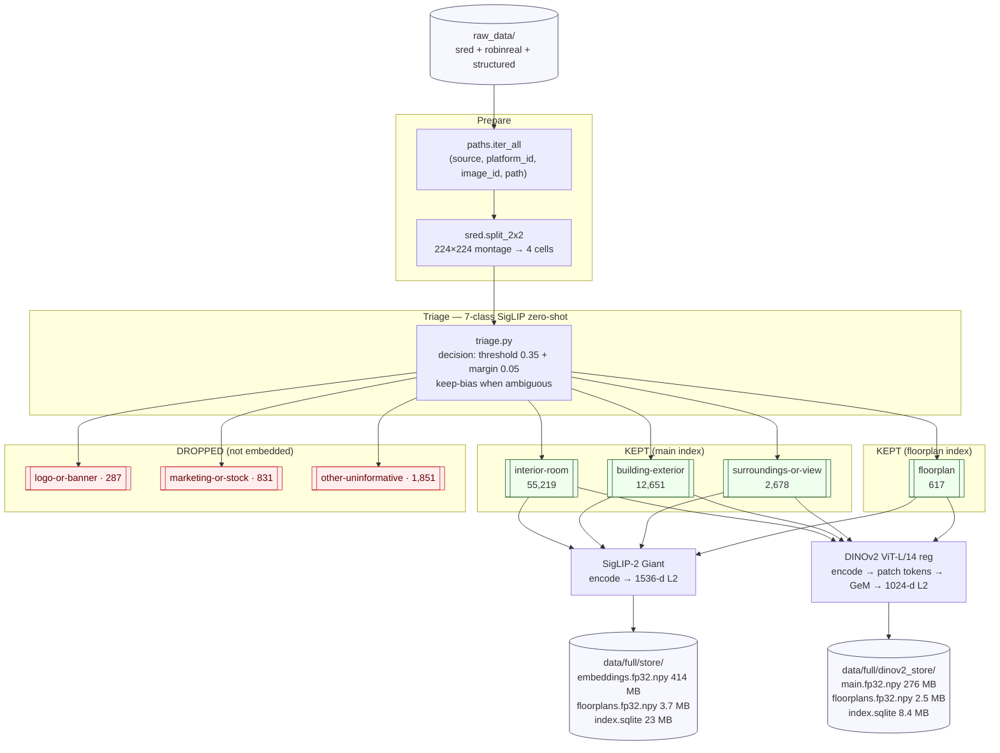

# `image_search/` — Visual retrieval over 70,548 listing photos

Two complementary image encoders over a de-duplicated, triage-filtered corpus of Swiss rental photos. Powers three query shapes in the API:

1. **Text → image** — *"modern bright kitchen"* → SigLIP-2 Giant cosine (1536-d)
2. **Image → image** — upload a photo → DINOv2 ViT-L/14 GeM cosine (1024-d)
3. **Listing → similar listings** — fusion of both + structured feature overlap

Both indexes sit on disk as `.npy` + SQLite; FastAPI loads them into RAM once at startup.

---

## Two parallel encoders

| | SigLIP-2 Giant | DINOv2 ViT-L/14 (reg) |
| --- | --- | --- |
| Model ID | [`google/siglip2-giant-opt-patch16-384`](https://huggingface.co/google/siglip2-giant-opt-patch16-384) | [`dinov2_vitl14_reg`](https://github.com/facebookresearch/dinov2) (torch.hub) |
| Purpose | Text **↔** image alignment | Dense visual structure |
| Main rows | **70,548** images | **70,548** images |
| Floorplan rows | **617** images | **617** images |
| Dropped (not indexed) | **2,969** images | identical filter |
| Embedding dim | **1,536** (fp32) | **1,024** (fp32, GeM-pooled) |
| Input | 384 × 384 | 224 × 224 (Resize-256 + CenterCrop-224) |
| Pooling | CLS projection | Generalized Mean (GeM) over `x_norm_patchtokens`, then L2 |

**Why both?** SigLIP is trained on text-image pairs — its image vector emphasizes what can be described in text ("modern", "bright", "view"). DINOv2 is self-supervised — it captures unstated structure (ceiling type, window grid, floor material, layout). For an apartment-photo domain, that split matters.

---

## Pipeline



---

## Triage taxonomy

From [`image_search/common/prompts.py`](common/prompts.py). Three **KEPT** classes go to the main index, **one** to floorplan, **three** are dropped:

| Label | Landing | Role |
| --- | --- | --- |
| `interior-room` | main | Retrieval target for most soft queries |
| `building-exterior` | main | Façade / curb appeal |
| `surroundings-or-view` | main | Outdoor / view / neighborhood |
| `floorplan` | floorplan | Separate index; never mixed with photos |
| `logo-or-banner` | — | Drop (not embedded) |
| `marketing-or-stock-photo` | — | Drop |
| `other-uninformative` | — | Drop |

Prompts are **multilingual** (DE / FR / IT / EN) with ≥3 templates per class per language, averaged to one class vector per label.

---

## SRED 2×2 split

Source images from SRED arrive as 224 × 224 montages of four unrelated rooms. Feeding the whole montage to SigLIP pools four scenes into one vector; the guard in [`image_search/common/sred.py:51-56`](common/sred.py#L51-L56) enforces a 2×2 split before any encoding:

```text
 ┌─────────┬─────────┐
 │   TL    │   TR    │      112×112 → 384×384 upscale (SigLIP)
 │  (#c0)  │  (#c1)  │      112×112 → 224×224 (DINOv2 via dinov2_sred.py)
 ├─────────┼─────────┤
 │   BL    │   BR    │
 │  (#c2)  │  (#c3)  │
 └─────────┴─────────┘
```

Cell identifiers are tagged `{image_id}#c{0..3}` so the two indexes stay row-index-joinable.

---

## Query path — max-cosine per listing

From [`image_search/scripts/query.py:54-69`](scripts/query.py#L54-L69):

```python
for idx in range(main.shape[0]):
    key = (info["source"], info["platform_id"])
    sim = float(sims[idx])
    if sim > best_per_listing.get(key, {"sim": -1})["sim"]:
        best_per_listing[key] = {"sim": sim, "image_id": …, "path": …}
```

**Max-pool** over a listing's images — one strong shot wins. Alternatives (mean, top-k-mean) dilute a great match with mediocre thumbnails.

The FastAPI [`app/core/visual_search.py`](../app/core/visual_search.py) and [`app/core/dinov2_search.py`](../app/core/dinov2_search.py) replicate this same aggregation.

---

## Modules

### Core ([`common/`](common/))

| File | Purpose |
| --- | --- |
| [`model.py`](common/model.py) | SigLIP-2 loader; CUDA→bf16 / MPS→fp16 / CPU→fp32 policy |
| [`embed.py`](common/embed.py) | SigLIP image + text encoders → L2-normalized fp32 numpy |
| [`triage.py`](common/triage.py) | Zero-shot 7-class triage with confidence + margin gating |
| [`prompts.py`](common/prompts.py) | 84+ multilingual class templates (DE/FR/IT/EN × 7 × ≥3) |
| [`sred.py`](common/sred.py) | 2×2 montage splitter for SigLIP (384×384 cells) |
| [`store.py`](common/store.py) | SQLite + `.npy` writer; safety-net refuses dropped-label writes |
| [`io.py`](common/io.py) | Safe image opener; RGBA→RGB composite; `[WARN]` on corrupt/missing |
| [`paths.py`](common/paths.py) | Enumerate `raw_data/*` with `(source, platform_id, image_id, path)` |
| [`status.py`](common/status.py) | STEP printer + JSONL run log |
| [`warn.py`](common/warn.py) | `warn(context, **kv)` → `[WARN] context: k=v …` |
| [`dinov2_model.py`](common/dinov2_model.py) | DINOv2 ViT-L/14 reg lazy loader |
| [`dinov2_embed.py`](common/dinov2_embed.py) | DINOv2 encoder: preprocess → forward → patch-token GeM → L2 |
| [`dinov2_transform.py`](common/dinov2_transform.py) | Canonical Resize-256 + CenterCrop-224 + ImageNet normalize |
| [`dinov2_sred.py`](common/dinov2_sred.py) | SRED splitter variant for DINOv2 (raw 112 cells, no upscale) |
| [`dinov2_store.py`](common/dinov2_store.py) | DINOv2 `.npy` + SQLite writer (lean schema; SigLIP-joinable) |
| [`dinov2_query.py`](common/dinov2_query.py) | Query-time index loader + max-pool-per-listing aggregator |
| [`gem.py`](common/gem.py) | Generalized-Mean pooling: `f_d = ((1/N) · Σ x_{i,d}^p)^(1/p)` |

### Scripts ([`scripts/`](scripts/))

| Script | Purpose |
| --- | --- |
| [`run_full.py`](scripts/run_full.py) | Full SigLIP pipeline: enumerate → SRED split → triage → embed → store |
| [`build_dinov2_index.py`](scripts/build_dinov2_index.py) | Build DINOv2 Tier-1 GeM index from the SigLIP-triaged images |
| [`query.py`](scripts/query.py) | CLI: text query → top-k listings (SigLIP) |
| [`query_dinov2.py`](scripts/query_dinov2.py) | CLI: image query → top-k listings (DINOv2 GeM) |
| [`verify_results.py`](scripts/verify_results.py) | 9-invariant check on the SigLIP store |
| [`verify_dinov2_index.py`](scripts/verify_dinov2_index.py) | 10-invariant check on the DINOv2 store |
| [`pilot_10_listings.py`](scripts/pilot_10_listings.py) | 10-listing validation gate (staged P0–P7) |
| [`recon_sweep.py`](scripts/recon_sweep.py) | Stage-0 class-existence recon before a full run |
| [`make_final_report.py`](scripts/make_final_report.py) | Combine run + verify + queries into `FINAL_REPORT.md` |
| [`make_samples_report.py`](scripts/make_samples_report.py) | Thumbnail panel per label |
| [`crosscheck_listings_samples.py`](scripts/crosscheck_listings_samples.py) | Cross-check listing-query hits against source CSVs |
| [`crosscheck_query_topk.py`](scripts/crosscheck_query_topk.py) | Top-k audit with thumbs + metadata side-by-side |

---

## Artifacts

On disk under [`image_search/data/full/`](data/full/) (gitignored — see [`docs/DATASET.md`](../docs/DATASET.md) for the pre-built bundle):

```text
store/                   (SigLIP-2 Giant, 1536-d)
  embeddings.fp32.npy    414 MB   (70,548 × 1536)
  floorplans.fp32.npy    3.7 MB   (617 × 1536)
  index.sqlite            23 MB   (per-image + per-listing + triage decisions)

dinov2_store/            (DINOv2 ViT-L/14, 1024-d GeM)
  main.fp32.npy          276 MB   (70,548 × 1024)
  floorplans.fp32.npy    2.5 MB   (617 × 1024)
  index.sqlite           8.4 MB
```

All arrays are **L2-normalized** (checked by the verify scripts) so cosine = dot product.

---

## Tests — 14 unit, all green

```text
test_gem.py                 test_dinov2_embed.py        test_dinov2_query.py
test_dinov2_transform.py    test_dinov2_sred.py         test_dinov2_store.py
test_triage_logic.py        test_prompts.py             test_sred_split.py
test_store.py               test_io.py                  test_paths.py
test_warn.py                test_status.py
```

Run: `uv run pytest image_search/tests -q`

Fixtures include pixel-exact SHA-256 hashes for the SRED split against a committed sample image in [`image_search/fixtures/sred_known/`](fixtures/sred_known/).

---

## Warning discipline

Every fallback path emits a line via [`warn(context, **kv)`](common/warn.py):

```text
[WARN] device_fallback_cpu: expected=cuda or mps got=cpu fallback=float32 on cpu (will be very slow)
[WARN] sred_guard: expected=(224,224) got=(1200,800) fallback=raised ValueError
[WARN] nan_embedding: context=full_run row=12473
[WARN] png_rgba_to_rgb: path=…/0-obj.png mode=RGBA fallback=white-composite
```

No silent `except: pass`. See [`CLAUDE.md §5`](../CLAUDE.md) for the project-wide rule.
