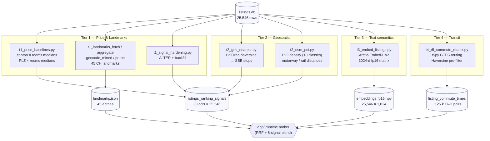

# `ranking/` — Layer 2: derived ranking signals

30 offline-computed signals per listing, plus an r5py commute matrix and a multilingual document embedding. This is everything the query-time ranker needs **after** the hard-filter gate, so the soft-ranking step is a fast SELECT + linear blend.

- **30 signals** × **25,546 listings** in [`listings_ranking_signals`](#tables)
- **~125 k** real transit travel-time pairs in [`listing_commute_times`](#tables)
- **25,546 × 1,024** fp16 [Arctic-Embed-L v2](https://huggingface.co/Snowflake/snowflake-arctic-embed-l-v2.0) document matrix
- **45** curated + GPT-mined Swiss landmarks (universities, Hauptbahnhöfe, lakes, employers)

---

## Pipeline



---

## Signals registry

All 30 columns live in [`ranking/schema.py:26-252`](schema.py). Every column is nullable — a missing value means "not computed yet", and the query-time ranker treats it explicitly rather than coercing to a default.

### Price (8) — [`t1_price_baselines.py`](scripts/t1_price_baselines.py), [`t1_signal_hardening.py`](scripts/t1_signal_hardening.py)

| Column | Type | Meaning |
|---|---|---|
| `price_baseline_chf_canton_rooms` | REAL | Median rent for this (canton, rooms) bucket |
| `price_baseline_chf_plz_rooms` | REAL | Median rent for this (PLZ-prefix, rooms) bucket |
| `price_delta_pct_canton_rooms` | REAL | `(price − baseline) / baseline` — signed |
| `price_delta_pct_plz_rooms` | REAL | as above, PLZ granularity |
| `price_baseline_n_canton_rooms` | INT | Sample size of the canton bucket (min 5 to publish) |
| `price_baseline_n_plz_rooms` | INT | Sample size of the PLZ bucket |
| `price_plausibility` | TEXT | `normal` \| `suspect` (set when \|delta\| > 3.0) |
| `last_updated_utc` | TEXT | UTC ISO timestamp |

### Geo / transit (6) — [`t2_gtfs_nearest.py`](scripts/t2_gtfs_nearest.py)

| Column | Type | Meaning |
|---|---|---|
| `dist_nearest_stop_m` | REAL | Haversine metres to nearest GTFS stop |
| `nearest_stop_name` | TEXT | SBB stop_name |
| `nearest_stop_id` | TEXT | GTFS stop_id (or parent_station) |
| `nearest_stop_type` | TEXT | `train` \| `tram` \| `bus` \| `ferry` \| `gondola` \| `funicular` |
| `nearest_stop_lines_count` | INT | Distinct routes serving the stop |
| `nearest_stop_lines_log` | REAL | `ln(1 + lines_count)` — compresses mega-hubs |

### POIs & noise proxies (13) — [`t2_osm_poi.py`](scripts/t2_osm_poi.py)

Counts are over the Switzerland OSM extract; distances are EPSG:2056 projected.

| Column | Type | Radius / class |
|---|---|---|
| `poi_supermarket_300m` / `_1km` | INT | OSM `shop=supermarket` |
| `poi_school_1km` | INT | OSM `amenity=school` |
| `poi_kindergarten_500m` | INT | `amenity=kindergarten` |
| `poi_playground_500m` | INT | `leisure=playground` |
| `poi_pharmacy_500m` | INT | `amenity=pharmacy` |
| `poi_clinic_1km` | INT | `amenity∈{clinic,hospital}` ∪ `healthcare` |
| `poi_gym_500m` | INT | `leisure=fitness_centre` |
| `poi_park_500m` | INT | `leisure=park` |
| `poi_restaurant_300m` | INT | `amenity=restaurant` |
| `dist_motorway_m` | REAL | Metres to nearest motorway / trunk road |
| `dist_primary_road_m` | REAL | Metres to nearest primary road |
| `dist_rail_m` | REAL | Metres to nearest surface rail (tunnels excluded) |

### Embedding metadata (3) — [`t3_embed_listings.py`](scripts/t3_embed_listings.py)

| Column | Type | Meaning |
|---|---|---|
| `embedding_row_index` | INT | Row index into [`data/ranking/embeddings.fp16.npy`](../data/ranking/embeddings.fp16.npy) |
| `embedding_model` | TEXT | HF model id — currently `Snowflake/snowflake-arctic-embed-l-v2.0` |
| `embedding_doc_hash` | TEXT | SHA-256 over the embedded text (for re-embed invalidation) |

---

## Scripts

11 scripts in [`ranking/scripts/`](scripts/). All idempotent (`INSERT OR REPLACE`), runnable independently.

| Script | Tier | What it produces |
|---|---|---|
| [`t1_create_table.py`](scripts/t1_create_table.py) | 1.1 | Creates `listings_ranking_signals`; emits `[WARN]` on schema drift |
| [`t1_price_baselines.py`](scripts/t1_price_baselines.py) | 1.2 | Per-segment medians (min 5 listings per bucket) |
| [`t1_landmarks_fetch.py`](scripts/t1_landmarks_fetch.py) | 1.3 | Nominatim forward-geocode for canonical landmarks |
| [`t1_landmarks_aggregate.py`](scripts/t1_landmarks_aggregate.py) | 1.3b | Aggregate GPT-mined mentions into geocoding candidates |
| [`t1_landmarks_geocode_mined.py`](scripts/t1_landmarks_geocode_mined.py) | 1.3c | Geocode mined candidates; append to `landmarks.json` |
| [`t1_landmarks_prune.py`](scripts/t1_landmarks_prune.py) | 1.3d | Apply reviewed DROP list (30 bad entries as of 2026-04-19) |
| [`t1_signal_hardening.py`](scripts/t1_signal_hardening.py) | 1 | `ALTER TABLE` + backfill `nearest_stop_lines_log`, `price_plausibility` |
| [`t2_gtfs_nearest.py`](scripts/t2_gtfs_nearest.py) | 2.1 | `sklearn.BallTree(metric='haversine')` over SBB GTFS stops |
| [`t2_osm_poi.py`](scripts/t2_osm_poi.py) | 2.2 | 10 POI counts + 3 noise-proxy distances from CH PBF |
| [`t3_embed_listings.py`](scripts/t3_embed_listings.py) | 3.1 | Arctic-Embed-L v2 fp16 matrix + `ids.json` |
| [`t4_r5_commute_matrix.py`](scripts/t4_r5_commute_matrix.py) | 4.1 | r5py Dijkstra over GTFS, Haversine-pruned, parallel workers |

---

## Runtime modules

Query-time helpers in [`ranking/runtime/`](runtime/). Zero offline deps at import time.

| File | Purpose | Imported by |
|---|---|---|
| [`embedding_search.py`](runtime/embedding_search.py) | Cosine top-k over the Arctic matrix; 50 MB fp16 loaded once per process | [`app/core/text_embed_search.py`](../app/core/text_embed_search.py) |
| [`signals_reader.py`](runtime/signals_reader.py) | Batched SELECT that attaches all signals to a candidate list | Direct SQL in [`app/core/soft_signals.py`](../app/core/soft_signals.py) |
| [`ojp_client.py`](runtime/ojp_client.py) | Swiss OJP 2.0 client for live transit queries; 50 req/min tier | On-demand; not in request critical path |
| [`diversify.py`](runtime/diversify.py) | Pareto-front + MMR reranking on top-K | Available; wired into ranker on demand |

---

## Tables

Both tables live in [`data/listings.db`](../data/listings.db) alongside `listings` + `listings_enriched`.

```sql
-- listings_ranking_signals  (schema.py:203-216)
CREATE TABLE listings_ranking_signals (
  listing_id TEXT PRIMARY KEY,
  price_baseline_chf_canton_rooms REAL,
  -- … 29 more signals …
  FOREIGN KEY (listing_id) REFERENCES listings(listing_id)
);
CREATE INDEX idx_lrs_dist_station ON listings_ranking_signals(dist_nearest_stop_m);
CREATE INDEX idx_lrs_price_delta  ON listings_ranking_signals(price_delta_pct_canton_rooms);

-- listing_commute_times  (schema.py:239-251)
CREATE TABLE listing_commute_times (
  listing_id   TEXT NOT NULL,
  landmark_key TEXT NOT NULL,
  travel_min   INTEGER,
  PRIMARY KEY (listing_id, landmark_key)
);
CREATE INDEX idx_lct_landmark_time ON listing_commute_times(landmark_key, travel_min);
```

---

## Rebuild

Each script is safe to run standalone. Typical order for a cold rebuild:

```bash
uv run python ranking/scripts/t1_create_table.py
uv run python ranking/scripts/t1_price_baselines.py
uv run python ranking/scripts/t1_landmarks_fetch.py
uv run python ranking/scripts/t2_gtfs_nearest.py      # needs GTFS feed on disk
uv run python ranking/scripts/t2_osm_poi.py           # needs switzerland-latest.osm.pbf
uv run python ranking/scripts/t3_embed_listings.py    # ~30 min on CPU, ~5 min on GPU
uv run python ranking/scripts/t4_r5_commute_matrix.py # ~4–6 h with parallel workers
uv run python ranking/scripts/t1_signal_hardening.py  # final backfill + ALTER
```

Data-source prep (not auto-downloaded):

- **SBB GTFS feed** → [gtfs.geops.ch](https://gtfs.geops.ch/)
- **Switzerland OSM extract** → [geofabrik.de](https://download.geofabrik.de/europe/switzerland-latest.osm.pbf)

See [`docs/DEVELOPMENT.md`](../docs/DEVELOPMENT.md) for prep recipes.

---

## Tests

7 files in [`ranking/tests/unit/`](tests/):

```
test_price_baselines_math.py    test_diversify.py
test_schema_registry.py         test_landmarks_curation.py
test_ojp_client.py              test_landmarks_aggregate.py
test_signals_reader.py
```

Run: `uv run pytest ranking/tests -q`

---

## Dependencies

- Offline pipelines: `r5py`, `scikit-learn` (BallTree), `geopandas`, `shapely`, `pandas`, `numpy`, `httpx`
- Runtime helpers: `sentence-transformers` (lazy-loaded), `numpy`, `sqlite3`, `httpx`, `python-dotenv`
- External APIs: **Nominatim** (landmarks only, rate-limited 1 req/s), **OpenTransportData.swiss OJP 2.0** (runtime, optional)

See [`pyproject.toml`](../pyproject.toml) for pinned versions.
